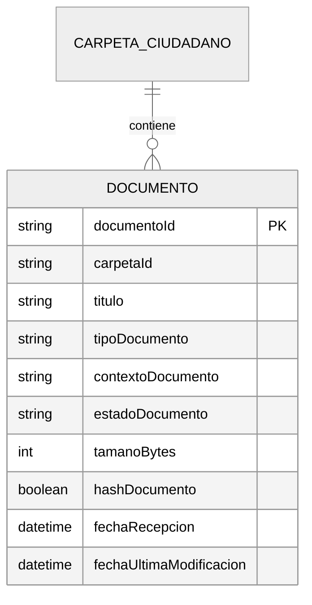
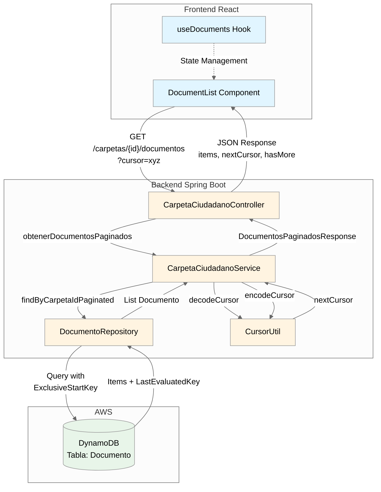
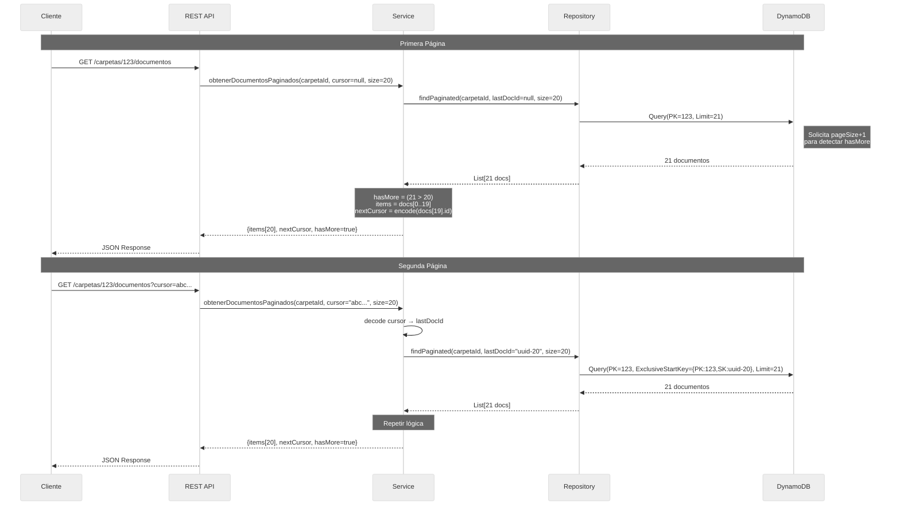
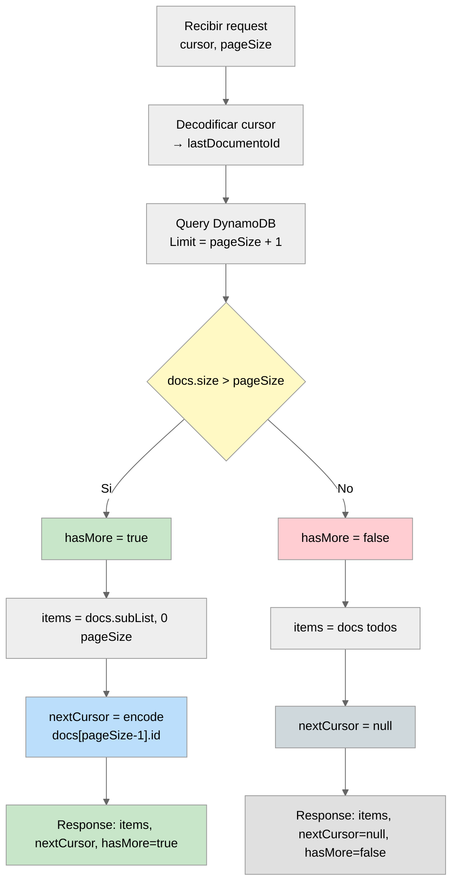
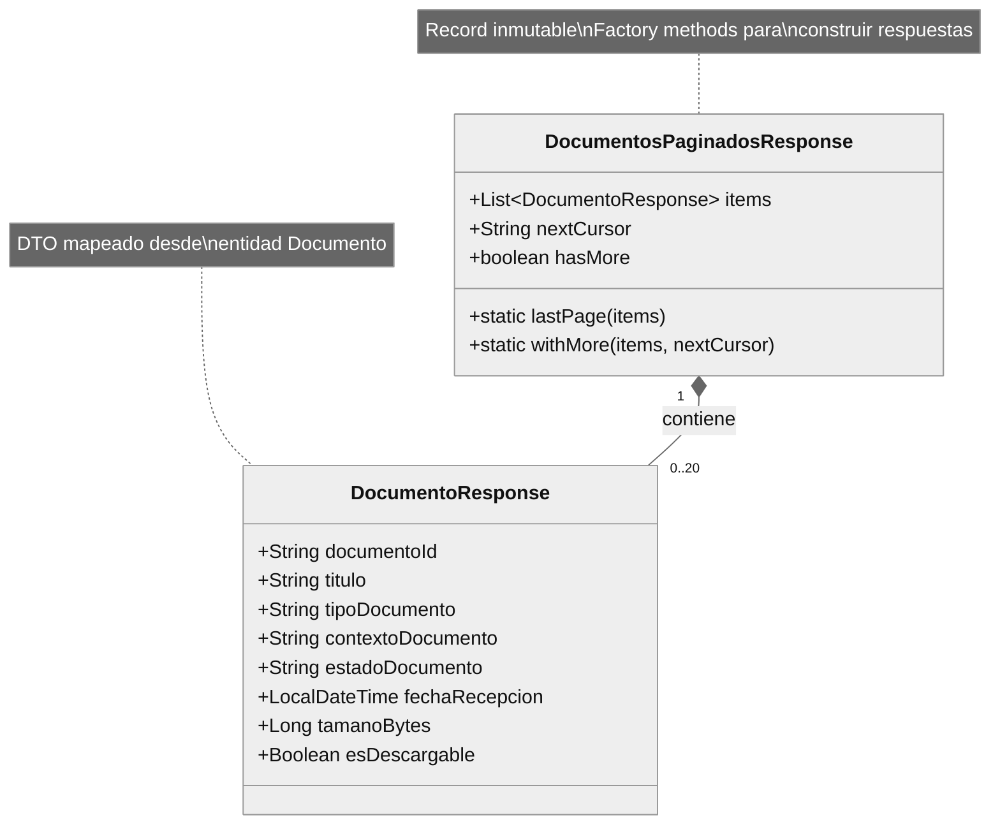
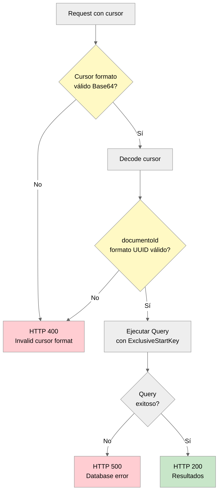
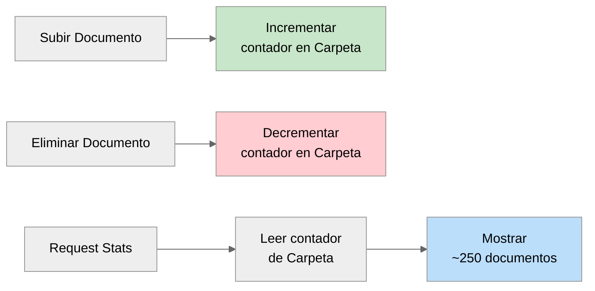
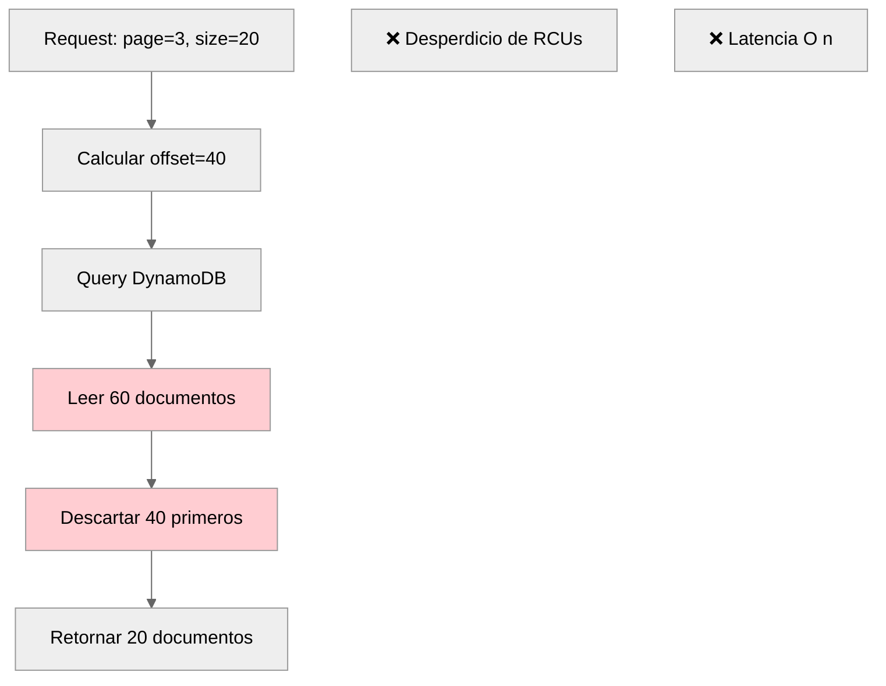
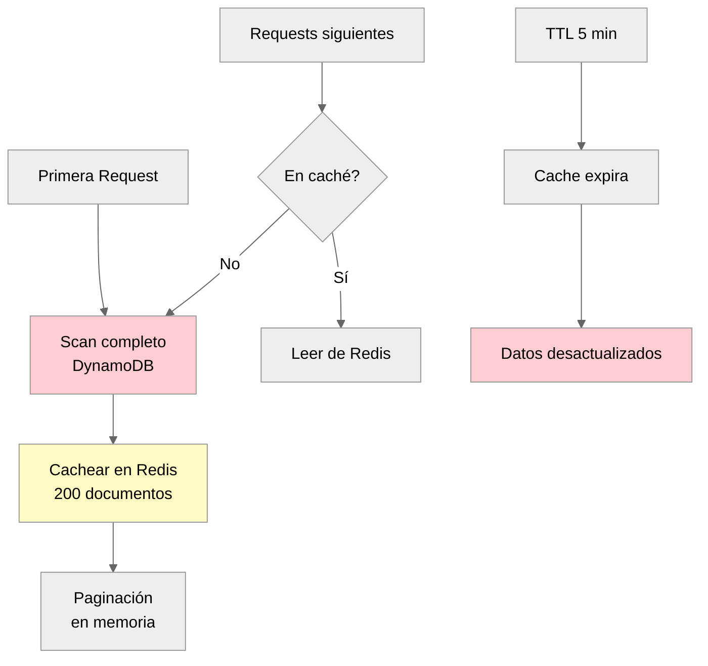

# ADR-0002: Paginación Basada en Cursores para Listado de Documentos en DynamoDB

## Estado
**Aceptado** - 2025-11-04

## Contexto

El sistema Carpeta Ciudadana requiere implementar la funcionalidad de visualización y descarga de documentos (FR-SD-04). Los ciudadanos deben poder acceder al listado completo de documentos almacenados en su carpeta personal. Considerando que un ciudadano puede acumular cientos o miles de documentos a lo largo de su vida (certificados educativos, documentos médicos, diplomas, actas, etc.), necesitamos diseñar una estrategia de paginación eficiente.

### Desafíos del Problema

1. **Escala Nacional:** El sistema debe soportar 55 millones de ciudadanos colombianos (RNF-06). Asumiendo un promedio conservador de 50-200 documentos por ciudadano a lo largo de su vida, estaremos manejando entre 2.75-11 mil millones de documentos.

2. **Selección de Base de Datos:** Hemos decidido usar Amazon DynamoDB como base de datos principal para documentos debido a:
   - Escalabilidad horizontal ilimitada (RNF-09)
   - Alta disponibilidad 99.99% (RNF-01)
   - Performance consistente a cualquier escala
   - Modelo de costo predecible

3. **Modelo de Datos Propuesto:**
   ```
   Tabla: Documento
   - Partition Key: carpetaId (UUID)
   - Sort Key: documentoId (UUID)
   - Atributos: titulo, tipoDocumento, fechaRecepcion, tamanoBytes, etc.
   ```

4. **Patrón de Acceso Principal:** Un ciudadano consulta "todos mis documentos" ordenados por algún criterio (por defecto, por documentoId).

5. **Características de DynamoDB:**
   - ✅ Queries eficientes por Partition Key
   - ✅ Ordenamiento automático por Sort Key
   - ✅ Mecanismo nativo de paginación con `LastEvaluatedKey`
   - ❌ Límite de 1MB de datos por query
   - ❌ NO soporta OFFSET nativo (estilo SQL)

6. **Requisitos de UX:** La interfaz frontend necesita un patrón de "Load More" o scroll infinito para evitar cargas masivas de datos que degraden la experiencia del usuario.

### Requisitos No Funcionales Críticos

- **RNF-01:** Disponibilidad del 99.99% para Core Domain (Carpeta Personal)
- **RNF-06:** Volumen de usuarios - 55 millones de ciudadanos
- **RNF-09:** Escalado horizontal de todos los componentes del Core Domain
- **RNF-11:** API Crítica (p95) < 600ms para APIs del Core Domain con verificación de firma/MFA

### Pregunta de Diseño

**¿Qué estrategia de paginación debemos implementar para el endpoint de listado de documentos que sea eficiente, escalable y compatible con las características de DynamoDB?**

## Decisión

Implementaremos **paginación basada en cursores (cursor-based pagination)** aprovechando el mecanismo nativo `LastEvaluatedKey` de DynamoDB.

### Fundamentos de la Decisión

1. **Compatibilidad Nativa:** DynamoDB provee `LastEvaluatedKey` de forma nativa en queries paginadas.
2. **Performance O(1):** El tiempo de respuesta es constante sin importar la posición en el dataset.
3. **Stateless:** No requiere almacenar estado de sesión en el servidor.
4. **Escalabilidad:** Compatible con sharding horizontal de DynamoDB por `carpetaId`.

### Diseño de la Solución

#### 1. Modelo de Datos



**Decisión de Claves:**
- **Partition Key = carpetaId:** Permite queries eficientes de "todos los documentos de un ciudadano"
- **Sort Key = documentoId:** Garantiza unicidad y ordenamiento determinístico

#### 2. Arquitectura de Componentes



#### 3. Diseño de API

**Endpoint:**
```
GET /carpetas/{carpetaId}/documentos?cursor={encodedCursor}&pageSize={size}
```

**Request:**
- `carpetaId` (path): UUID de la carpeta
- `cursor` (query, opcional): Cursor opaco para continuar paginación
- `pageSize` (query, opcional, default=20): Tamaño de página

**Response:**
```json
{
  "success": true,
  "message": "Documentos obtenidos exitosamente",
  "data": {
    "items": [
      {
        "documentoId": "uuid-1",
        "titulo": "Diploma Universitario",
        "tipoDocumento": "DIPLOMA",
        "estadoDocumento": "PROCESADO",
        "fechaRecepcion": "2025-10-21T16:00:00",
        "tamanoBytes": 2048000
      }
    ],
    "nextCursor": "base64EncodedString",
    "hasMore": true
  }
}
```

**Campos de Respuesta:**
- `items`: Array con máximo `pageSize` documentos
- `nextCursor`: String opaco para obtener siguiente página (null si es última página)
- `hasMore`: Boolean indicando si existen más documentos

#### 4. Diseño del Cursor

```mermaid
%%{init: {'theme': 'neutral', "flowchart" : { "curve" : "basis" } } }%%
flowchart LR
    A[documentoId<br/>UUID simple] -->|"Base64.encode()"| B[Cursor Opaco<br/>eyJkb2N1bW...=]
    B -->|"Enviado al Cliente"| C[Frontend almacena]
    C -->|"Siguiente Request"| D[Backend recibe]
    D -->|"Base64.decode()"| E[documentoId<br/>extraído]
    E -->|"ExclusiveStartKey"| F[(DynamoDB Query)]

    style A fill:#bbdefb
    style B fill:#c8e6c9
    style C fill:#fff9c4
    style D fill:#ffccbc
    style E fill:#bbdefb
    style F fill:#e1bee7
```



**Características del Cursor:**
- **Opaco:** Codificado en Base64 para ocultar estructura interna
- **Simple:** Solo contiene el `documentoId` del último item de la página
- **Stateless:** Toda la información necesaria está en el cursor mismo
- **Versionable:** Fácil evolucionar a estructuras más complejas sin breaking changes

**Implementación:**
```java
public class CursorUtil {
    public static String encodeCursor(String documentoId) {
        return Base64.getEncoder()
            .encodeToString(documentoId.getBytes(StandardCharsets.UTF_8));
    }

    public static String decodeCursor(String cursor) {
        byte[] decoded = Base64.getDecoder().decode(cursor);
        return new String(decoded, StandardCharsets.UTF_8);
    }
}
```

#### 5. Flujo de Paginación



#### 6. Algoritmo de Detección de Última Página



**Lógica:**
1. Solicitar **pageSize + 1** documentos a DynamoDB
2. Si recibimos **más de pageSize** → hay más páginas
3. Retornar **exactamente pageSize** documentos al cliente
4. Generar **nextCursor** desde el último documento visible

#### 7. Modelo de Respuesta



## Consecuencias

### Positivas

1. ✅ **Performance Consistente O(1):**
   - Tiempo de respuesta constante sin importar posición en dataset
   - Lectura eficiente: ~1 RCU por 4KB de datos
   - Cumple RNF-11 (< 600ms para p95)

2. ✅ **Escalabilidad Horizontal:**
   - Compatible con sharding de DynamoDB por `carpetaId`
   - No requiere coordinación entre nodos
   - Escala a 55 millones de ciudadanos (RNF-06)
   - Cumple RNF-09 (escalado horizontal)

3. ✅ **Alta Disponibilidad:**
   - Stateless: no requiere almacenar estado de sesión
   - Tolera fallos de instancias individuales
   - Cumple RNF-01 (99.99% uptime)

4. ✅ **Eficiencia de Costos:**
   - Minimiza RCUs de DynamoDB
   - Solo lee documentos necesarios (no scan completo)
   - ~5 RCUs por página de 20 documentos (100KB)

5. ✅ **Correctitud:**
   - `ExclusiveStartKey` garantiza no duplicados
   - No sufre "jumping records" si se insertan/eliminan docs entre requests

6. ✅ **Simplicidad de Implementación:**
   - Aprovecha mecanismo nativo de DynamoDB
   - Código simple y mantenible
   - Fácil de testear

7. ✅ **Opacidad del Cursor:**
   - Base64 oculta implementación interna
   - Permite evolucionar estructura sin breaking changes
   - Cliente no depende de formato interno

### Negativas

1. ❌ **No Permite Saltos de Página:**
   - Solo navegación secuencial (siguiente)
   - No se puede ir directamente a "página 10"
   - No se puede retroceder sin historial de cursores

2. ❌ **No Hay Conteo Total Nativo:**
   - No se puede mostrar "Página X de Y"
   - Implementar count requiere query adicional costoso
   - **Mitigación:** Mostrar solo "Cargar más" en UI

3. ❌ **Cursor Puede Invalidarse:**
   - Si el documento referenciado se elimina, cursor puede fallar
   - **Mitigación:** Validar cursor y retornar HTTP 400 con mensaje claro

4. ❌ **Experiencia Limitada para Power Users:**
   - Usuarios que quieran ver "últimos documentos" deben paginar todo
   - **Mitigación Futura:** GSI con índice invertido por fecha

### Mitigaciones Planificadas

#### 1. Validación de Cursor



#### 2. Contador Aproximado de Documentos

Para mostrar estadísticas sin scan completo:



**Implementación:**
```java
// En entidad CarpetaCiudadano
private Long totalDocumentosAproximado = 0L;

// Actualizar en operaciones CRUD
void onDocumentoCreado() {
    carpeta.setTotalDocumentosAproximado(
        carpeta.getTotalDocumentosAproximado() + 1
    );
}
```

## Alternativas Consideradas

### Opción A: Paginación Offset-Based (Estilo SQL)



**Propuesta:**
```
GET /documentos?page=3&pageSize=20
→ Skip 40, tomar 20
```

**Pros:**
- ✅ Saltos directos a cualquier página
- ✅ Navegación bidireccional
- ✅ Muestra "Página X de Y"

**Contras:**
- ❌ DynamoDB NO soporta OFFSET nativo
- ❌ Requeriría leer y descartar todos los documentos anteriores
- ❌ Performance degrada linealmente: O(n) donde n = offset
- ❌ Desperdicio masivo de RCUs

**Performance:**
```
Página 1  (offset=0):    50ms,   5 RCUs  ✅
Página 10 (offset=180):  250ms,  50 RCUs ❌
Página 50 (offset=980):  900ms, 250 RCUs ❌❌
```

**Razón de Rechazo:**
- Incompatible con arquitectura de DynamoDB
- Viola RNF-11 (latencia < 600ms)
- No escalable a 55M usuarios (RNF-06)

### Opción B: Scan Completo + Caché en Memoria



**Propuesta:**
```java
// Cargar todos los docs en memoria/cache
List<Documento> all = repo.findAll(carpetaId);
cache.put(carpetaId, all, 5.minutes);
return all.subList(offset, offset + pageSize);
```

**Pros:**
- ✅ Paginación arbitraria
- ✅ Navegación bidireccional
- ✅ Total count disponible

**Contras:**
- ❌ No escalable: 200 docs × 5KB = 1MB por usuario
- ❌ Con 10K usuarios concurrentes = 10GB RAM
- ❌ Latencia inicial alta (scan completo)
- ❌ Desperdicia RCUs (lee docs que nunca se ven)
- ❌ Datos desactualizados (problemas de consistencia)

**Razón de Rechazo:**
- Desperdicio masivo de memoria y RCUs
- No cumple RNF-01 (disponibilidad comprometida por memoria)
- No escalable a 55M usuarios (RNF-06)

### Opción C: GraphQL Connections (Relay Spec)

**Propuesta:**
```graphql
query {
  carpeta(id: "123") {
    documentos(first: 20, after: "cursor") {
      edges {
        node { titulo, tipo }
        cursor
      }
      pageInfo {
        hasNextPage
        endCursor
      }
    }
  }
}
```

**Pros:**
- ✅ Estándar de industria
- ✅ Navegación bidireccional (first/after, last/before)
- ✅ Rico tooling

**Contras:**
- ❌ Requiere adoptar stack completo GraphQL
- ❌ Overhead de Apollo Server, schema stitching
- ❌ Curva de aprendizaje para equipo
- ❌ Overkill para necesidad actual

**Razón de Rechazo:**
- Sistema actual es REST API
- No justifica complejidad adicional
- YAGNI (You Aren't Gonna Need It)

### Comparativa Final

| Criterio | Cursor-Based<br>✅ | Offset-Based<br>❌ | Scan + Cache<br>❌ |
| :--- | :--- | :--- | :--- |
| **Performance** | O 1 | O n | O 1 cached |
| **RCUs** | ~5 por página | 5-250 por página | ~50 inicial |
| **Memoria** | Stateless | Stateless | 1MB/usuario |
| **Escalabilidad** | ✅ Alta | ❌ Baja | ❌ Muy Baja |
| **Saltos** | ❌ No | ✅ Sí | ✅ Sí |
| **Complejidad** | Baja | Media | Alta |


## Métricas de Éxito

### 1. Performance
- **Latencia P50:** < 200ms
- **Latencia P95:** < 500ms (objetivo: cumplir RNF-11 < 600ms con margen)
- **Latencia P99:** < 1s
- **RCUs por request:** ~5 RCUs promedio

### 2. Escalabilidad
- **Throughput:** Soportar 1000 req/seg con latencia < 500ms
- **Consistencia:** Latencia P95 no debe degradarse con tamaño de carpeta (100 vs 10K docs)

### 3. Confiabilidad
- **Uptime:** 99.99% (RNF-01)
- **Tasa de errores cursor inválido:** < 0.1%

### 4. UX
- **Tiempo primera página:** < 1 segundo end-to-end
- **Tasa de engagement:** > 80% usuarios cargan ≥ 2 páginas

## Plan de Implementación

### Fase 1: Backend (Semana 1-2)
1. Crear `CursorUtil` con encode/decode
2. Implementar `DocumentoRepository.findByCarpetaIdPaginated()`
3. Implementar `DocumentosPaginadosResponse` DTO
4. Crear endpoint `GET /carpetas/{id}/documentos`
5. Tests unitarios y de integración

### Fase 2: Frontend (Semana 2-3)
1. Crear hook `useDocuments()` con estado de paginación
2. Implementar componente `DocumentList` con "Load More"
3. Agregar loading states y error handling
4. Tests de componente

### Fase 3: Testing y Optimización (Semana 3-4)
1. Load testing con K6 (1000 req/seg)
2. Pruebas con carpetas grandes (1K, 10K, 100K docs)
3. Monitoreo de RCUs en DynamoDB
4. Ajustes de performance

## Revisión Futura

Revisar esta decisión si:

1. **Requisito de Saltos de Página:** Si negocio requiere ir directamente a página N
   - Considerar: GSI con índices secundarios

2. **Necesidad de Total Count:** Si UI requiere "X de Y documentos"
   - Implementar: Contador incremental en `CarpetaCiudadano`

3. **Ordenamiento Dinámico:** Si usuarios necesitan ordenar por fecha/tipo/tamaño
   - Considerar: GSIs adicionales o Elasticsearch

4. **Adopción de GraphQL:** Si sistema migra a GraphQL
   - Migrar a: Relay Connections (reutilizar lógica de cursor)

**Fecha revisión:** 2026-05-01 (6 meses post-implementación)

## Referencias

- **Requisitos Funcionales:** `/docs/informacion_cruda/requisitos_funcionales_consolidados.md`
  - FR-SD-04: Visualización y Descarga de Documentos

- **Requisitos No Funcionales:** `/docs/informacion_cruda/requisitos_no_funcionales.md`
  - RNF-01: Disponibilidad 99.99%
  - RNF-06: Volumen 55M usuarios
  - RNF-09: Escalado horizontal
  - RNF-11: API p95 < 600ms

- **DDD Análisis:** `/docs/informacion_cruda/ddd_analisis/ddd__analisis.md`
  - Bounded Context: Carpeta Personal

- **Referencias Técnicas:**
  - [DynamoDB Query Pagination](https://docs.aws.amazon.com/amazondynamodb/latest/developerguide/Query.Pagination.html)
  - [AWS SDK Enhanced Client](https://docs.aws.amazon.com/sdk-for-java/latest/developer-guide/examples-dynamodb-enhanced.html)
  - [Relay Cursor Connections](https://relay.dev/graphql/connections.htm)

## Autores

- **Propuesto y revisado por:** Equipo de Desarrollo Backend

---

**Versión:** 1.0
**Última Actualización:** 2025-11-04

