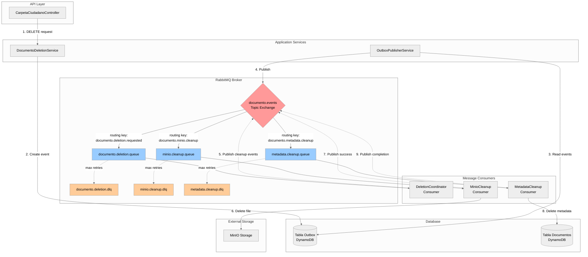
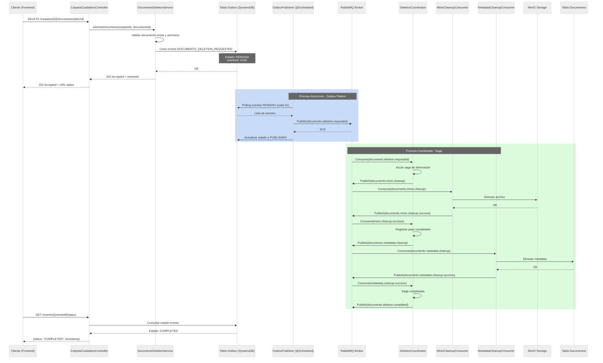
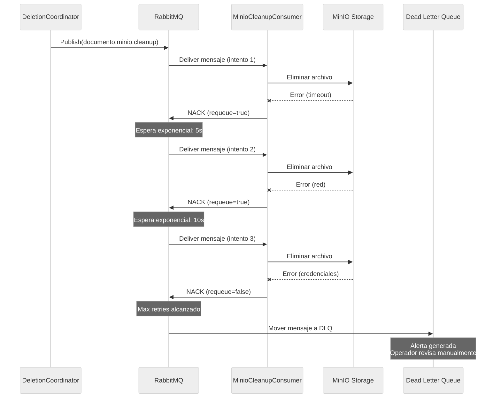

# ADR-0004: Eliminación de Documentos con Arquitectura Event-Driven usando RabbitMQ

## Estado
Propuesto

## Contexto

El sistema Carpeta Ciudadana requiere un mecanismo confiable para eliminar documentos que garantice la consistencia entre dos sistemas de almacenamiento independientes:

1. **MinIO (S3)**: Almacenamiento de archivos binarios
2. **DynamoDB**: Metadatos y referencias de documentos

### Problema Principal

La eliminación de documentos implica operaciones en dos sistemas distribuidos sin soporte nativo para transacciones distribuidas. Los desafíos incluyen:

- **Falla parcial**: MinIO puede eliminar el archivo pero DynamoDB puede fallar, o viceversa
- **Inconsistencia**: Estados intermedios donde existe metadata sin archivo o archivo sin metadata
- **Reintentos**: Necesidad de reintentar operaciones fallidas sin duplicar eliminaciones exitosas
- **Visibilidad**: Usuario necesita feedback del estado de la operación
- **Escalabilidad**: El sistema debe manejar miles de operaciones concurrentes
- **Resiliencia**: Debe recuperarse automáticamente de fallos temporales

### Requisitos Relacionados

- **FR-SD-02**: El sistema debe permitir eliminar documentos temporales
- Los documentos certificados tienen restricciones adicionales de eliminación (pueden requerir aprobaciones)

### Restricciones

- La solución debe ser asíncrona para no bloquear requests HTTP
- Debe garantizar consistencia eventual entre MinIO y DynamoDB
- Debe soportar operadores con diferentes capacidades de infraestructura
- Debe ser compatible con escalamiento horizontal (múltiples instancias del servicio)

## Decisión

Implementar una **arquitectura event-driven completa** utilizando RabbitMQ como message broker central con los siguientes componentes:

1. **RabbitMQ** como sistema de mensajería confiable
2. **Exchange tipo Topic** para routing flexible de eventos
3. **Dead Letter Queue (DLQ)** para mensajes fallidos
4. **Patrón Saga Coreografiado** para coordinación distribuida
5. **Tabla Outbox en DynamoDB** para garantizar at-least-once delivery
6. **Consumers dedicados** para cada tipo de operación

### Arquitectura de Solución



### Flujo de Eliminación Completo



### Componentes Principales

#### 1. Tabla Outbox en DynamoDB

```
Tabla: DocumentoEventosOutbox
PK (Partition Key): eventoId (UUID)
SK (Sort Key): timestamp (ISO8601)

Atributos:
- eventoId: UUID único
- tipoEvento: "DOCUMENTO_DELETION_REQUESTED"
- estado: "PENDING" | "PUBLISHED" | "COMPLETED" | "FAILED"
- payload: JSON con {carpetaId, documentoId, minioObjectName, usuarioId}
- routingKey: "documento.deletion.requested"
- intentosPublicacion: Número de intentos de publicación a RabbitMQ
- timestamp: Timestamp de creación
- timestampPublicacion: Timestamp cuando se publicó a RabbitMQ
- TTL: Expiración automática (30 días después de COMPLETED)
```

#### 2. Configuración de RabbitMQ

```java
@Configuration
public class RabbitMQConfig {

    public static final String EXCHANGE_NAME = "documento.events";

    // Queues principales
    public static final String DELETION_QUEUE = "documento.deletion.queue";
    public static final String MINIO_CLEANUP_QUEUE = "minio.cleanup.queue";
    public static final String METADATA_CLEANUP_QUEUE = "metadata.cleanup.queue";

    // Dead Letter Queues
    public static final String DELETION_DLQ = "documento.deletion.dlq";
    public static final String MINIO_DLQ = "minio.cleanup.dlq";
    public static final String METADATA_DLQ = "metadata.cleanup.dlq";

    // Routing keys
    public static final String RK_DELETION_REQUESTED = "documento.deletion.requested";
    public static final String RK_MINIO_CLEANUP = "documento.minio.cleanup";
    public static final String RK_METADATA_CLEANUP = "documento.metadata.cleanup";
    public static final String RK_DELETION_COMPLETED = "documento.deletion.completed";

    @Bean
    public TopicExchange documentoExchange() {
        return ExchangeBuilder
            .topicExchange(EXCHANGE_NAME)
            .durable(true)
            .build();
    }

    @Bean
    public Queue deletionQueue() {
        return QueueBuilder
            .durable(DELETION_QUEUE)
            .withArgument("x-dead-letter-exchange", EXCHANGE_NAME)
            .withArgument("x-dead-letter-routing-key", "documento.deletion.dlq")
            .withArgument("x-message-ttl", 3600000) // 1 hora
            .build();
    }

    @Bean
    public Queue minioCleanupQueue() {
        return QueueBuilder
            .durable(MINIO_CLEANUP_QUEUE)
            .withArgument("x-dead-letter-exchange", EXCHANGE_NAME)
            .withArgument("x-dead-letter-routing-key", "minio.cleanup.dlq")
            .withArgument("x-max-retries", 3)
            .build();
    }

    @Bean
    public Queue metadataCleanupQueue() {
        return QueueBuilder
            .durable(METADATA_CLEANUP_QUEUE)
            .withArgument("x-dead-letter-exchange", EXCHANGE_NAME)
            .withArgument("x-dead-letter-routing-key", "metadata.cleanup.dlq")
            .withArgument("x-max-retries", 3)
            .build();
    }

    @Bean
    public Queue deletionDLQ() {
        return QueueBuilder.durable(DELETION_DLQ).build();
    }

    @Bean
    public Binding deletionBinding() {
        return BindingBuilder
            .bind(deletionQueue())
            .to(documentoExchange())
            .with(RK_DELETION_REQUESTED);
    }

    @Bean
    public Binding minioBinding() {
        return BindingBuilder
            .bind(minioCleanupQueue())
            .to(documentoExchange())
            .with(RK_MINIO_CLEANUP);
    }

    @Bean
    public Binding metadataBinding() {
        return BindingBuilder
            .bind(metadataCleanupQueue())
            .to(documentoExchange())
            .with(RK_METADATA_CLEANUP);
    }
}
```

#### 3. Servicio de Eliminación (Producer)

```java
@Service
@Slf4j
public class DocumentoDeletionService {

    private final IDocumentoRepository documentoRepository;
    private final OutboxEventRepository outboxRepository;

    /**
     * Inicia el proceso de eliminación creando evento en Outbox.
     * La publicación a RabbitMQ la hace OutboxPublisherService.
     *
     * @return ID del evento para tracking
     */
    @Transactional
    public String eliminarDocumentoAsync(String carpetaId, String documentoId, String usuarioId) {
        // 1. Validar que documento existe y permisos
        Documento doc = documentoRepository.findById(carpetaId, documentoId)
            .orElseThrow(() -> new DocumentoNoEncontradoException(documentoId));

        if (doc.isCertificado()) {
            throw new OperacionNoPermitidaException(
                "Eliminación de documentos certificados requiere flujo de aprobación"
            );
        }

        // 2. Crear payload del evento
        DocumentoDeletionPayload payload = DocumentoDeletionPayload.builder()
            .carpetaId(carpetaId)
            .documentoId(documentoId)
            .minioObjectName(doc.getStoragePath())
            .usuarioId(usuarioId)
            .tipoCarpeta(doc.getTipoCarpeta())
            .build();

        // 3. Crear evento en Outbox (garantiza persistencia antes de publicar)
        OutboxEvent evento = OutboxEvent.builder()
            .eventoId(UUID.randomUUID().toString())
            .tipoEvento(TipoEvento.DOCUMENTO_DELETION_REQUESTED)
            .estado(EstadoEvento.PENDING)
            .payload(objectMapper.writeValueAsString(payload))
            .routingKey(RabbitMQConfig.RK_DELETION_REQUESTED)
            .intentosPublicacion(0)
            .timestamp(Instant.now())
            .build();

        outboxRepository.save(evento);

        log.info("Evento de eliminación creado en Outbox: eventoId={}, documentoId={}",
            evento.getEventoId(), documentoId);

        return evento.getEventoId();
    }
}
```

#### 4. Publisher de Outbox (Job Programado)

```java
@Component
@Slf4j
public class OutboxPublisherService {

    private final OutboxEventRepository outboxRepository;
    private final RabbitTemplate rabbitTemplate;

    /**
     * Polling cada 5 segundos para publicar eventos pendientes.
     * Garantiza at-least-once delivery.
     */
    @Scheduled(fixedDelay = 5000)
    public void publishPendingEvents() {
        List<OutboxEvent> pendingEvents = outboxRepository
            .findByEstado(EstadoEvento.PENDING);

        for (OutboxEvent evento : pendingEvents) {
            try {
                // Publicar a RabbitMQ
                rabbitTemplate.convertAndSend(
                    RabbitMQConfig.EXCHANGE_NAME,
                    evento.getRoutingKey(),
                    evento.getPayload(),
                    message -> {
                        message.getMessageProperties().setMessageId(evento.getEventoId());
                        message.getMessageProperties().setTimestamp(
                            Date.from(evento.getTimestamp())
                        );
                        return message;
                    }
                );

                // Actualizar estado a PUBLISHED
                evento.setEstado(EstadoEvento.PUBLISHED);
                evento.setTimestampPublicacion(Instant.now());
                outboxRepository.update(evento);

                log.info("Evento publicado exitosamente: eventoId={}, routingKey={}",
                    evento.getEventoId(), evento.getRoutingKey());

            } catch (Exception e) {
                log.error("Error publicando evento {}: {}", evento.getEventoId(), e.getMessage());

                evento.setIntentosPublicacion(evento.getIntentosPublicacion() + 1);
                outboxRepository.update(evento);

                if (evento.getIntentosPublicacion() >= 5) {
                    evento.setEstado(EstadoEvento.FAILED);
                    outboxRepository.update(evento);
                    log.error("Evento {} marcado como FAILED después de 5 intentos",
                        evento.getEventoId());
                }
            }
        }
    }
}
```

#### 5. Coordinador de Saga (Consumer Principal)

```java
@Component
@Slf4j
public class DeletionCoordinatorConsumer {

    private final RabbitTemplate rabbitTemplate;
    private final SagaStateRepository sagaStateRepository;

    /**
     * Consume eventos de solicitud de eliminación e inicia la saga.
     */
    @RabbitListener(queues = RabbitMQConfig.DELETION_QUEUE)
    public void handleDeletionRequest(
        @Payload String payloadJson,
        @Header(AmqpHeaders.MESSAGE_ID) String messageId,
        @Header(AmqpHeaders.DELIVERY_TAG) long deliveryTag,
        Channel channel
    ) throws IOException {
        try {
            log.info("Procesando solicitud de eliminación: messageId={}", messageId);

            DocumentoDeletionPayload payload = objectMapper.readValue(
                payloadJson, DocumentoDeletionPayload.class
            );

            // Crear estado de la saga
            SagaState saga = SagaState.builder()
                .sagaId(messageId)
                .eventoId(messageId)
                .estado(SagaEstado.INICIADA)
                .pasoActual("MINIO_CLEANUP")
                .payload(payload)
                .timestamp(Instant.now())
                .build();

            sagaStateRepository.save(saga);

            // Publicar evento para limpiar MinIO
            rabbitTemplate.convertAndSend(
                RabbitMQConfig.EXCHANGE_NAME,
                RabbitMQConfig.RK_MINIO_CLEANUP,
                objectMapper.writeValueAsString(payload),
                message -> {
                    message.getMessageProperties().setHeader("sagaId", messageId);
                    return message;
                }
            );

            // ACK manual
            channel.basicAck(deliveryTag, false);
            log.info("Saga iniciada exitosamente: sagaId={}", messageId);

        } catch (Exception e) {
            log.error("Error procesando solicitud de eliminación: {}", e.getMessage(), e);
            // NACK para reintento
            channel.basicNack(deliveryTag, false, true);
        }
    }

    /**
     * Consume eventos de éxito de limpieza de MinIO.
     */
    @RabbitListener(queues = "minio.cleanup.success.queue")
    public void handleMinioCleanupSuccess(
        @Payload String payloadJson,
        @Header("sagaId") String sagaId,
        Channel channel,
        @Header(AmqpHeaders.DELIVERY_TAG) long deliveryTag
    ) throws IOException {
        try {
            log.info("MinIO cleanup exitoso para saga: {}", sagaId);

            SagaState saga = sagaStateRepository.findById(sagaId).orElseThrow();
            saga.setPasoActual("METADATA_CLEANUP");
            sagaStateRepository.update(saga);

            // Publicar evento para limpiar metadata
            rabbitTemplate.convertAndSend(
                RabbitMQConfig.EXCHANGE_NAME,
                RabbitMQConfig.RK_METADATA_CLEANUP,
                payloadJson,
                message -> {
                    message.getMessageProperties().setHeader("sagaId", sagaId);
                    return message;
                }
            );

            channel.basicAck(deliveryTag, false);

        } catch (Exception e) {
            log.error("Error procesando éxito de MinIO: {}", e.getMessage(), e);
            channel.basicNack(deliveryTag, false, true);
        }
    }

    /**
     * Consume eventos de éxito de limpieza de metadata.
     */
    @RabbitListener(queues = "metadata.cleanup.success.queue")
    public void handleMetadataCleanupSuccess(
        @Header("sagaId") String sagaId,
        Channel channel,
        @Header(AmqpHeaders.DELIVERY_TAG) long deliveryTag
    ) throws IOException {
        try {
            log.info("Metadata cleanup exitoso para saga: {}", sagaId);

            SagaState saga = sagaStateRepository.findById(sagaId).orElseThrow();
            saga.setEstado(SagaEstado.COMPLETADA);
            saga.setPasoActual("COMPLETED");
            saga.setTimestampCompletado(Instant.now());
            sagaStateRepository.update(saga);

            // Publicar evento de completitud
            rabbitTemplate.convertAndSend(
                RabbitMQConfig.EXCHANGE_NAME,
                RabbitMQConfig.RK_DELETION_COMPLETED,
                saga.getPayload()
            );

            channel.basicAck(deliveryTag, false);
            log.info("Saga completada exitosamente: sagaId={}", sagaId);

        } catch (Exception e) {
            log.error("Error completando saga: {}", e.getMessage(), e);
            channel.basicNack(deliveryTag, false, true);
        }
    }
}
```

#### 6. Consumer de Limpieza de MinIO

```java
@Component
@Slf4j
public class MinioCleanupConsumer {

    private final IMinioStorageService minioService;
    private final RabbitTemplate rabbitTemplate;

    @RabbitListener(queues = RabbitMQConfig.MINIO_CLEANUP_QUEUE)
    public void handleMinioCleanup(
        @Payload String payloadJson,
        @Header("sagaId") String sagaId,
        @Header(AmqpHeaders.DELIVERY_TAG) long deliveryTag,
        Channel channel
    ) throws IOException {
        try {
            log.info("Iniciando limpieza de MinIO para saga: {}", sagaId);

            DocumentoDeletionPayload payload = objectMapper.readValue(
                payloadJson, DocumentoDeletionPayload.class
            );

            // Eliminar archivo de MinIO
            minioService.deleteObject(payload.getMinioObjectName());
            log.info("Archivo eliminado de MinIO: {}", payload.getMinioObjectName());

            // Publicar evento de éxito
            rabbitTemplate.convertAndSend(
                RabbitMQConfig.EXCHANGE_NAME,
                "documento.minio.cleanup.success",
                payloadJson,
                message -> {
                    message.getMessageProperties().setHeader("sagaId", sagaId);
                    return message;
                }
            );

            // ACK manual
            channel.basicAck(deliveryTag, false);

        } catch (Exception e) {
            log.error("Error eliminando archivo de MinIO: {}", e.getMessage(), e);
            // NACK para reintento (RabbitMQ manejará reintentos automáticamente)
            channel.basicNack(deliveryTag, false, true);
        }
    }
}
```

#### 7. Consumer de Limpieza de Metadata

```java
@Component
@Slf4j
public class MetadataCleanupConsumer {

    private final IDocumentoRepository documentoRepository;
    private final RabbitTemplate rabbitTemplate;

    @RabbitListener(queues = RabbitMQConfig.METADATA_CLEANUP_QUEUE)
    public void handleMetadataCleanup(
        @Payload String payloadJson,
        @Header("sagaId") String sagaId,
        @Header(AmqpHeaders.DELIVERY_TAG) long deliveryTag,
        Channel channel
    ) throws IOException {
        try {
            log.info("Iniciando limpieza de metadata para saga: {}", sagaId);

            DocumentoDeletionPayload payload = objectMapper.readValue(
                payloadJson, DocumentoDeletionPayload.class
            );

            // Eliminar metadata de DynamoDB
            documentoRepository.delete(payload.getCarpetaId(), payload.getDocumentoId());
            log.info("Metadata eliminada de DynamoDB: documentoId={}",
                payload.getDocumentoId());

            // Publicar evento de éxito
            rabbitTemplate.convertAndSend(
                RabbitMQConfig.EXCHANGE_NAME,
                "documento.metadata.cleanup.success",
                payloadJson,
                message -> {
                    message.getMessageProperties().setHeader("sagaId", sagaId);
                    return message;
                }
            );

            // ACK manual
            channel.basicAck(deliveryTag, false);

        } catch (Exception e) {
            log.error("Error eliminando metadata: {}", e.getMessage(), e);
            // NACK para reintento
            channel.basicNack(deliveryTag, false, true);
        }
    }
}
```

#### 8. Tabla SagaState para Tracking

```
Tabla: SagaState
PK: sagaId (UUID del messageId)
SK: timestamp

Atributos:
- sagaId: UUID único
- eventoId: ID del evento original en Outbox
- estado: "INICIADA" | "COMPLETADA" | "FALLIDA" | "COMPENSANDO"
- pasoActual: "MINIO_CLEANUP" | "METADATA_CLEANUP" | "COMPLETED"
- payload: JSON con datos del documento
- timestamp: Timestamp de inicio
- timestampCompletado: Timestamp de finalización
- errores: Lista de errores encontrados
- TTL: Expiración (30 días después de COMPLETADA)
```

### Manejo de Fallos y Compensaciones



### Configuración de Reintentos

```java
@Bean
public SimpleRabbitListenerContainerFactory rabbitListenerContainerFactory(
    ConnectionFactory connectionFactory
) {
    SimpleRabbitListenerContainerFactory factory =
        new SimpleRabbitListenerContainerFactory();

    factory.setConnectionFactory(connectionFactory);
    factory.setAcknowledgeMode(AcknowledgeMode.MANUAL);
    factory.setPrefetchCount(10); // Procesar max 10 mensajes a la vez

    // Configurar exponential backoff
    factory.setAdviceChain(
        RetryInterceptorBuilder
            .stateless()
            .maxAttempts(3)
            .backOffOptions(1000, 2.0, 10000) // initial, multiplier, max
            .recoverer(new RejectAndDontRequeueRecoverer()) // A DLQ después de max attempts
            .build()
    );

    return factory;
}
```

## Consecuencias

### Positivas

- ✅ **Garantía de entrega**: Outbox pattern + RabbitMQ garantizan at-least-once delivery
- ✅ **Desacoplamiento total**: Productores y consumidores no se conocen entre sí
- ✅ **Escalabilidad horizontal**: Múltiples instancias pueden consumir de las mismas queues
- ✅ **Trazabilidad completa**: Cada paso de la saga está registrado y es auditable
- ✅ **Resiliencia**: Dead Letter Queues capturan mensajes fallidos para análisis manual
- ✅ **Idempotencia**: Reintentos automáticos no causan efectos secundarios duplicados
- ✅ **Observabilidad**: RabbitMQ Management UI provee métricas en tiempo real
- ✅ **Extensibilidad**: Fácil agregar nuevos consumers para otros tipos de eventos
- ✅ **Separación de responsabilidades**: Cada consumer tiene una única responsabilidad
- ✅ **Testing**: Consumers pueden probarse independientemente publicando mensajes a queues

### Negativas

- ⚠️ **Complejidad arquitectónica**: Requiere infraestructura adicional (RabbitMQ cluster)
- ⚠️ **Consistencia eventual**: No hay garantía de eliminación inmediata
- ⚠️ **Costo operacional**: RabbitMQ requiere monitoreo, mantenimiento, y backup
- ⚠️ **Latencia adicional**: Paso por message broker agrega latency
- ⚠️ **Duplicación de datos**: Eventos almacenados en Outbox, RabbitMQ, y SagaState
- ⚠️ **Complejidad de debugging**: Flujos distribuidos son más difíciles de trazar
- ⚠️ **Overhead de serialización**: JSON encoding/decoding en cada paso

### Riesgos

- 🔴 **RabbitMQ como punto único de fallo**
    - **Mitigación**: Cluster RabbitMQ con 3+ nodos, persistent queues, disk replication

- 🔴 **Mensajes duplicados** (at-least-once puede entregar >1 vez)
    - **Mitigación**: Implementar consumers idempotentes usando messageId para deduplicación

- 🔴 **Orden de mensajes no garantizado**
    - **Mitigación**: Usar single consumer por queue si orden es crítico, o agregar versiones a eventos

- 🔴 **Saturación de DLQ**
    - **Mitigación**: Alertas automáticas, dashboard de monitoreo, proceso de revisión periódica

- 🔴 **Pérdida de mensajes en RabbitMQ**
    - **Mitigación**: Queues persistentes, publisher confirms, consumer acknowledgments

## Alternativas Consideradas

### Opción 1: Eliminación Síncrona
- **Rechazo**: No escala, bloquea requests HTTP, no maneja fallos parciales

### Opción 2: Outbox + Job Programado (sin RabbitMQ)
- **Rechazo**: Polling ineficiente, no escala horizontalmente, mayor latencia

### Opción 3: AWS SQS + Lambda
- **Rechazo**: Vendor lock-in con AWS, no todos los operadores usan AWS

### Opción 4: Kafka Streams
- **Rechazo**: Overhead excesivo para caso de uso simple, steeper learning curve

## Implementación por Fases

### Fase 1: Infraestructura Base (Semana 1-2)
- [ ] Desplegar RabbitMQ cluster (3 nodos)
- [ ] Configurar exchanges, queues, bindings
- [ ] Implementar tabla Outbox en DynamoDB
- [ ] Implementar tabla SagaState

### Fase 2: Producers (Semana 3)
- [ ] Implementar DocumentoDeletionService
- [ ] Implementar OutboxPublisherService
- [ ] Testing de publicación de eventos

### Fase 3: Consumers (Semana 4-5)
- [ ] Implementar DeletionCoordinatorConsumer
- [ ] Implementar MinioCleanupConsumer
- [ ] Implementar MetadataCleanupConsumer
- [ ] Testing end-to-end del flujo completo

### Fase 4: Observabilidad (Semana 6)
- [ ] Configurar dashboards en RabbitMQ Management
- [ ] Implementar métricas con Micrometer
- [ ] Configurar alertas para DLQ
- [ ] Documentación operacional

### Fase 5: Producción (Semana 7)
- [ ] Load testing
- [ ] Chaos engineering (simular fallos)
- [ ] Rollout gradual (canary deployment)

## Monitoreo y Observabilidad

### Métricas Clave

```java
@Component
public class DeletionMetrics {

    private final MeterRegistry meterRegistry;

    @PostConstruct
    public void init() {
        // Contador de eventos publicados
        meterRegistry.counter("documento.deletion.events.published");

        // Contador de sagas completadas
        meterRegistry.counter("documento.deletion.sagas.completed");

        // Contador de mensajes en DLQ
        meterRegistry.gauge("rabbitmq.dlq.messages",
            () -> getRabbitMQDLQCount());

        // Tiempo promedio de saga
        meterRegistry.timer("documento.deletion.saga.duration");
    }
}
```

### Alertas Críticas

1. **DLQ con >10 mensajes**: Indica fallos sistemáticos
2. **Saga duration >5 minutos**: Posible degradación de MinIO/DynamoDB
3. **Outbox con >100 eventos PENDING**: Posible fallo de RabbitMQ o publisher
4. **RabbitMQ cluster con <2 nodos**: Pérdida de alta disponibilidad

## Docker Compose para Desarrollo Local

```yaml
version: '3.8'

services:
  rabbitmq:
    image: rabbitmq:3.12-management
    container_name: carpeta-rabbitmq
    ports:
      - "5672:5672"   # AMQP
      - "15672:15672" # Management UI
    environment:
      - RABBITMQ_DEFAULT_USER=admin
      - RABBITMQ_DEFAULT_PASS=admin123
    volumes:
      - rabbitmq-data:/var/lib/rabbitmq
    healthcheck:
      test: ["CMD", "rabbitmq-diagnostics", "ping"]
      interval: 30s
      timeout: 10s
      retries: 5

  carpeta-ciudadana-service:
    depends_on:
      rabbitmq:
        condition: service_healthy
    environment:
      - SPRING_RABBITMQ_HOST=rabbitmq
      - SPRING_RABBITMQ_PORT=5672
      - SPRING_RABBITMQ_USERNAME=admin
      - SPRING_RABBITMQ_PASSWORD=admin123

volumes:
  rabbitmq-data:
```

## Referencias

- [RabbitMQ Patterns](https://www.rabbitmq.com/getstarted.html)
- [Saga Pattern](https://microservices.io/patterns/data/saga.html)
- [Transactional Outbox](https://microservices.io/patterns/data/transactional-outbox.html)
- [Spring AMQP Documentation](https://docs.spring.io/spring-amqp/reference/)
- FR-SD-02: Requisito funcional de eliminación de documentos temporales

## Notas de Implementación

1. **Idempotencia**: Todos los consumers deben verificar si la operación ya fue realizada usando messageId
2. **Testing**: Usar Testcontainers con RabbitMQ para integration tests
3. **Serialización**: Considerar Avro o Protobuf para schemas versionados en el futuro
4. **Security**: Configurar TLS para conexiones a RabbitMQ en producción
5. **Quotas**: Configurar max-length en queues para prevenir memory overflow

---

**Fecha**: 2025-11-04
**Autores**: Equipo Carpeta Ciudadana
**Revisores**: Pendiente
