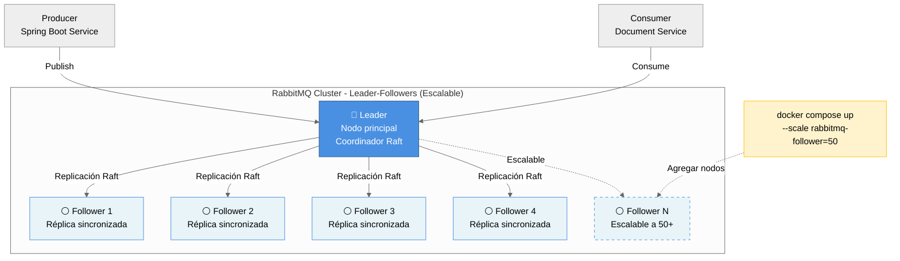

# ADR-0004: RabbitMQ Quorum Queues con Arquitectura Leader-Followers Escalable

## Estado
**Aceptado** - 2025-11-05

## Contexto

El sistema Carpeta Ciudadana utiliza RabbitMQ como message broker central para implementar arquitectura event-driven (ver ADR-0003). Este sistema requiere alta disponibilidad y durabilidad de mensajes debido a:

1. **Escala Nacional**: ~55 millones de ciudadanos colombianos (RNF-06)
2. **Alta Disponibilidad Crítica**: 99.99% de uptime para Core Domain (RNF-01)
3. **Volumen de Transacciones**: Hasta 5 millones de transferencias de documentos al día (RNF-08)
4. **Pérdida de Datos Mínima**: RPO < 5 minutos (RNF-03)
5. **Tolerancia a Fallos**: Sistema resiliente a fallo de una región completa (RNF-04)
6. **Escalabilidad Horizontal**: Capacidad de agregar nodos sin límite teórico (RNF-09)

### Problema de Configuración Manual de Nodos

Al diseñar un cluster RabbitMQ, una aproximación común pero **problemática** es definir cada nodo explícitamente en la configuración:

```yaml
# ❌ ANTI-PATTERN: Configuración no escalable
services:
  rabbitmq-node1:
    ...
  rabbitmq-node2:
    ...
  rabbitmq-node3:
    ...
  # ¿Qué pasa si necesitamos 50 nodos?
```

**Limitaciones de Configuración Node-by-Node:**
- ❌ **No Escalable**: Requiere editar configuración manualmente para cada nodo adicional
- ❌ **Overhead de Configuración**: 50 nodos = 50 definiciones de servicio duplicadas
- ❌ **Propenso a Errores**: Fácil olvidar configurar un parámetro en algún nodo
- ❌ **Difícil de Mantener**: Cambios requieren actualizar N definiciones idénticas
- ❌ **Violación RNF-09**: No permite escalado horizontal sin límite teórico

**Impacto en Requisitos No Funcionales:**
- 🔴 **RNF-06 (55M ciudadanos)**: Cluster debe crecer con la demanda sin reescribir config
- 🔴 **RNF-08 (5M transacciones/día)**: Load puede requerir 10-50 nodos bajo picos
- 🔴 **RNF-09 (Escalado Horizontal)**: No se puede agregar nodos dinámicamente

### Solución: Arquitectura Leader-Followers

La **arquitectura Leader-Followers** es un patrón estándar en sistemas distribuidos donde:

1. **Un nodo Leader** actúa como punto de entrada inicial y coordinador del cluster
2. **N nodos Followers** se unen dinámicamente al cluster liderado por el Leader
3. **Escalabilidad mediante replicación de servicio** usando `docker compose scale` o `deploy.replicas`

**Características Clave:**
- ✅ **Escalabilidad Ilimitada**: `docker compose up --scale rabbitmq-follower=50`
- ✅ **Configuración DRY**: Definir una vez el servicio follower, escalar N veces
- ✅ **Mantenimiento Simplificado**: Cambios se propagan a todos los followers
- ✅ **Cumple RNF-09**: Escalado horizontal sin editar archivos de configuración
- ✅ **Industry Standard**: Patrón usado en Kubernetes, Kafka, Elasticsearch



### Quorum Queues con Raft Consensus

Las **Quorum Queues** (RabbitMQ 3.8+) usan el algoritmo de consenso **Raft** para replicación:

- ✅ **Replicación Automática**: Mensajes replicados a mayoría de nodos (RF=2)
- ✅ **Consistencia Fuerte**: Raft garantiza consenso distribuido linearizable
- ✅ **Failover Automático**: Elección de nuevo líder en <5 segundos
- ✅ **Sin Pérdida de Mensajes**: ACK solo cuando persistido en quorum (mayoría)
- ✅ **Poison Message Handling**: Tracking de delivery count a nivel de cluster

### Pregunta de Diseño

**¿Cómo debemos configurar el cluster RabbitMQ para soportar escalabilidad horizontal ilimitada mientras mantenemos alta disponibilidad y simplicidad operacional?**

## Decisión

Implementaremos **RabbitMQ con arquitectura Leader-Followers escalable** usando:

1. **1 servicio Leader** - Nodo principal que inicia el cluster
2. **1 servicio Follower (escalable)** - Servicio replicable que se une al Leader
3. **Quorum Queues con replication factor 2** - Para durabilidad de mensajes
4. **Configuración inicial: 1 Leader + 4 Followers = 5 nodos totales**

### Fundamentos de la Decisión

#### 1. Por Qué Leader-Followers (No Node-by-Node)

**Comparación de Enfoques:**

| Criterio | Node-by-Node | Leader-Followers |
|----------|--------------|------------------|
| **Escalabilidad** | ❌ Manual, editar config | ✅ `--scale follower=N` |
| **Mantenimiento** | ❌ Actualizar N nodos | ✅ Actualizar 1 definición |
| **Configuración** | ❌ N × definiciones | ✅ 2 definiciones (L+F) |
| **Cumple RNF-09** | ❌ No | ✅ Sí |
| **Industry Standard** | ⚠️ Legacy approach | ✅ Modern pattern |

**Ejemplo de Escalabilidad:**

```bash
# Cluster inicial (5 nodos)
docker compose up -d

# Escalar a 10 nodos (1 Leader + 9 Followers)
docker compose up -d --scale rabbitmq-follower=9

# Escalar a 50 nodos (1 Leader + 49 Followers)
docker compose up -d --scale rabbitmq-follower=49

# Sin editar docker-compose.yml ✅
```

#### 2. Número Inicial de Nodos: 5 (1 Leader + 4 Followers)

**Por qué 5 nodos inicialmente:**

- ✅ **Consenso Raft**: 5 nodos toleran 2 fallos simultáneos (quorum = 3)
- ✅ **Balance Producción**: 5 nodos es estándar para clusters productivos
- ✅ **Redundancia Mejorada**: Mejor que 3 nodos para cargas críticas
- ✅ **Cumple RNF-04**: Tolera 2 fallos vs 1 fallo con 3 nodos

**Fórmula de Tolerancia Raft:**
```
Tolerancia a fallos = ⌊(N - 1) / 2⌋

N=3 → Tolerancia = ⌊(3-1)/2⌋ = 1 nodo
N=5 → Tolerancia = ⌊(5-1)/2⌋ = 2 nodos ✅ (MEJOR)
N=7 → Tolerancia = ⌊(7-1)/2⌋ = 3 nodos (overhead excesivo para inicio)
```

**Configuración Escalable:**
- **Desarrollo**: 1 Leader + 2 Followers (3 nodos, recursos limitados)
- **Staging**: 1 Leader + 4 Followers (5 nodos, balanceado)
- **Producción**: 1 Leader + 6-49 Followers (7-50 nodos, según carga)

#### 3. Replication Factor: 2

**Por qué RF=2:**
- ✅ **Durabilidad Garantizada**: Mensajes en 2+ nodos antes de ACK
- ✅ **Balance Latencia-Durabilidad**: Más rápido que RF=3, más seguro que RF=1
- ✅ **Cumple RNF-03**: RPO < 5 minutos; sin pérdida si 1+ nodos operativos
- ✅ **Overhead Aceptable**: 2x almacenamiento vs 1x (classic queues)

| RF | Durabilidad | Latencia | Almacenamiento | Decisión |
|----|-------------|----------|----------------|----------|
| 1  | ❌ Baja     | ⚡ Rápida | 1x             | ❌ Rechazado |
| 2  | ✅ Alta     | ⚡ Buena  | 2x             | ✅ **Seleccionado** |
| 3  | ✅ Muy Alta | ⚠️ Lenta  | 3x             | ⚠️ Excesivo |

### Configuración Técnica

#### Docker Compose Escalable

```yaml
services:
  # ==========================================
  # RabbitMQ Leader - Nodo principal
  # ==========================================
  rabbitmq-leader:
    image: rabbitmq:3.12-management
    container_name: rabbitmq-leader
    hostname: rabbitmq-leader
    ports:
      - "5672:5672"   # AMQP
      - "15672:15672" # Management UI
    environment:
      - RABBITMQ_ERLANG_COOKIE=SWQOKODSQALRPCLNMEQG
      - RABBITMQ_DEFAULT_USER=admin
      - RABBITMQ_DEFAULT_PASS=admin123
      - RABBITMQ_NODE_NAME=rabbit@rabbitmq-leader
    volumes:
      - rabbitmq-leader-data:/var/lib/rabbitmq
    networks:
      - app-network
    restart: unless-stopped
    healthcheck:
      test: ["CMD", "rabbitmq-diagnostics", "check_port_connectivity"]
      interval: 30s
      timeout: 10s
      retries: 5
      start_period: 40s

  # ==========================================
  # RabbitMQ Followers - Nodos escalables
  # ==========================================
  rabbitmq-follower:
    image: rabbitmq:3.12-management
    hostname: rabbitmq-follower
    environment:
      - RABBITMQ_ERLANG_COOKIE=SWQOKODSQALRPCLNMEQG
      - RABBITMQ_DEFAULT_USER=admin
      - RABBITMQ_DEFAULT_PASS=admin123
      - RABBITMQ_LEADER_HOST=rabbitmq-leader
    volumes:
      - ./rabbitmq/cluster-entrypoint.sh:/usr/local/bin/cluster-entrypoint.sh:ro
    entrypoint: ["/usr/local/bin/cluster-entrypoint.sh"]
    networks:
      - app-network
    depends_on:
      rabbitmq-leader:
        condition: service_healthy
    restart: unless-stopped
    healthcheck:
      test: ["CMD", "rabbitmq-diagnostics", "check_port_connectivity"]
      interval: 30s
      timeout: 10s
      retries: 5
      start_period: 60s
    deploy:
      replicas: 4  # Escalable con --scale rabbitmq-follower=N

volumes:
  rabbitmq-leader-data:  # Solo el Leader necesita volume nombrado

networks:
  app-network:
    driver: bridge
```

#### Script de Clustering Dinámico

```bash
#!/bin/bash
set -e

echo "Starting RabbitMQ follower node..."

# Obtener hostname del líder desde variable de entorno
LEADER_HOST="${RABBITMQ_LEADER_HOST:-rabbitmq-leader}"
echo "Leader host: $LEADER_HOST"

# Iniciar RabbitMQ
rabbitmq-server -detached

# Esperar a que RabbitMQ esté listo
echo "Waiting for RabbitMQ to be ready..."
timeout 90 bash -c 'until rabbitmq-diagnostics -q ping; do sleep 2; done'

# Unirse al cluster del líder
echo "Joining cluster..."
rabbitmqctl stop_app
rabbitmqctl reset
rabbitmqctl join_cluster rabbit@${LEADER_HOST}
rabbitmqctl start_app

echo "Successfully joined cluster!"
rabbitmqctl cluster_status

# Mantener contenedor vivo
exec rabbitmq-server
```

#### Configuración de Quorum Queues en Spring Boot

```java
@Configuration
public class RabbitMQQuorumConfig {

    public static final String EXCHANGE_NAME = "documento.events";
    public static final String DELETION_QUEUE = "documento.deletion.queue";

    @Bean
    public TopicExchange documentoExchange() {
        return ExchangeBuilder
            .topicExchange(EXCHANGE_NAME)
            .durable(true)
            .build();
    }

    /**
     * Quorum Queue con arquitectura Leader-Followers.
     * El cluster escala dinámicamente; la queue se replica automáticamente
     * a todos los nodos activos según Raft consensus.
     */
    @Bean
    public Queue deletionQueue() {
        return QueueBuilder
            .durable(DELETION_QUEUE)
            .withArgument("x-queue-type", "quorum")  // 🔑 Quorum Queue
            .withArgument("x-quorum-initial-group-size", 5)  // 🔑 1 Leader + 4 Followers
            .withArgument("x-delivery-limit", 3)
            .withArgument("x-dead-letter-exchange", EXCHANGE_NAME)
            .withArgument("x-dead-letter-routing-key", "documento.deletion.dlq")
            .build();
    }

    @Bean
    public Binding deletionBinding() {
        return BindingBuilder
            .bind(deletionQueue())
            .to(documentoExchange())
            .with("documento.deletion.requested");
    }
}
```

#### Spring Boot Connection

```yaml
# application-docker.yml
spring:
  rabbitmq:
    # Conectar al Leader; RabbitMQ balancea automáticamente
    host: rabbitmq-leader
    port: 5672
    username: admin
    password: admin123
    
    # Publisher Confirms
    publisher-confirm-type: correlated
    publisher-returns: true
    
    # Listener configuration
    listener:
      simple:
        acknowledge-mode: manual
        prefetch: 10
        retry:
          enabled: true
          max-attempts: 3
```

## Consecuencias

### Positivas

- ✅ **RNF-09 (Escalabilidad Horizontal)**: Cluster escala de 3 a 50+ nodos sin cambiar config
- ✅ **RNF-01 (Disponibilidad 99.99%)**: 5 nodos toleran 2 fallos simultáneos
- ✅ **RNF-03 (RPO < 5 minutos)**: RF=2 garantiza mensajes en 2+ nodos
- ✅ **RNF-04 (Tolerancia a Fallos)**: Tolera 2 fallos con 5 nodos (mejor que 1 con 3)
- ✅ **Mantenimiento Simplificado**: Cambios solo en 1 definición de servicio follower
- ✅ **Industry Standard**: Patrón usado en Kubernetes, Kafka, Elasticsearch
- ✅ **Flexibility**: Escalar up/down en segundos según carga
- ✅ **DRY Principle**: No repetir configuración N veces

### Negativas

- ⚠️ **Dependencia en Leader**: Si el Leader falla, Raft elige nuevo líder (5-10s downtime)
    - **Mitigación**: Raft failover automático en <5 segundos
    
- ⚠️ **Overhead de Replicación**: RF=2 implica 2x almacenamiento
    - **Aceptable**: Trade-off necesario para durabilidad
    
- ⚠️ **Configuración Inicial Más Compleja**: Requiere script de clustering
    - **Mitigación**: Script reutilizable, documentado y probado

### Riesgos

- 🔴 **Split Brain con N nodos**: Red particionada podría crear sub-clusters
    - **Mitigación**: Raft previene split brain; solo cluster con mayoría opera

- 🔴 **Pérdida de Mayoría**: Si fallan 3+ de 5 nodos, cluster se vuelve read-only
    - **Mitigación**: Monitoreo proactivo, alertas, auto-scaling en cloud

- 🔴 **Latencia con Muchos Nodos**: 50 nodos pueden incrementar latencia Raft
    - **Mitigación**: Medir latencia, ajustar número óptimo según carga real

## Alternativas Consideradas

### Opción 1: Configuración Node-by-Node (3 Nodos Explícitos)
```yaml
services:
  rabbitmq-node1: ...
  rabbitmq-node2: ...
  rabbitmq-node3: ...
```
- **Rechazo**: No escalable, viola RNF-09, overhead de configuración para N>10 nodos

### Opción 2: Kubernetes StatefulSet desde el Inicio
```yaml
apiVersion: apps/v1
kind: StatefulSet
metadata:
  name: rabbitmq
spec:
  replicas: 5
```
- **Rechazo**: Overkill para desarrollo local, requiere cluster K8s, curva de aprendizaje

### Opción 3: RabbitMQ Cluster Operator (Kubernetes)
- **Rechazo para Desarrollo**: Complejidad innecesaria para ambiente local
- **Aceptado para Producción**: Ver ADR-0005 para migración futura

### Opción 4: Classic Queues con HA Mirroring
- **Rechazo**: Deprecado en RabbitMQ 3.8+, menor consistencia que Quorum Queues

## Métricas y Monitoreo

### Métricas Clave de Cluster Escalable

```java
@Component
public class RabbitMQClusterMetrics {

    @Scheduled(fixedDelay = 60000)
    public void captureClusterMetrics() {
        // Número dinámico de nodos en el cluster
        meterRegistry.gauge("rabbitmq.cluster.nodes.total", getClusterNodesCount());
        
        // Followers activos
        meterRegistry.gauge("rabbitmq.cluster.followers.active", getActiveFollowersCount());
        
        // Estado de quorum (cuántos nodos tienen réplica)
        meterRegistry.gauge("rabbitmq.quorum.members.online", 
            () -> getQuorumMembersOnline("documento.deletion.queue"));
    }
}
```

### Alertas Críticas

1. **Cluster con <3 nodos activos**: Pérdida de mayoría Raft
2. **Followers <2**: Solo Leader + 1 follower = sin redundancia real
3. **Quorum Queue sin mayoría**: Mensajes no pueden ser escritos
4. **Latencia Raft >100ms**: Indicador de problema de red o CPU

## Validación y Testing

### Test de Escalabilidad

```bash
# 1. Iniciar con configuración mínima (3 nodos)
docker compose up -d --scale rabbitmq-follower=2

# 2. Verificar cluster
docker exec rabbitmq-leader rabbitmqctl cluster_status
# Expected: 1 Leader + 2 Followers = 3 nodos

# 3. Escalar a 10 nodos
docker compose up -d --scale rabbitmq-follower=9

# 4. Verificar escalado
docker exec rabbitmq-leader rabbitmqctl cluster_status
# Expected: 1 Leader + 9 Followers = 10 nodos

# 5. Escalar a 50 nodos (stress test)
docker compose up -d --scale rabbitmq-follower=49

# 6. Verificar cluster sigue funcional
docker exec rabbitmq-leader rabbitmqctl list_queues name type state
```

### Test de Failover

```bash
# 1. Detener el Leader
docker stop rabbitmq-leader

# 2. Verificar elección de nuevo líder (<10 segundos)
docker exec rabbitmq-follower-1 rabbitmqctl cluster_status

# 3. Verificar queue sigue operacional
docker exec rabbitmq-follower-1 rabbitmqctl list_queues name state

# 4. Reiniciar antiguo Leader
docker start rabbitmq-leader

# 5. Verificar se une como Follower
docker exec rabbitmq-leader rabbitmqctl cluster_status
```

## Implementación Faseada

### Fase 1: Cluster Escalable Base (Semana 1)
- [x] Configurar servicio Leader en docker-compose.yml
- [x] Configurar servicio Follower escalable
- [x] Crear script de clustering dinámico
- [x] Validar escalado: 3, 5, 10 nodos

### Fase 2: Quorum Queues (Semana 2)
- [ ] Implementar RabbitMQQuorumConfig con x-queue-type=quorum
- [ ] Configurar x-quorum-initial-group-size dinámico
- [ ] Testing de replicación con RF=2

### Fase 3: Monitoreo Escalabilidad (Semana 3)
- [ ] Métricas de cluster dinámico (nodes, followers)
- [ ] Alertas para pérdida de nodos
- [ ] Dashboard Grafana con número de nodos activos

### Fase 4: Load Testing (Semana 4)
- [ ] Test con 10K msg/s en cluster de 5 nodos
- [ ] Test con 10K msg/s en cluster de 10 nodos
- [ ] Test con 10K msg/s en cluster de 50 nodos
- [ ] Medir impacto de escalado en latencia

## Referencias

- [RabbitMQ Quorum Queues](https://www.rabbitmq.com/quorum-queues.html)
- [Raft Consensus Algorithm](https://raft.github.io/)
- [RabbitMQ Clustering Guide](https://www.rabbitmq.com/clustering.html)
- [Docker Compose Scale](https://docs.docker.com/compose/compose-file/deploy/#replicas)
- [Leader-Followers Pattern (Microservices)](https://microservices.io/patterns/deployment/service-per-container.html)
- ADR-0003: Eliminación de Documentos con Arquitectura Event-Driven
- ADR-0005: Ubicación de RabbitMQ en Docker Compose
- RNF-01, RNF-03, RNF-04, RNF-06, RNF-08, RNF-09

## Notas Adicionales

1. **Escalabilidad en Producción**: En Kubernetes, usar RabbitMQ Cluster Operator con StatefulSet
2. **Número Óptimo de Nodos**: Medir en producción; 5-10 nodos suele ser óptimo para la mayoría de casos
3. **Erlang Cookie**: Mismo cookie en todos los nodos para permitir clustering
4. **Network Latency**: Mantener nodos en la misma región para minimizar latencia Raft
5. **Backup Strategy**: Solo Leader necesita backups periódicos; Followers son replicables

---

**Fecha**: 2025-11-05  
**Autores**: Equipo Carpeta Ciudadana  
**Revisores**: Pendiente
