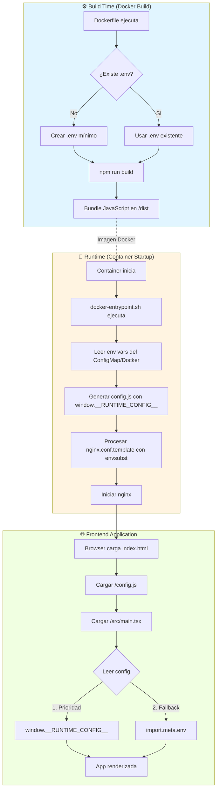
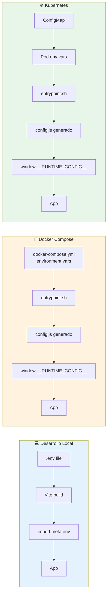
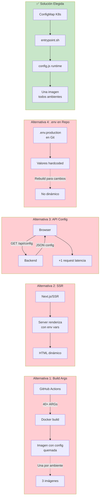
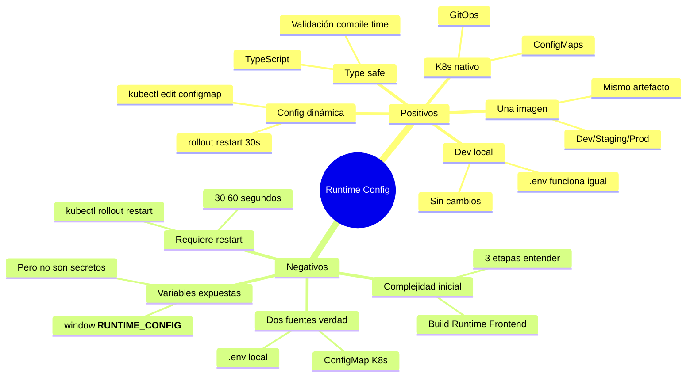
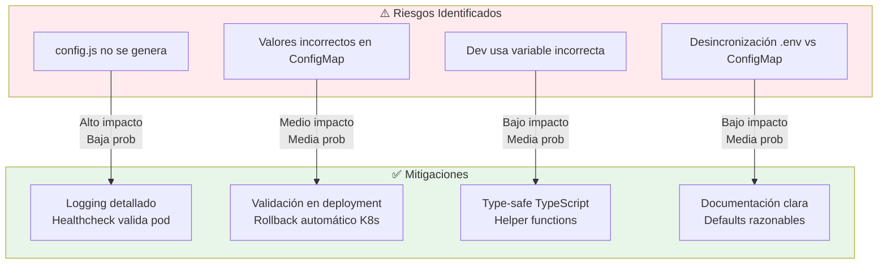
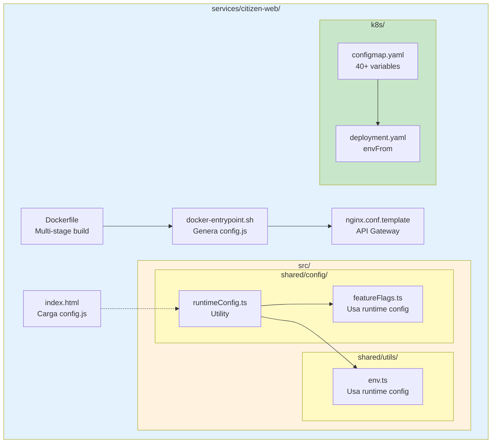
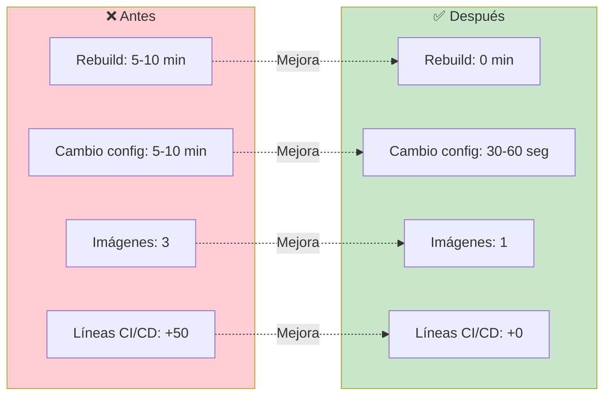

# ADR-0008: Configuración en Runtime para citizen-web usando Kubernetes ConfigMap

**Estado**: Aceptado
**Fecha**: 2025-11-07
**Autores**: Equipo Carpeta Ciudadana
**Tags**: `frontend`, `docker`, `kubernetes`, `configuracion`, `devops`

## Contexto

El servicio `citizen-web` (frontend React + Vite) requería un archivo `.env` durante el proceso de build de Docker para configurar variables de entorno que Vite "quema" en el bundle JavaScript durante la compilación. Esto presentaba varios problemas para el despliegue en Kubernetes y CI/CD:

### Problemas Identificados

1. **Dependencia de `.env` en CI/CD**: El pipeline de GitHub Actions necesitaba generar un archivo `.env` o usar build args complejos
2. **Imagen por ambiente**: Se requería una imagen Docker diferente para cada ambiente (dev, staging, prod)
3. **Cambios requieren rebuild**: Cualquier cambio de configuración (feature flags, URLs, etc.) requería reconstruir y redesplegar la imagen
4. **No es nativo de Kubernetes**: No aprovechaba ConfigMaps, la forma estándar de K8s para configuración
5. **Complejidad en desarrollo local**: Los desarrolladores necesitaban sincronizar su `.env` con los valores de producción

### Requisitos

- **RNF-02**: Escalabilidad - Despliegues rápidos sin rebuilds innecesarios
- **RNF-05**: Mantenibilidad - Configuración centralizada y fácil de actualizar
- **RNF-08**: Interoperabilidad - Funcionamiento en diferentes ambientes (local, Docker, K8s)

## Decisión

Implementar un **sistema de configuración en runtime** que inyecta variables de entorno en el contenedor al iniciar, generando dinámicamente un archivo `config.js` que expone las variables como `window.__RUNTIME_CONFIG__`.

### Arquitectura de la Solución



### Flujo de Configuración por Ambiente



### Componentes del Sistema

```mermaid
graph TB
    subgraph Frontend["Frontend (TypeScript)"]
        RC[runtimeConfig.ts<br/>getConfig, getBooleanConfig]
        FF[featureFlags.ts<br/>lee feature flags]
        ENV[env.ts<br/>getEnvVar, isMockAPIEnabled]

        RC --> FF
        RC --> ENV
    end

    subgraph Docker["Docker Layer"]
        DF[Dockerfile<br/>Crea .env mínimo<br/>Configura entrypoint]
        EP[docker-entrypoint.sh<br/>Genera config.js<br/>Procesa nginx template]
        NC[nginx.conf.template<br/>API Gateway config]

        DF --> EP
        EP --> NC
    end

    subgraph K8s["Kubernetes Layer"]
        CM[ConfigMap<br/>citizen-web-config<br/>40+ variables]
        DEP[Deployment<br/>envFrom configMapRef]
        POD[Pod<br/>Variables inyectadas]

        CM --> DEP
        DEP --> POD
    end

    POD -.->|Environment vars| EP
    EP -.->|Genera| CJS[/usr/share/nginx/html/config.js]
    CJS -.->|window.__RUNTIME_CONFIG__| RC

    style Frontend fill:#bbdefb
    style Docker fill:#ffe0b2
    style K8s fill:#c8e6c9
    style CJS fill:#fff9c4
```

### Secuencia de Inicialización

```mermaid
sequenceDiagram
    participant K as Kubernetes
    participant P as Pod
    participant E as Entrypoint Script
    participant N as Nginx
    participant B as Browser

    K->>P: Crear pod con ConfigMap
    activate P
    P->>P: Inyectar env vars
    P->>E: Ejecutar entrypoint.sh
    activate E

    Note over E: STEP 1: Generar config.js
    E->>E: Leer VITE_* env vars
    E->>E: Crear window.__RUNTIME_CONFIG__
    E-->>P: Escribir /usr/share/nginx/html/config.js

    Note over E: STEP 2: Configurar nginx
    E->>E: Procesar nginx.conf.template
    E->>E: envsubst con URLs de servicios
    E-->>P: Escribir /etc/nginx/conf.d/default.conf

    Note over E: STEP 3: Iniciar servidor
    E->>N: exec nginx -g 'daemon off;'
    deactivate E
    activate N

    N-->>K: Healthcheck OK
    K->>K: Pod READY
    deactivate P

    B->>N: GET /
    N-->>B: index.html
    B->>N: GET /config.js
    N-->>B: window.__RUNTIME_CONFIG__ = {...}
    B->>N: GET /assets/main.js
    N-->>B: React bundle
    B->>B: App renderizada con config
    deactivate N
```

## Alternativas Consideradas

### Comparación Visual



### Alternativa 1: Build Args en Docker

**Descripción**: Pasar variables como ARG en el Dockerfile y generar `.env` durante build.

```dockerfile
ARG VITE_API_BASE_URL=/api/v1
ARG VITE_OPERATOR_ID=micarpeta
# ... 40+ args

RUN echo "VITE_API_BASE_URL=${VITE_API_BASE_URL}" > .env
```

**Ventajas**:
- ✅ Las variables están "quemadas" en el bundle (no runtime)
- ✅ No requiere `config.js` adicional

**Desventajas**:
- ❌ Requiere modificar workflow de GitHub Actions
- ❌ Una imagen por ambiente
- ❌ Cambios requieren rebuild completo
- ❌ No es nativo de Kubernetes
- ❌ Dockerfile con 40+ ARGs (difícil mantener)

**Razón de rechazo**: No escala bien con múltiples ambientes y requiere rebuilds frecuentes.

### Alternativa 2: Server-Side Rendering (SSR)

**Descripción**: Migrar a Next.js o similar para renderizar en servidor.

**Ventajas**:
- ✅ Variables de entorno en servidor (no expuestas al cliente)
- ✅ SEO mejorado
- ✅ Configuración dinámica nativa

**Desventajas**:
- ❌ Refactorización completa del frontend
- ❌ Cambio de arquitectura SPA → SSR
- ❌ Mayor complejidad operacional
- ❌ Tiempo de desarrollo: semanas

**Razón de rechazo**: Demasiado invasivo para el problema que resuelve.

### Alternativa 3: API de Configuración

**Descripción**: Endpoint REST que devuelve la configuración: `GET /api/config`.

**Ventajas**:
- ✅ Configuración centralizada en backend
- ✅ Puede cambiar sin reiniciar frontend

**Desventajas**:
- ❌ Request adicional al cargar la app (latencia)
- ❌ Requiere backend para configuración de frontend
- ❌ Más complejidad de infraestructura

**Razón de rechazo**: Overhead innecesario. La configuración es estática durante la vida del pod.

### Alternativa 4: .env.production en el Repositorio

**Descripción**: Commitear `.env.production` con valores de producción.

**Ventajas**:
- ✅ Simple de implementar
- ✅ No requiere cambios en Dockerfile

**Desventajas**:
- ❌ Valores hardcodeados en Git
- ❌ Una imagen por ambiente
- ❌ Cambios requieren PR + rebuild

**Razón de rechazo**: No resuelve el problema fundamental de configuración por ambiente.

### Tabla Comparativa

| Criterio | Runtime Config | Build Args | SSR | API Config | .env en Repo |
|----------|---------------|------------|-----|------------|--------------|
| **Una imagen/todos ambientes** | ✅ | ❌ | ✅ | ✅ | ❌ |
| **Cambios sin rebuild** | ✅ | ❌ | ✅ | ✅ | ❌ |
| **Nativo de K8s** | ✅ | ❌ | ⚠️ | ⚠️ | ❌ |
| **Complejidad** | ⚠️ Media | ⚠️ Media | ❌ Alta | ⚠️ Media | ✅ Baja |
| **Latencia inicial** | ✅ | ✅ | ⚠️ | ❌ | ✅ |
| **Compatible dev local** | ✅ | ⚠️ | ✅ | ✅ | ✅ |
| **GitOps** | ✅ | ❌ | ✅ | ⚠️ | ⚠️ |

## Consecuencias

### Diagrama de Impactos



### Positivas

✅ **Una imagen, múltiples ambientes**: Mismo artefacto para dev, staging y prod

✅ **Configuración dinámica**: Cambiar ConfigMap + rollout restart (< 1 minuto)

✅ **Nativo de Kubernetes**: Usa ConfigMaps como debe ser

✅ **GitOps**: ConfigMaps versionados en Git, deployment declarativo

✅ **Backward compatible**: Desarrollo local sigue usando `.env` sin cambios

✅ **Type-safe**: TypeScript valida las variables en tiempo de desarrollo

✅ **Debugging**: `curl http://localhost:8080/config.js` muestra la config actual

✅ **Sin overhead**: El archivo se genera una vez al startup, no en cada request

✅ **Separación de concerns**: Configuración separada del código

### Negativas

⚠️ **Complejidad inicial**: Requiere entender el flujo de 3 etapas (build → runtime → frontend)

⚠️ **Variables expuestas al cliente**: Todo en `window.__RUNTIME_CONFIG__` es visible (pero no son secretos)

⚠️ **Dos fuentes de verdad**: `.env` local vs ConfigMap en K8s (pero esto es intencional)

⚠️ **Requiere restart**: Cambios en ConfigMap necesitan `kubectl rollout restart` (30-60 segundos)

### Riesgos y Mitigaciones



## Implementación

### Estructura de Archivos



### Timeline de Implementación

```mermaid
gantt
    title Implementación Runtime Config
    dateFormat HH:mm
    axisFormat %H:%M

    section Diseño
    Spike y diseño           :done, d1, 00:00, 2h

    section Frontend
    runtimeConfig.ts         :done, f1, 02:00, 1h
    Actualizar featureFlags  :done, f2, after f1, 1h
    Actualizar env.ts        :done, f3, after f2, 1h

    section Docker
    Modificar Dockerfile     :done, d2, 05:00, 1h
    docker-entrypoint.sh     :done, d3, after d2, 1h

    section Kubernetes
    ConfigMap y Deployment   :done, k1, 07:00, 1h

    section Testing
    Tests unitarios          :done, t1, 08:00, 1h
    Build Docker             :done, t2, after t1, 1h

    section Docs
    ADR y documentación      :done, doc1, 10:00, 2h
```



## Métricas de Éxito



| Métrica | Antes | Después | Objetivo |
|---------|-------|---------|----------|
| **Tiempo rebuild por cambio config** | 5-10 min | 0 min | 0 min |
| **Tiempo aplicar cambio config** | 5-10 min | 30-60 seg | < 2 min |
| **Imágenes Docker por ambiente** | 3 | 1 | 1 |
| **Líneas código workflow CI/CD** | +50 | +0 | Minimizar |
| **Tests pasando** | 100% | 100% | 100% |

## Referencias

### Patrones de Arquitectura

- **12-Factor App - Config**: https://12factor.net/config
- **Kubernetes Configuration Best Practices**: https://kubernetes.io/docs/concepts/configuration/configmap/

### Implementaciones Similares

- **Create React App - Runtime Environment Variables**
- **Nginx with envsubst**

### Documentación Interna

- **ADR-0001**: Frontend monolítico con React + Vite
- **RNF-02**: Requisitos de escalabilidad
- **RNF-05**: Requisitos de mantenibilidad

## Aprobación

**Decisión tomada por**: Equipo de desarrollo
**Aprobado por**: Arquitecto de soluciones
**Fecha de aprobación**: 2025-11-07

## Revisiones

| Versión | Fecha | Cambios |
|---------|-------|---------|
| 1.0 | 2025-11-07 | Versión inicial |

---

**Estado actual**: ✅ Implementado y en revisión
**Próximos pasos**: Testing en ambiente de staging, validación en producción

