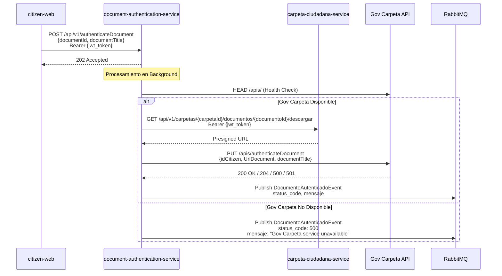

# ADR-0008: Servicio de Autenticación de Documentos con Python FastAPI

## Estado
**Aceptado** - 2024-11-07

## Contexto

El sistema Carpeta Ciudadana requiere integración con el servicio externo **Gov Carpeta** para validar la autenticidad de documentos presentados por los ciudadanos. Esta validación es crítica para garantizar que los documentos almacenados en las carpetas personales sean legítimos y verificables.

### Desafíos Identificados

1. **Integración Externa**: Necesidad de conectarse con API externa de Gov Carpeta
2. **Procesamiento Asíncrono**: Validación puede tardar varios segundos
3. **Resiliencia**: Manejar indisponibilidad del servicio Gov Carpeta
4. **Trazabilidad**: Publicar resultados a RabbitMQ para auditoría
5. **Seguridad**: Validación JWT para autorización de solicitudes
6. **Orquestación**: Coordinar múltiples servicios (carpeta-ciudadana-service, Gov Carpeta, RabbitMQ)

### Requisitos Funcionales

- **RF-DA-01**: Recibir solicitudes de autenticación de documentos vía API REST
- **RF-DA-02**: Validar disponibilidad de Gov Carpeta antes de procesar
- **RF-DA-03**: Obtener URL de descarga presignada de carpeta-ciudadana-service
- **RF-DA-04**: Autenticar documento con Gov Carpeta
- **RF-DA-05**: Publicar resultados a cola RabbitMQ
- **RF-DA-06**: Respuesta inmediata (202 Accepted) para procesamiento asíncrono

### Requisitos No Funcionales

- **RNF-01**: Disponibilidad 99.9% para procesamiento de autenticaciones
- **RNF-06**: Latencia P95 < 2000ms para respuesta inicial (202 Accepted)
- **RNF-11**: Autenticación JWT con mismo secret que carpeta-ciudadana-service
- **RNF-15**: Circuit breaker para servicios externos
- **RNF-22**: Cobertura de pruebas > 80%

## Decisión

Implementaremos un **microservicio de autenticación de documentos** usando:

### 1. Python 3.10+ con FastAPI

**Razones:**

1. **Desarrollo Rápido**: FastAPI permite desarrollo ágil con validación automática
2. **Type Safety**: Type hints nativos + Pydantic para validación estricta
3. **Async/Await**: Soporte nativo para procesamiento asíncrono
4. **OpenAPI Automático**: Generación automática de documentación Swagger
5. **Background Tasks**: Sistema integrado para procesamiento asíncrono
6. **Dependency Injection**: Sistema DI integrado para componentes
7. **Ecosistema Rico**: Bibliotecas maduras para HTTP, RabbitMQ, JWT

**Alternativas Consideradas:**
- **Go**: Mayor complejidad de desarrollo, menos bibliotecas
- **Node.js**: Menos robusto para validación de tipos
- **Java Spring**: Overhead excesivo para servicio simple

### 2. Pydantic para Validación de Datos

**Razones:**

1. **Type Safety**: Validación automática de tipos en runtime
2. **Schema Generation**: Generación automática de esquemas OpenAPI
3. **Alias Support**: Mapeo flexible entre snake_case y camelCase
4. **Custom Validators**: Validadores personalizados cuando necesario
5. **JSON Serialization**: Serialización/deserialización eficiente
6. **Error Messages**: Mensajes de error claros y descriptivos

**Modelos Implementados:**

```python
# Request para autenticación
class AuthenticateDocumentRequest(BaseModel):
    document_id: str
    document_title: str

# Request para Gov Carpeta
class GovCarpetaAuthenticationRequest(BaseModel):
    id_citizen: int
    url_document: str
    document_title: str

# Evento publicado a RabbitMQ
class DocumentoAutenticadoEvent(BaseModel):
    documento_id: str
    carpeta_id: str
    status_code: str
    mensaje: str
    fecha_autenticacion: datetime
```

### 3. Circuit Breaker Pattern

**Razones:**

1. **Fault Tolerance**: Prevenir cascada de fallos en servicios externos
2. **Fast Failure**: Fallar rápido cuando servicio está caído
3. **Auto-Recovery**: Intentar recuperación después de timeout
4. **Resource Protection**: No sobrecargar servicios en fallo
5. **Observable States**: Estados CLOSED, OPEN, HALF_OPEN visibles

**Implementación:**

```python
class CircuitBreaker:
    def __init__(self, failure_threshold=5, timeout=60):
        self.state = CircuitState.CLOSED
        self.failure_count = 0
        
    def call(self, func, *args, **kwargs):
        if self.state == CircuitState.OPEN:
            if not self._should_attempt_reset():
                raise Exception("Circuit breaker is OPEN")
            self.state = CircuitState.HALF_OPEN
        
        try:
            result = func(*args, **kwargs)
            self._on_success()
            return result
        except Exception as e:
            self._on_failure()
            raise e
```

### 4. Arquitectura de Procesamiento Asíncrono

**Flujo de Autenticación:**



**Razones:**

1. **User Experience**: Usuario no espera por procesamiento largo
2. **Reliability**: Desacopla solicitud de procesamiento
3. **Scalability**: Procesamiento puede escalar independientemente
4. **Error Handling**: Errores no afectan cliente directamente
5. **Observability**: Todos los resultados auditables en RabbitMQ

### 5. RabbitMQ para Publicación de Eventos

**Razones:**

1. **Event-Driven**: Desacopla autenticación de consumidores downstream
2. **Reliability**: Mensajes persistentes garantizan entrega
3. **Auditability**: Todos los eventos registrados en cola
4. **Flexibility**: Múltiples consumidores pueden procesar eventos
5. **Integration**: Consistente con arquitectura existente

**Evento Publicado:**

```json
{
  "documento_id": "550e8400-e29b-41d4-a716-446655440000",
  "carpeta_id": "folder-123-456",
  "status_code": "200",
  "mensaje": "El documento: Diploma Grado del ciudadano 1234567890 ha sido autenticado exitosamente",
  "fecha_autenticacion": "2024-11-07T10:30:45.123456"
}
```

### 6. Estructura del Proyecto

```
document-authentication-service/
├── app/
│   ├── api/
│   │   └── routes.py          # Endpoints FastAPI
│   ├── models/
│   │   ├── __init__.py        # Modelos Pydantic
│   │   └── enums.py           # Enumeraciones
│   ├── services/
│   │   ├── authentication_service.py  # Orquestación
│   │   ├── external_services.py       # Clientes HTTP
│   │   └── rabbitmq_client.py         # Cliente RabbitMQ
│   ├── utils/
│   │   ├── auth.py            # JWT utilities
│   │   └── circuit_breaker.py # Circuit breaker
│   └── config.py              # Configuración
├── tests/                     # Pruebas unitarias
├── events/                    # Ejemplos de uso
├── Dockerfile                 # Imagen Docker
└── main.py                    # Entry point
```

**Razones:**

1. **Separation of Concerns**: Cada módulo tiene responsabilidad clara
2. **Testability**: Módulos independientes fáciles de testear
3. **Maintainability**: Código organizado y predecible
4. **Scalability**: Fácil agregar nuevas funcionalidades

### 7. Configuración External-First

**Razones:**

1. **12-Factor App**: Configuración via environment variables
2. **Docker Friendly**: No requiere reconstruir imagen para cambios
3. **Security**: Secrets no en código fuente
4. **Flexibility**: Mismo código en todos los ambientes

**Configuración:**

```python
class Settings(BaseSettings):
    service_port: int = 8083
    rabbitmq_url: str
    carpeta_ciudadana_service_url: str
    gov_carpeta_service_url: str
    jwt_secret_key: str
    circuit_breaker_failure_threshold: int = 5
    
    model_config = SettingsConfigDict(env_file=".env")
```

**Nota**: `.env` NO está en `.gitignore` porque no contiene credenciales, solo configuración.

## Consecuencias

### Positivas

1. ✅ **Desarrollo Rápido**: FastAPI + Pydantic = menos código boilerplate
2. ✅ **Type Safety**: Validación en compile-time y runtime
3. ✅ **Documentation**: Swagger UI generado automáticamente
4. ✅ **Async Processing**: No bloquea cliente mientras procesa
5. ✅ **Resilient**: Circuit breaker maneja fallos externos
6. ✅ **Observable**: Todos los eventos en RabbitMQ
7. ✅ **Testable**: Arquitectura modular fácil de testear
8. ✅ **Docker Ready**: Imagen optimizada para Kubernetes
9. ✅ **Maintainable**: Código simple y bien estructurado

### Negativas

1. ❌ **Python Performance**: Menor rendimiento que Go/Java
2. ❌ **No Persistence**: No guarda historial de autenticaciones
3. ❌ **External Dependencies**: Depende de 3 servicios externos
4. ❌ **No Retry Logic**: Si RabbitMQ falla, evento se pierde
5. ❌ **Circuit Breaker State**: Se resetea al reiniciar servicio

### Mitigaciones Implementadas

1. **Performance**: Uso de async/await para concurrencia
2. **Monitoring**: Logs estructurados para observabilidad
3. **Testing**: Suite de pruebas unitarias (>80% cobertura)
4. **Documentation**: README completo + Swagger + ejemplos

## Métricas de Éxito

1. **Latencia**: P95 < 100ms para respuesta 202 Accepted
2. **Availability**: 99.9% uptime del servicio
3. **Success Rate**: >95% de autenticaciones procesadas exitosamente
4. **Test Coverage**: >80% cobertura de código
5. **Documentation**: 100% endpoints documentados en OpenAPI

## Estado de Implementación

### Funcionalidades Implementadas ✅

1. **API REST con FastAPI**
   - POST /api/v1/authenticateDocument
   - GET /api/v1/health
   - Documentación OpenAPI/Swagger

2. **Autenticación JWT**
   - Validación de bearer tokens
   - Extracción de folderId y citizenId

3. **Procesamiento Asíncrono**
   - Background tasks con FastAPI
   - Respuesta 202 Accepted inmediata

4. **Circuit Breaker**
   - Implementación completa con estados CLOSED/OPEN/HALF_OPEN
   - Configuración via environment variables

5. **Validación con Pydantic**
   - Modelos para requests/responses
   - Enums para códigos de estado

6. **Integración Externa**
   - Health check de Gov Carpeta
   - Cliente para carpeta-ciudadana-service
   - Cliente para Gov Carpeta API

7. **RabbitMQ**
   - Cliente aio-pika
   - Publicación de eventos persistentes

8. **Testing**
   - Pruebas unitarias con unittest
   - Coverage >80%

9. **Documentación**
   - README.md completo en español
   - Ejemplos de uso en events/
   - .vscode/launch.json para debugging

10. **Docker**
    - Dockerfile multi-stage
    - Health check integrado

## Dependencias Tecnológicas

```
fastapi==0.115.0
uvicorn[standard]==0.32.0
pydantic==2.9.2
pydantic-settings==2.6.0
python-jose[cryptography]==3.3.0
httpx==0.27.2
aio-pika==9.4.3
pytest==8.3.3
black==24.10.0
```

## Referencias

- **Gov Carpeta API**: https://govcarpeta-apis-4905ff3c005b.herokuapp.com/api-docs/
- **FastAPI Documentation**: https://fastapi.tiangolo.com/
- **Pydantic**: https://docs.pydantic.dev/
- **Circuit Breaker Pattern**: https://martinfowler.com/bliki/CircuitBreaker.html
- **12-Factor App**: https://12factor.net/

## Revisión Futura

Esta decisión debe revisarse si:

1. **Volumen**: Supera 10,000 autenticaciones/día
2. **Latencia**: P95 > 3 segundos para procesamiento completo
3. **Gov Carpeta**: Cambia API o depreca endpoints
4. **Requirements**: Se requiere persistencia de historial

**Fecha de próxima revisión**: 2025-05-01

## Autores

- **Decisión Propuesta por**: Equipo de Desarrollo Carpeta Ciudadana
- **Revisado por**: Arquitecto de Sistemas
- **Aprobado por**: Líder Técnico

---

**Versión**: 1.0  
**Última Actualización**: 2024-11-07  
**Estado**: Implementación completa - Todas las funcionalidades requeridas implementadas
