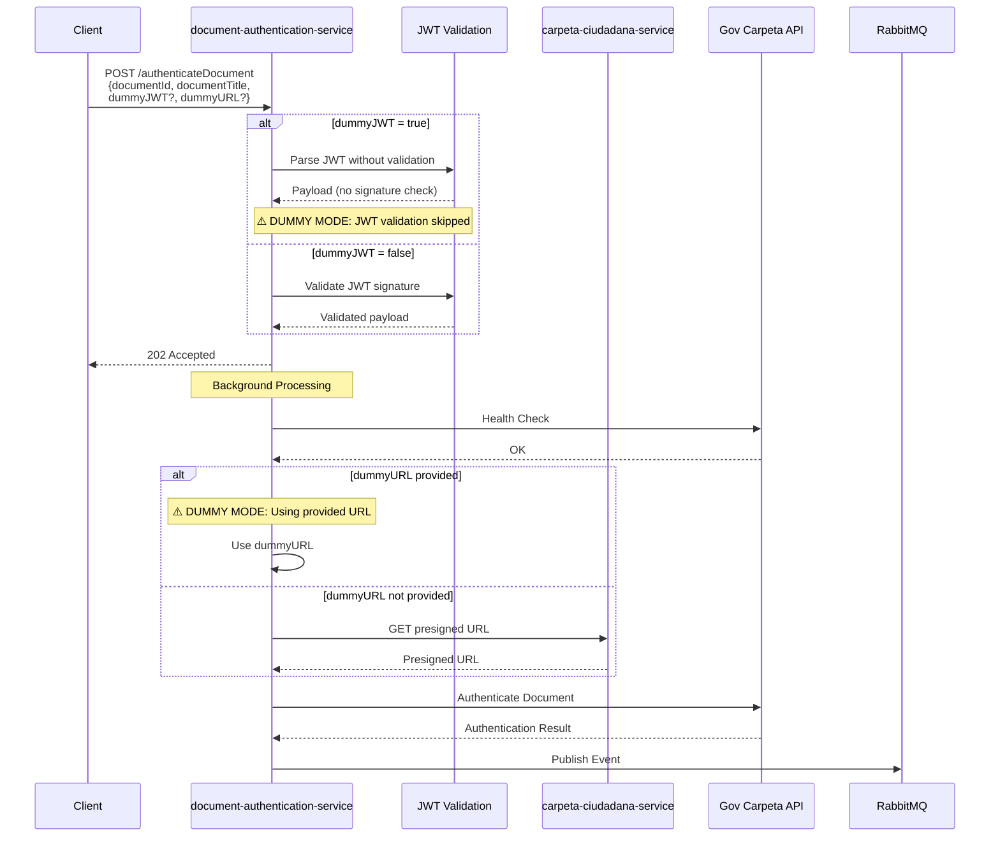

# ADR-0009: Modo de Testing Dummy para Autenticación de Documentos

## Estado
**Aceptado** - 2024-11-07

## Contexto

El servicio de autenticación de documentos (`document-authentication-service`) tiene múltiples dependencias externas que dificultan el testing y desarrollo local:

1. **auth-service**: Requiere JWT tokens válidos firmados con `JWT_SECRET_KEY`
2. **carpeta-ciudadana-service**: Debe estar disponible para obtener presigned URLs
3. **Gov Carpeta API**: Servicio externo que puede no estar disponible en desarrollo

### Problemas Identificados

Durante el desarrollo y testing del servicio, se identificaron los siguientes desafíos:

- **Testing End-to-End**: Difícil probar el flujo completo sin todas las dependencias activas
- **Desarrollo Local**: Requiere levantar múltiples servicios para testing básico
- **Debugging**: Difícil aislar problemas cuando múltiples servicios están involucrados
- **CI/CD**: Tests de integración requieren infraestructura compleja
- **Demos**: Difícil demostrar funcionalidad sin environment completo

### Requisitos

- **REQ-TEST-01**: Permitir testing sin auth-service disponible
- **REQ-TEST-02**: Permitir testing sin carpeta-ciudadana-service disponible
- **REQ-TEST-03**: Mantener seguridad en producción
- **REQ-TEST-04**: Código de testing fácilmente removible
- **REQ-TEST-05**: Documentación clara de uso de características de testing

## Decisión

Implementaremos un **modo de testing dummy** que permite saltar validaciones específicas durante desarrollo y testing, pero que puede ser fácilmente comentado o removido para producción.

### 1. Parámetro `dummyJWT` (Boolean Opcional)

Permite saltar la validación de firma JWT y parsear el token como JSON plano.

**Implementación:**

```python
class AuthenticateDocumentRequest(BaseModel):
    document_id: str
    document_title: str
    dummy_jwt: Optional[bool] = Field(default=False, alias="dummyJWT")
    dummy_url: Optional[str] = Field(default=None, alias="dummyURL")
```

**Funcionalidad:**

```python
def decode_jwt_token(token: str, skip_validation: bool = False) -> JWTPayload:
    if skip_validation:
        logger.warning("JWT validation SKIPPED - dummy mode enabled")
        # Parse JWT payload without signature verification
        parts = token.split(".")
        payload_part = parts[1]
        # Add base64 padding if needed
        padding = 4 - (len(payload_part) % 4)
        if padding != 4:
            payload_part += "=" * padding
        decoded_bytes = base64.urlsafe_b64decode(payload_part)
        payload = json.loads(decoded_bytes)
        return JWTPayload(**payload)
    else:
        # Normal JWT validation with signature verification
        payload = jwt.decode(token, settings.jwt_secret_key, 
                           algorithms=[settings.jwt_algorithm])
        return JWTPayload(**payload)
```

**Ventajas:**
- ✅ Testing sin necesidad de `JWT_SECRET_KEY` válida
- ✅ Permite crear tokens de prueba fácilmente
- ✅ No requiere auth-service corriendo
- ✅ Logging claro cuando está activo

**Uso:**

```json
{
  "documentId": "uuid-here",
  "documentTitle": "Test Document",
  "dummyJWT": true
}
```

### 2. Parámetro `dummyURL` (String Opcional)

Permite proporcionar una presigned URL directamente, saltando la llamada a carpeta-ciudadana-service.

**Implementación:**

```python
async def process_document_authentication(
    request: AuthenticateDocumentRequest,
    jwt_payload: JWTPayload,
    raw_token: str,
) -> None:
    # ...health check...
    
    # Get presigned URL or use dummy
    if request.dummy_url:
        logger.warning(f"Using DUMMY URL: {request.dummy_url}")
        presigned_url = request.dummy_url
    else:
        presigned_url = await get_presigned_document_url(
            carpeta_id=str(carpeta_id),
            documento_id=documento_id,
            jwt_token=raw_token,
        )
```

**Ventajas:**
- ✅ Testing sin carpeta-ciudadana-service
- ✅ Permite simular diferentes URLs
- ✅ Útil para testing de Gov Carpeta directamente
- ✅ Logging claro cuando está activo

**Uso:**

```json
{
  "documentId": "uuid-here",
  "documentTitle": "Test Document",
  "dummyURL": "https://test-bucket.s3.amazonaws.com/test.pdf?signature=xyz"
}
```

### 3. Combinaciones de Modos

El diseño permite cuatro modos de operación:

| Modo | dummyJWT | dummyURL | Descripción |
|------|----------|----------|-------------|
| **Producción** | false | null | Validación completa, todas las dependencias |
| **Dummy JWT** | true | null | JWT sin validar, URL real de carpeta-service |
| **Dummy URL** | false | "url" | JWT validado, URL proporcionada |
| **Full Dummy** | true | "url" | Sin validación JWT, URL proporcionada |

### 4. Ejemplos de Testing

Se crearon 7 ejemplos en el directorio `events/`:

**Producción:**
1. `example_1_diploma.py` - Diploma universitario
2. `example_2_birth_certificate.py` - Certificado de nacimiento
3. `example_3_professional_license.py` - Tarjeta profesional

**Testing Dummy:**
4. `example_4_dummy_jwt.py` - Solo dummyJWT=true
5. `example_5_dummy_url.py` - Solo dummyURL
6. `example_6_full_dummy.py` - Ambos flags (testing completo)
7. `example_7_hybrid_dummy_jwt.py` - dummyJWT con URL real

### 5. Seguridad y Producción

**Medidas de Seguridad:**

1. **Logging Explícito**: Warnings claros en logs cuando modo dummy está activo
   ```python
   logger.warning("JWT validation SKIPPED - dummy mode enabled")
   logger.warning(f"Using DUMMY URL instead of calling carpeta-ciudadana-service")
   ```

2. **Valores por Defecto Seguros**: 
   - `dummy_jwt` default = `False`
   - `dummy_url` default = `None`

3. **Documentación Clara**: README advierte que es solo para testing

4. **Fácil Remoción**: Código puede comentarse o removerse fácilmente:
   - Eliminar campos `dummy_jwt` y `dummy_url` del modelo
   - Remover parámetro `skip_validation` de `decode_jwt_token()`
   - Remover condicional de `dummy_url` en authentication service

### 6. Configuración de Debugging

Se movió la configuración de VS Code launch.json a la raíz del proyecto y se actualizó para usar `debugpy`:

```json
{
  "name": "Document Auth Service: FastAPI (debugpy)",
  "type": "debugpy",
  "request": "launch",
  "module": "uvicorn",
  "args": ["main:app", "--reload", "--host", "0.0.0.0", "--port", "8083"],
  "cwd": "${workspaceFolder}/services/document-authentication-service"
}
```

**Ventaja**: Permite debugging desde workspace raíz del monorepo.

## Consecuencias

### Positivas

✅ **Desarrollo Ágil**: Testing más rápido sin levantar dependencias  
✅ **Debugging Simplificado**: Aislar problemas más fácilmente  
✅ **CI/CD Mejorado**: Tests pueden correr sin infraestructura completa  
✅ **Demos**: Demostrar funcionalidad sin environment completo  
✅ **Documentación**: Ejemplos claros para diferentes escenarios  
✅ **Flexibilidad**: Cuatro modos de operación según necesidad  
✅ **Type Safety**: Todo tipado con Pydantic y type hints  

### Negativas

⚠️ **Riesgo de Seguridad**: Si se usa dummy mode en producción por error  
  - **Mitigación**: Logging explícito, documentación clara, valores default seguros

⚠️ **Complejidad Adicional**: Más código para mantener  
  - **Mitigación**: Código bien documentado, fácil de remover si no se necesita

⚠️ **Falsa Sensación de Testing**: Tests con dummy pueden no reflejar producción  
  - **Mitigación**: Documentar claramente que dummy es para desarrollo, no reemplaza tests de integración reales

### Neutras

📝 **Código Adicional**: ~50 líneas de código para funcionalidad dummy  
📝 **Ejemplos**: 4 archivos adicionales de ejemplo (útiles para onboarding)  
📝 **Documentación**: Sección adicional en README

## Alternativas Consideradas

### 1. Environment Variables para Testing

**Descripción**: Usar `TESTING_MODE=true` en .env

**Rechazada porque:**
- Menos granular (todo o nada)
- Requiere reiniciar servicio para cambiar modo
- Menos flexible para diferentes escenarios de testing

### 2. Mocks en Tests Unitarios

**Descripción**: Solo usar mocks en pytest

**Rechazada porque:**
- No ayuda con testing manual/exploratorio
- No permite demos sin infrastructure
- No facilita debugging de issues específicos

### 3. Feature Flags Complejos

**Descripción**: Sistema de feature flags con LaunchDarkly, etc.

**Rechazada porque:**
- Overkill para necesidad simple
- Dependencia externa adicional
- Complejidad innecesaria

### 4. Servicios Mock Separados

**Descripción**: Crear mock auth-service y mock carpeta-service

**Rechazada porque:**
- Más servicios para mantener
- Mayor complejidad de setup
- No tan flexible como parámetros inline

## Flujo de Autenticación con Modo Dummy



## Implementación

### Archivos Modificados

1. **app/models/__init__.py**: Agregados campos `dummy_jwt` y `dummy_url`
2. **app/utils/auth.py**: Agregado parámetro `skip_validation`
3. **app/api/routes.py**: Manejo de flag `dummyJWT`
4. **app/services/authentication_service.py**: Manejo de `dummyURL`
5. **requirements.txt**: Agregado `debugpy==1.8.7`
6. **.vscode/launch.json**: Movido a raíz con debugpy
7. **README.md**: Documentación de características dummy

### Archivos Creados

1. **events/example_4_dummy_jwt.py**
2. **events/example_5_dummy_url.py**
3. **events/example_6_full_dummy.py**
4. **events/example_7_hybrid_dummy_jwt.py**

## Referencias

- [ADR-0008: Document Authentication Service Python FastAPI](./0008-document-authentication-service-python-fastapi.md)
- [The Twelve-Factor App - Dev/Prod Parity](https://12factor.net/dev-prod-parity)
- [FastAPI Testing](https://fastapi.tiangolo.com/tutorial/testing/)
- [Pydantic Field Aliases](https://docs.pydantic.dev/latest/concepts/fields/#field-aliases)

## Notas de Implementación

### Para Producción

Si se decide remover el modo dummy para producción:

1. Eliminar campos del modelo:
```python
# REMOVE THESE LINES
dummy_jwt: Optional[bool] = Field(default=False, alias="dummyJWT")
dummy_url: Optional[str] = Field(default=None, alias="dummyURL")
```

2. Remover parámetro de auth.py:
```python
# Change signature back to:
def decode_jwt_token(token: str) -> JWTPayload:
    # Remove skip_validation logic
```

3. Remover condicional de URL:
```python
# Remove the if/else and keep only:
presigned_url = await get_presigned_document_url(...)
```

4. Eliminar ejemplos dummy (4-7)

### Para Mantener

Si se mantiene el modo dummy:

- ✅ Agregar tests unitarios para modo dummy
- ✅ Documentar en onboarding de nuevos desarrolladores
- ✅ Incluir en checklist de deployment (verificar dummy=false en prod)
- ✅ Agregar monitoring/alerting si dummy mode se usa en producción

## Fecha

7 de Noviembre de 2024

## Autor

Equipo de Arquitectura - Universidad EAFIT
