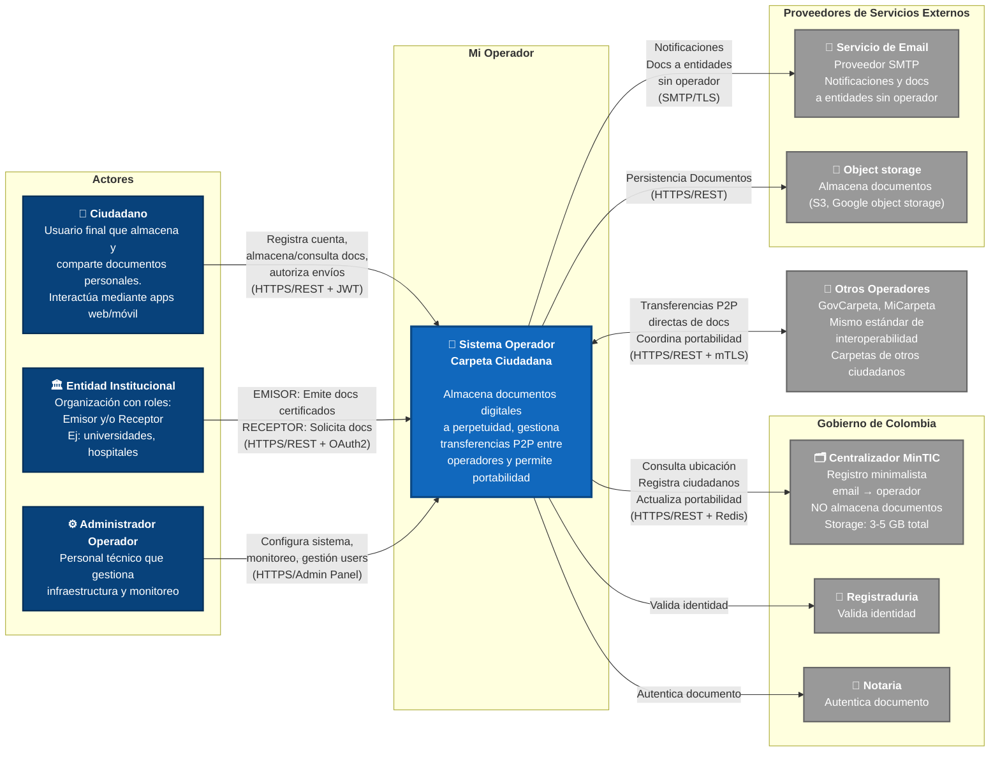

# Diagramas C4 - Sistema Carpeta Ciudadana

Este documento contiene los diagramas C4 (Context, Container, Component, Code) para el sistema Carpeta Ciudadana, siguiendo la metodología de Simon Brown.

## Tabla de Contenidos
1. [C4 Level 1: System Context](#c4-level-1-system-context)
2. [C4 Level 2: Container Diagram](#c4-level-2-container-diagram)

---

## C4 Level 1: System Context

El diagrama de contexto muestra el sistema Carpeta Ciudadana y cómo interactúa con usuarios y sistemas externos.

### Descripción del Contexto

#### Líneas de Separación (Boundaries)

El diagrama utiliza dos líneas conceptuales para organizar los elementos según las mejores prácticas de C4:

1. **Automation Line** (Línea de Automatización)
   - Separa los **actores humanos** (izquierda) del **sistema automatizado** (centro)
   - Define el límite entre interacciones manuales y procesos automatizados
   - Todo lo que cruza esta línea representa una interacción usuario-sistema

2. **Integration Line** (Línea de Integración)
   - Separa el **sistema principal** (centro) de **otros sistemas externos** (derecha)
   - Define los puntos de integración e interoperabilidad
   - Todo lo que cruza esta línea representa una integración sistema-a-sistema

#### Actores Principales (Izquierda - Automation Boundary)

- **Ciudadano**: Usuario final que almacena documentos personales (cédula, diplomas, certificados) y los comparte con entidades cuando lo necesita. Interactúa mediante aplicaciones web/móvil con autenticación multifactor.

- **Entidad Institucional**: Organización (identificada por NIT) que puede actuar en dos roles:
  - **Rol Emisor**: Genera y envía documentos certificados con firma digital X.509 directamente a la carpeta del ciudadano (ej: universidad emite diploma, hospital emite certificado médico).
  - **Rol Receptor**: Solicita documentos específicos al ciudadano para trámites (ej: empleador solicita antecedentes, banco solicita extractos, embajada solicita documentación para visa).
  - **Nota**: Una misma entidad puede tener ambos roles simultáneamente (ej: universidad emite diplomas Y recibe documentos al contratar profesores).

- **Administrador Operador**: Personal técnico que gestiona la infraestructura del operador privado: configuración de sistemas, monitoreo, gestión de usuarios premium, y coordinación de portabilidades.

#### Sistema Principal (Centro)

**Sistema Operador Carpeta Ciudadana**: Plataforma de gestión documental que implementa los requisitos de interoperabilidad definidos por MinTIC. Almacena documentos certificados a perpetuidad sin límite de tamaño, gestiona transferencias P2P directas entre operadores (sin pasar por MinTIC), y permite portabilidad entre operadores en máximo 72 horas.

#### Sistemas Externos (Derecha - Integration Boundary)

**1. Gobierno de Colombia**
   - **Centralizador MinTIC**: Registro minimalista que solo mantiene mapeo email → operador actual. NO almacena documentos, NO rutea información. Almacenamiento estimado: 3-5 GB para todo el país (~50M ciudadanos). Responde consultas en <100ms (p95).
   - **Autenticación Gubernamental**: Sistema nacional de autenticación ciudadana (ej: Clave Única) que valida identidad contra la Registraduría Nacional. Proporciona tokens SAML 2.0 para Single Sign-On.

**2. Ecosistema de Operadores Privados**
   - **Otros Operadores**: Operadores competidores (ej: GovCarpeta, MiCarpeta) que implementan el mismo estándar de interoperabilidad. Gestionan carpetas de otros ciudadanos/entidades. Las transferencias son **P2P directas** (operador A → operador B) sin pasar por MinTIC. Soportan coordinación de portabilidad con migración completa de datos.

**3. Proveedores de Servicios Externos**
   - **Servicio de Email**: Proveedor SMTP/TLS para notificaciones a ciudadanos y entidades. También se usa para enviar documentos a entidades que no tienen operador (fallback cuando MinTIC responde "entidad sin operador").
   - **Autoridad Certificadora**: Proveedor de certificados digitales X.509 con validez legal en Colombia. Valida firmas digitales, verifica cadenas de certificados, y consulta listas de revocación (OCSP/CRL).

#### Flujos Clave de Información

**Transferencia de Documentos (P2P):**
1. Operador A consulta a MinTIC: "¿Dónde está ciudadano X?" → MinTIC: "Operador B"
2. Operador A transfiere documentos **DIRECTAMENTE** a Operador B (sin pasar por MinTIC)
3. Operador B confirma recepción (ACK) y notifica al ciudadano

**Portabilidad entre Operadores:**
1. Ciudadano solicita cambio de Operador A → Operador B
2. Operador A exporta TODOS los documentos + metadatos + historial
3. Operador B valida integridad, confirma recepción
4. MinTIC actualiza registro: email → Operador B
5. Proceso completo en máximo 72 horas

**Emisión de Documento Certificado:**
1. Entidad (Rol Emisor) genera documento con firma digital X.509
2. Sistema valida firma contra Autoridad Certificadora
3. Sistema consulta MinTIC para ubicar al ciudadano destinatario
4. Sistema transfiere documento directamente al operador del ciudadano
5. Ciudadano recibe notificación por email/SMS/push

---

## C4 Level 2: Container Diagram

El diagrama de contenedores muestra la arquitectura interna del Sistema Operador Carpeta Ciudadana.

```mermaid
graph TB

    %% ============================================
    %% SISTEMA OPERADOR CARPETA CIUDADANA
    %% ============================================
    subgraph operator["<b>💼 Mi Operador - Sistema Operador Carpeta Ciudadana</b>"]
        subgraph frontend["<b>Capa de Presentación</b>"]
            web_app["💻 <b>Aplicación Web Ciudadano</b><br/>SPA para gestionar documentos"]
            web_entidad["🏢 <b>Aplicación Web Entidad</b><br/>SPA para emitir/recibir docs"]
            mobile_app["📱 <b>App Móvil</b><br/>App para ciudadanos"]
            admin_panel["🖥️ <b>Panel Administrativo</b><br/>Gestión del operador"]
        end
                
        api_gateway["🚪 <b>API Gateway</b><br/>Autenticación, rate limiting, routing"]
        
        subgraph services["<b>Microservicios</b>"]
            carpeta_service["📁 <b>Carpeta Personal Service</b><br/>Gestiona carpetas de ciudadanos"]
            carpeta_inst_service["🗂️ <b>Carpeta Institucional Service</b><br/>Gestiona carpetas de entidades"]
            transfer_service["🔄 <b>Transferencia Service</b><br/>Coordina transferencias P2P"]
            portability_service["📦 <b>Portabilidad Service</b><br/>Recepción nuevo ciudadano"]
            identity_service["👥 <b>Identidad y Registro Service</b><br/>Registro, verificación, email inmutable"]
            auth_service["🔐 <b>Autenticación Service</b><br/>JWT, MFA, sesiones"]
            notification_service["🔔 <b>Notificaciones Service</b><br/>Email, SMS, push"]
        end
        
        event_bus["⚡ <b>Event Bus</b><br/>Broker<br/>Comunicación asíncrona"]
        
        subgraph data["<b>Capa de Datos</b>"]
            carpeta_db[("🗄️ <b>Carpeta DB</b><br/>Metadatos de documentos")]
            identity_db[("🗄️ <b>Identity DB</b><br/>Registro ciudadanos/entidades")]
            cache[("⚡ <b>Cache</b><br/>Cache consultas MinTIC")]
        end

        frontend --- api_gateway --- services
    end

    %% ============================================
    %% ACTORES (Arriba)
    %% ============================================
    subgraph actors["Actores"]
        ciudadano("👤 <b>Ciudadano</b><br/>Usuario final que almacena y<br/>comparte documentos personales")
        entidad("🏛️ <b>Entidad Institucional</b><br/>Organización con roles:<br/>Emisor y/o Receptor")
        admin("⚙️ <b>Administrador Operador</b><br/>Personal técnico que gestiona<br/>infraestructura y monitoreo")
    end

    %% ============================================
    %% SISTEMAS EXTERNOS
    %% ============================================
    subgraph externals["Sistemas externos"]
        subgraph gov["<b>Gobierno de Colombia</b>"]
            mintic["🗂️ <b>Centralizador MinTIC</b><br/>Registro minimalista<br/>email → operador<br/>NO almacena documentos"]
            gov_auth["🔐 <b>Registraduría</b><br/>Valida identidad"]
            gov_authorization["🔐 <b>Notaría</b><br/>Autentica documento"]
        end

        otro_operador["🔄 <b>Otros Operadores</b><br/>GovCarpeta, MiCarpeta<br/>Mismo estándar de interoperabilidad"]
        
        subgraph providers["<b>Proveedores de Servicios Externos</b>"]
            email_provider["📧 <b>Servicio de Email</b><br/>Proveedor SMTP<br/>Notificaciones y docs"]
            object_storage["☁️ <b>Object Storage</b><br/>S3/Google Cloud Storage<br/>Almacena documentos binarios"]
        end
    end

    actors --- operator --- externals

    %% ============================================
    %% RELACIONES: Frontend → Gateway
    %% ============================================
    web_app -->|"HTTPS/JSON<br/>JWT"| api_gateway
    web_entidad -->|"HTTPS/JSON<br/>OAuth2"| api_gateway
    mobile_app -->|"HTTPS/JSON<br/>JWT"| api_gateway
    admin_panel -->|"HTTPS/JSON<br/>Admin Token"| api_gateway

    %% ============================================
    %% RELACIONES: Gateway → Servicios
    %% ============================================
    api_gateway -->|"HTTP/REST"| carpeta_service
    api_gateway -->|"HTTP/REST"| carpeta_inst_service
    api_gateway -->|"HTTP/REST"| transfer_service
    api_gateway -->|"HTTP/REST"| portability_service
    api_gateway -->|"HTTP/REST"| identity_service
    api_gateway -->|"Autentica<br/>HTTP/REST"| auth_service
    api_gateway -->|"HTTP/REST"| notification_service

    %% ============================================
    %% RELACIONES: Carpeta Service
    %% ============================================
    carpeta_service -->|"SQL"| carpeta_db
    carpeta_service -->|"S3 API"| object_storage
    carpeta_service -->|"Publica eventos<br/>Broker"| event_bus

    %% ============================================
    %% RELACIONES: Carpeta Institucional Service
    %% ============================================
    carpeta_inst_service -->|"SQL"| carpeta_db
    carpeta_inst_service -->|"Publica eventos<br/>Broker"| event_bus
    carpeta_inst_service -->|"Valida firma"| gov_authorization

    %% ============================================
    %% RELACIONES: Transfer Service
    %% ============================================
    transfer_service -->|"Consulta ubicación<br/>HTTPS/REST"| mintic
    transfer_service -->|"Cache<br/>Redis Protocol"| cache
    transfer_service -->|"Envía docs P2P<br/>HTTPS/REST + mTLS"| otro_operador
    transfer_service -->|"Publica eventos<br/>Broker"| event_bus

    %% ============================================
    %% RELACIONES: Portability Service
    %% ============================================
    portability_service -->|"Actualiza operador<br/>HTTP/REST"| identity_service
    portability_service -->|"Actualiza registro<br/>HTTPS/REST"| mintic
    portability_service -->|"Coordina migración<br/>HTTPS/REST + mTLS"| otro_operador
    portability_service -->|"Publica eventos<br/>Broker"| event_bus
    event_bus  -->|"Consume eventos<br/>Broker"| portability_service

    %% ============================================
    %% RELACIONES: Identity Service
    %% ============================================
    identity_service -->|"SQL"| identity_db
    identity_service -->|"Registra inicial<br/>HTTPS/REST"| mintic
    identity_service -->|"Valida identidad<br/>HTTPS"| gov_auth
    identity_service -->|"Publica eventos<br/>Broker"| event_bus

    %% ============================================
    %% RELACIONES: Auth Service
    %% ============================================
    auth_service -->|"Delega validación<br/>HTTPS"| gov_auth
    auth_service -->|"Valida usuarios<br/>SQL"| identity_db

    %% ============================================
    %% RELACIONES: Notification Service
    %% ============================================
    notification_service -->|"Consume eventos<br/>Broker"| event_bus
    notification_service -->|"SMTP/TLS"| email_provider

    %% ============================================
    %% RELACIONES BIDIRECCIONALES
    %% ============================================
    otro_operador -->|"Recibe Docs<br/>HTTPS/REST"| api_gateway
    otro_operador -->|"OAuth2: two-legged-or-three-legged"| api_gateway

    %% ============================================
    %% RELACIONES: Actores → Frontend
    %% ============================================
    ciudadano -->|"HTTPS"| web_app
    ciudadano -->|"HTTPS"| mobile_app
    entidad -->|"HTTPS/OAuth2"| web_entidad
    admin -->|"HTTPS"| admin_panel

    %% ============================================
    %% ESTILOS
    %% ============================================
    classDef actorStyle fill:#08427B,stroke:#052E56,color:#fff,stroke-width:2px
    classDef frontendStyle fill:#63B3ED,stroke:#2C5282,color:#000,stroke-width:2px
    classDef gatewayStyle fill:#F6AD55,stroke:#C05621,color:#000,stroke-width:3px
    classDef serviceStyle fill:#68D391,stroke:#22543D,color:#000,stroke-width:2px
    classDef dataStyle fill:#B794F4,stroke:#44337A,color:#fff,stroke-width:2px
    classDef eventStyle fill:#FC8181,stroke:#742A2A,color:#fff,stroke-width:2px
    classDef externalStyle fill:#999999,stroke:#666666,color:#fff,stroke-width:2px
    classDef systemStyle fill:#1168BD,stroke:#0B4884,color:#fff,stroke-width:3px

    class ciudadano,entidad,admin actorStyle
    class web_app,web_entidad,mobile_app,admin_panel frontendStyle
    class api_gateway gatewayStyle
    class carpeta_service,carpeta_inst_service,transfer_service,portability_service,identity_service,auth_service,notification_service serviceStyle
    class carpeta_db,identity_db,cache dataStyle
    class event_bus eventStyle
    class mintic,gov_auth,gov_authorization,otro_operador,email_provider,object_storage externalStyle
```

### Descripción de Contenedores

**Frontend Applications:**
- **Aplicación Web Ciudadano**: SPA para gestión de documentos personales
- **Aplicación Web Entidad**: Portal para instituciones
- **App Móvil**: Aplicación nativa para ciudadanos

**Core Services (Microservicios):**
- **Carpeta Personal Service**: CRUD de documentos ciudadanos, autorización de compartir
- **Carpeta Institucional Service**: Emisión y recepción de documentos institucionales
- **Transferencia Service**: Transferencias P2P entre operadores (sin pasar por MinTIC)
- **Portabilidad Service**: Cambio de operador en 72h con migración de datos
- **Identidad y Registro Service**: Registro inicial, email inmutable @carpetacolombia.co
- **Autenticación Service**: MFA, JWT tokens, gestión de sesiones
- **Notificaciones Service**: Envío de notificaciones multi-canal

**Data Stores:**
- **Carpeta DB**: Metadatos de documentos, historial de accesos
- **Document Storage**: Archivos binarios (S3-compatible)
- **Identity DB**: Ciudadanos, entidades, verificaciones
- **Cache**: Redis para cachear consultas al Centralizador MinTIC

**Infrastructure:**
- **API Gateway**: Kong/Nginx para routing, autenticación, rate limiting
- **Event Bus**: Kafka/RabbitMQ para comunicación asíncrona

---

## Decisiones de Diseño Clave

### Patrones Aplicados

1. **Adapter Pattern**:
   - **MinTIC Registry Adapter**: Adapta la API del Centralizador MinTIC a interfaces del dominio interno
   - **External Operator Adapter**: Permite integración con múltiples operadores con diferentes APIs
   - **Storage Adapter**: Abstrae el almacenamiento (S3, MinIO, Azure Blob)
   - **Digital Signature Adapter**: Adapta diferentes proveedores de firma digital

2. **Proxy Pattern**:
   - **MinTIC Caching Proxy**: Añade cache sobre el adapter para reducir latencia y carga
   - **Operator Retry Proxy**: Añade reintentos automáticos, circuit breaker y timeouts para llamadas a operadores externos

3. **Arquitectura Hexagonal (Ports & Adapters)**:
   - Lógica de negocio (Use Cases) independiente de frameworks
   - Adapters intercambiables sin afectar el core
   - Facilita testing con mocks

4. **Event-Driven Architecture**:
   - Servicios publican eventos de dominio al Event Bus
   - Desacoplamiento entre servicios (ej: Notification Service consume eventos)

### Decisiones de Escalabilidad

- **API Gateway**: Balanceo de carga, rate limiting
- **Microservicios independientes**: Escalado horizontal por servicio según demanda
- **Cache distribuido**: Redis para reducir latencia en consultas a MinTIC (99% menos llamadas)
- **Document Storage**: S3-compatible para escalabilidad infinita
- **Event Bus**: Kafka para alta throughput (~5M transferencias/día)

### Decisiones de Disponibilidad

- **Circuit Breaker**: Evita cascading failures cuando operadores externos fallan
- **Retry Logic**: Reintentos exponenciales en transferencias P2P
- **Cache Fallback**: Si MinTIC cae, se usa cache (eventual consistency)
- **Multiple Replicas**: Cada servicio con múltiples réplicas en Kubernetes

---

## Referencias

- [Análisis DDD del Sistema](./informacion_cruda/ddd_analisis/ddd__analisis.md)
- [Requisitos Funcionales](./informacion_cruda/1_req_funcionales.md)
- [Requisitos No Funcionales](./informacion_cruda/2_req_no_funcionales.md)
- [C4 Model Specification](https://c4model.com/)

