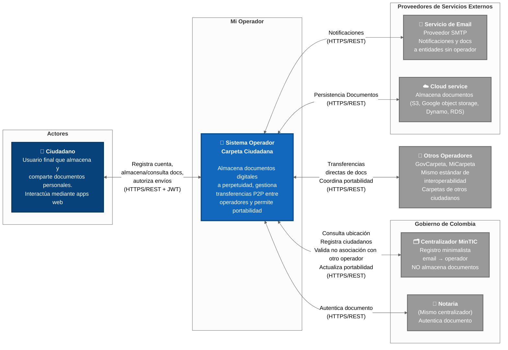
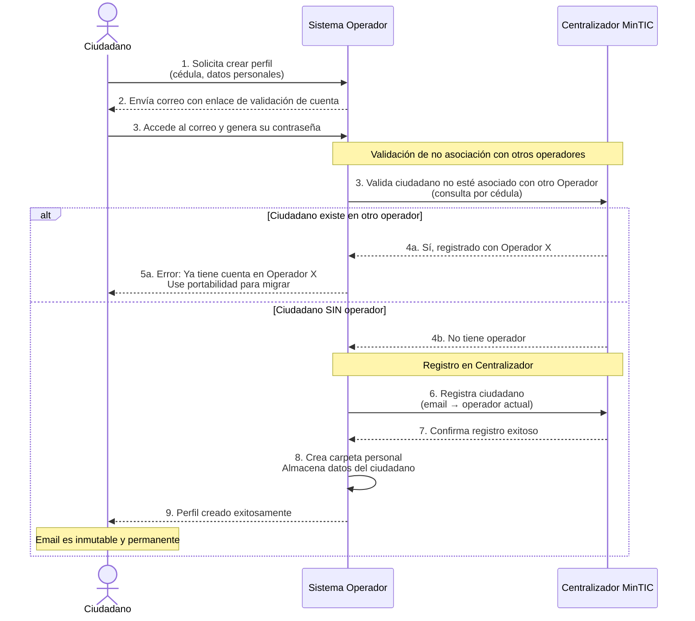
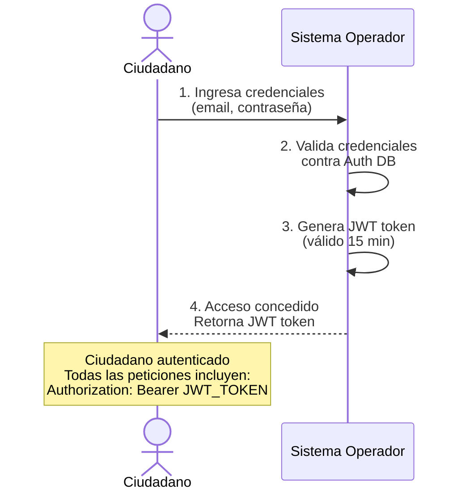
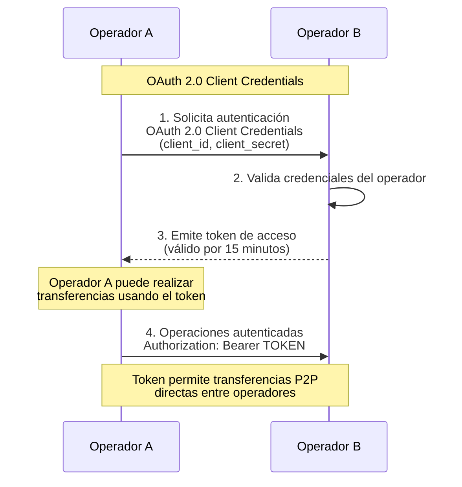
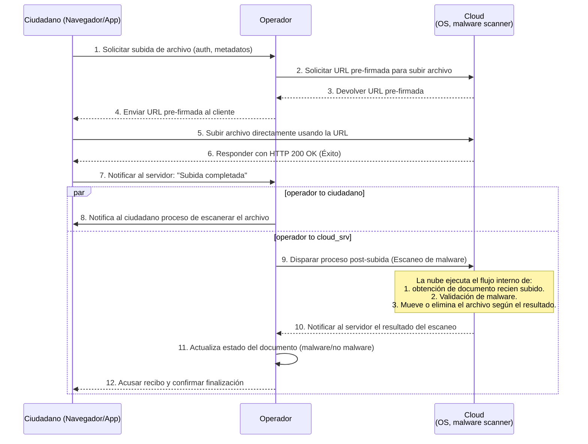
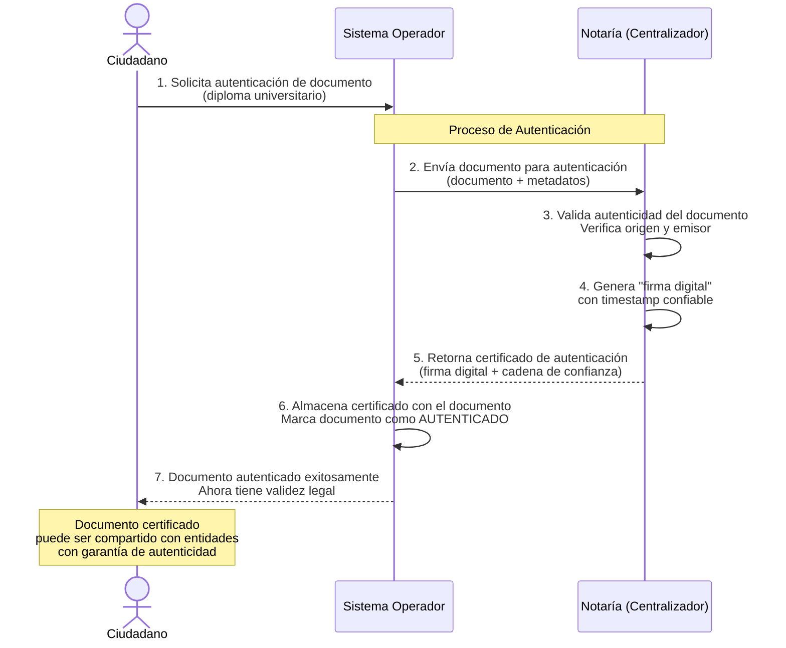
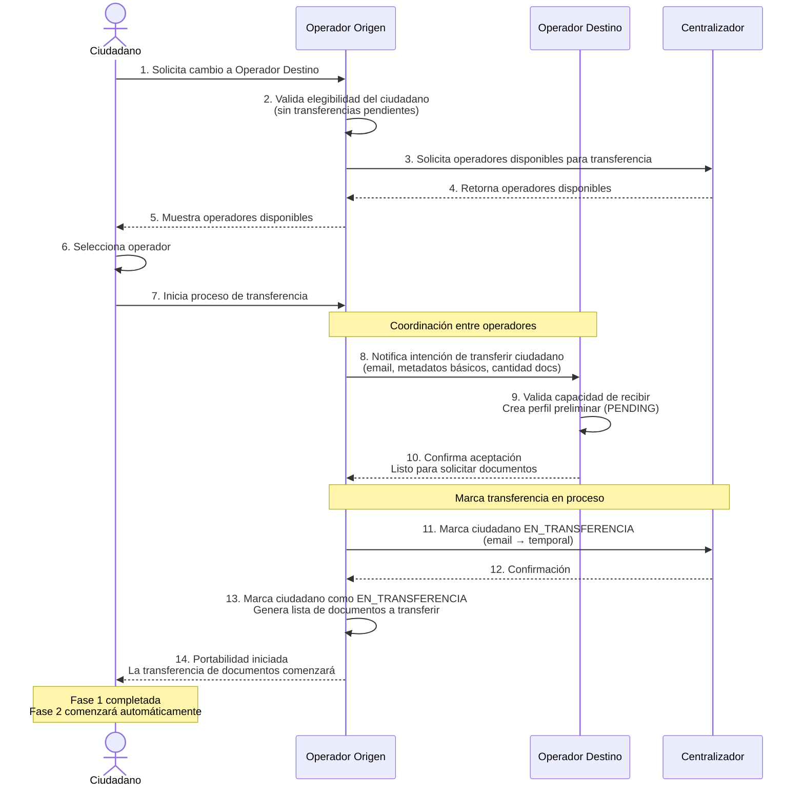
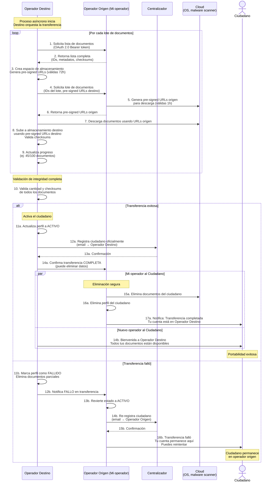
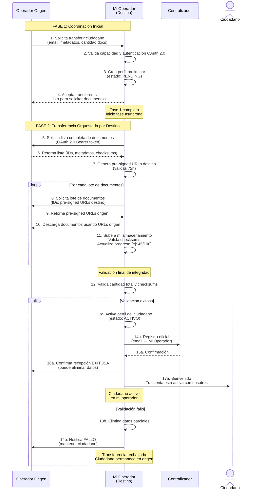

# Diagramas C4 - Sistema Carpeta Ciudadana

Este documento contiene los diagramas C4 (Context, Container, Component, Code) para el sistema Carpeta Ciudadana, siguiendo la metodología de Simon Brown.

## Tabla de Contenidos
1. [C4 Level 1: System Context](#c4-level-1-system-context)
2. [C4 Level 2: Container Diagram](#c4-level-2-container-diagram)

---

## C4 Level 1: System Context

El diagrama de contexto muestra el sistema Carpeta Ciudadana y cómo interactúa con usuarios y sistemas externos.

### Descripción del Contexto

#### Líneas de Separación (Boundaries)

El diagrama utiliza dos líneas conceptuales para organizar los elementos según las mejores prácticas de C4:

1. **Automation Line** (Línea de Automatización)
   - Separa los **actores humanos** (izquierda) del **sistema automatizado** (centro)
   - Define el límite entre interacciones manuales y procesos automatizados
   - Todo lo que cruza esta línea representa una interacción usuario-sistema

2. **Integration Line** (Línea de Integración)
   - Separa el **sistema principal** (centro) de **otros sistemas externos** (derecha)
   - Define los puntos de integración e interoperabilidad
   - Todo lo que cruza esta línea representa una integración sistema-a-sistema

#### Actores Principales (Izquierda - Automation Boundary)

- **Ciudadano**: Usuario final que almacena documentos personales (cédula, diplomas, certificados) y los comparte con entidades cuando lo necesita. Interactúa mediante aplicaciones web/móvil con autenticación multifactor.

#### Sistema Principal (Centro)

**Sistema Operador Carpeta Ciudadana**: Plataforma de gestión documental que implementa los requisitos de interoperabilidad definidos por MinTIC. Almacena documentos certificados a perpetuidad sin límite de tamaño, gestiona transferencias P2P directas entre operadores (sin pasar por MinTIC), y permite portabilidad entre operadores en máximo 72 horas.

#### Sistemas Externos (Derecha - Integration Boundary)

**1. Gobierno de Colombia**
   - **Centralizador MinTIC**: Registro minimalista que solo mantiene mapeo email → operador actual. NO almacena documentos, NO rutea información. Valida que el ciudadano no esté asociado con otro operador durante el registro. Almacenamiento estimado: 3-5 GB para todo el país (~50M ciudadanos). Responde consultas en <100ms (p95).

**2. Ecosistema de Operadores Privados**
   - **Otros Operadores**: Operadores competidores (ej: GovCarpeta, MiCarpeta) que implementan el mismo estándar de interoperabilidad. Gestionan carpetas de otros ciudadanos/entidades. Las transferencias son **P2P directas** (operador A → operador B) sin pasar por MinTIC. Soportan coordinación de portabilidad con migración completa de datos.

**3. Proveedores de Servicios Externos**
   - **Servicio de Email**: Proveedor SMTP/TLS para notificaciones a ciudadanos y entidades. También se usa para enviar documentos a entidades que no tienen operador (fallback cuando MinTIC responde "entidad sin operador").
   - **Servicios de Nube**: Usado para la persistencia de la información, por ejemplo, donde se guardan los documentos que son subidos por el usuario.

#### Flujos Clave de Información

**Transferencia de Documentos:**
1. Operador A consulta a MinTIC: "¿Dónde está ciudadano X?" → MinTIC: "Operador B"
2. Operador A transfiere documentos **DIRECTAMENTE** a Operador B (sin pasar por MinTIC)
3. Operador B confirma recepción (ACK) y notifica al ciudadano

**Portabilidad entre Operadores:**
1. Ciudadano solicita cambio de Operador A → Operador B
2. Operador A exporta TODOS los documentos + metadatos + historial
3. Operador B valida integridad, confirma recepción
4. MinTIC actualiza registro: email → Operador B
5. Proceso completo en máximo 72 horas

---

## C4 Level 2: Container Diagram

El diagrama de contenedores muestra la arquitectura interna del Sistema Operador Carpeta Ciudadana.

```mermaid
flowchart LR
    %%{init: {'theme': 'neutral', "flowchart" : { "curve" : "basis" } } }%%
    %% ============================================
    %% SISTEMA OPERADOR CARPETA CIUDADANA
    %% ============================================
    subgraph operator["<b>💼 Mi Operador - Sistema Operador Carpeta Ciudadana</b>"]
        subgraph frontend["<b>Capa de Presentación</b>"]
            web_app["💻 <b>Aplicación Web Ciudadano</b><br/>SPA para gestionar documentos"]
        end
                
        api_gateway["🚪 <b>API Gateway</b><br/>Autenticación, rate limiting, routing"]
        
        subgraph communication[" "]
            subgraph services["<b>Microservicios</b>"]
                carpeta_service["📁 <b>Carpeta Personal Service</b><br/>Gestiona carpetas de ciudadanos<br/>Genera pre-signed URLs"]
                transfer_service["🔄 <b>Transferencia Service</b><br/>Coordina transferencias P2P"]
                identity_service["👥 <b>Identidad y Registro Service</b><br/>Registro, verificación<br/>Centralizador genera email inmutable"]
                portability_service["📦 <b>Portabilidad Service</b><br/>Recepción nuevo ciudadano<br/>Usa pre-signed URLs para migración"]
                auth_service["🔐 <b>Autenticación Service</b><br/>JWT, MFA, sesiones<br/>OAuth 2.0 client credentials"]
                notification_service["🔔 <b>Notificaciones Service</b><br/>Email, SMS, push"]
                signature_service["✍️ <b>Digital Signature Service</b><br/>Coordina autenticación de docs"]
            end
            
            event_bus["⚡ <b>Event Bus</b><br/>Broker<br/>Comunicación asíncrona"]@{ shape: h-cyl}

            subgraph data["<b>Capa de Datos</b>"]
                carpeta_db[("🗄️ <b>Carpeta DB</b><br/>Metadatos de documentos")]
                identity_db[("🗄️ <b>Identity DB</b><br/>Registro ciudadanos/entidades")]
                cache[("⚡ <b>Cache</b><br/>Cache consultas Centralizador")]
            end
        end
    end

    %% ============================================
    %% SISTEMAS EXTERNOS
    %% ============================================
    subgraph externals["Sistemas externos"]
        direction TB
        subgraph gov["<b>Gobierno de Colombia</b>"]
            mintic["🗂️ <b>Centralizador MinTIC</b><br/>Registro minimalista<br/>email → operador<br/>NO almacena documentos"]
            gov_authorization["🔐 <b>Notaría</b><br/>(Mismo centralizador)<br/>Autentica documento"]
        end

        subgraph providers["<b>Proveedores de Servicios Externos</b>"]
            email_provider["📧 <b>Servicio de Email</b><br/>Proveedor SMTP<br/>Notificaciones y docs"]
            cloud_services["☁️ <b>Cloud service</b><br/>Almacena documentos (S3, Google object storage, Dynamo, RDS)"]
        end

        otro_operador["🔄 <b>Otros Operadores</b><br/>GovCarpeta, MiCarpeta<br/>Mismo estándar de interoperabilidad"]
    end

    
    %% ============================================
    %% ACTORES (Arriba)
    %% ============================================
    subgraph actors["Actores"]
        ciudadano("👤 <b>Ciudadano</b><br/>Usuario final que almacena y<br/>comparte documentos personales")
    end

    operator ~~~ externals

    %% ============================================
    %% RELACIONES: Frontend → Gateway
    %% ============================================
    web_app -->|"HTTPS/JSON<br/>JWT"| api_gateway

    %% ============================================
    %% RELACIONES: Gateway → Servicios
    %% ============================================
    api_gateway <-->|"HTTP/REST"| carpeta_service
    api_gateway <-->|"HTTP/REST"| transfer_service
    api_gateway <-->|"HTTP/REST"| portability_service
    api_gateway <-->|"HTTP/REST"| identity_service
    api_gateway <-->|"Autentica<br/>"| auth_service

    %% ============================================
    %% RELACIONES: Carpeta Service
    %% ============================================
    carpeta_service -->|"Almacena Datos de Documentos"| carpeta_db
    carpeta_service -->|"Object storage Service<br/>Pre-signed URLs"| cloud_services
    carpeta_service -->|"Publica eventos<br/>Broker"| event_bus

    %% ============================================
    %% RELACIONES: Digital Signature Service
    %% ============================================
    signature_service -->|"Consume eventos<br/>Broker"| event_bus
    signature_service -->|"Autentica documento<br/>HTTPS/REST"| gov_authorization

    %% ============================================
    %% RELACIONES: Transfer Service
    %% ============================================
    transfer_service <-->|"Consulta ubicación<br/>HTTPS/REST"| mintic
    transfer_service <-->|"Cache<br/>Redis Protocol (fallback)"| cache
    transfer_service <-->|"HTTPS/REST"| otro_operador
    transfer_service <-->|"Publica/Consume eventos<br/>Broker"| event_bus

    %% ============================================
    %% RELACIONES: Portability Service
    %% ============================================
    portability_service -->|"Actualiza operador<br/>HTTP/REST"| identity_service
    portability_service -->|"Actualiza registro<br/>HTTPS/REST"| mintic
    portability_service -->|"Coordina migración<br/>HTTPS/REST"| otro_operador
    portability_service -->|"Publica eventos<br/>Broker"| event_bus
    

    %% ============================================
    %% RELACIONES: Identity Service
    %% ============================================
    identity_service -->|"SQL"| identity_db
    identity_service -->|"Registra inicial<br/>Valida no asociación con otro operador<br/>HTTPS/REST"| mintic
    identity_service -->|"Publica eventos<br/>Broker"| event_bus

    %% ============================================
    %% RELACIONES: Auth Service
    %% ============================================
    auth_service -->|"Valida usuarios<br/>SQL"| identity_db

    %% ============================================
    %% RELACIONES: Notification Service
    %% ============================================
    notification_service -->|"Consume eventos<br/>Broker"| event_bus
    notification_service -->|"SMTP/TLS"| email_provider

    %% ============================================
    %% RELACIONES BIDIRECCIONALES
    %% ============================================
    otro_operador <-->|"Envía/Recibe Docs<br/>HTTPS/REST"| api_gateway
    otro_operador -->|"OAuth 2.0<br/>Client Credentials"| api_gateway

    %% ============================================
    %% RELACIONES: Actores → Frontend
    %% ============================================
    ciudadano -->|"HTTPS"| web_app

    %% ============================================
    %% ESTILOS
    %% ============================================
    classDef actorStyle fill:#08427B,stroke:#052E56,color:#fff,stroke-width:2px
    classDef frontendStyle fill:#63B3ED,stroke:#2C5282,color:#000,stroke-width:2px
    classDef gatewayStyle fill:#F6AD55,stroke:#C05621,color:#000,stroke-width:5px
    classDef serviceStyle fill:#68D391,stroke:#22543D,color:#000,stroke-width:5px
    classDef dataStyle fill:#B794F4,stroke:#44337A,color:#fff,stroke-width:2px
    classDef eventStyle fill:#FC8181,stroke:#742A2A,color:#fff,stroke-width:2px,width:100px
    classDef externalStyle fill:#999999,stroke:#666666,color:#fff,stroke-width:2px
    classDef systemStyle border:no-border,stroke-width:3px

    class ciudadano,entidad,admin actorStyle
    class web_app frontendStyle
    class api_gateway gatewayStyle
    class carpeta_service,carpeta_inst_service,transfer_service,portability_service,identity_service,auth_service,notification_service,signature_service serviceStyle
    class carpeta_db,identity_db,cache dataStyle
    class event_bus eventStyle
    class mintic,gov_authorization,otro_operador,email_provider,cloud_services externalStyle

    class system systemStyle

    %% ============================================
    %% ESTILOS DE LÍNEAS/ENLACES
    %% ============================================
    linkStyle 2,3,4,5,6 stroke:#F6AD55,stroke-width:2px %% API Gateway
    linkStyle 7,8,9 stroke:#68D391,stroke-width:2px %% Carpeta Service
    linkStyle 10,11 stroke:#FDB366,stroke-width:2px %% Digital Signature Service
    linkStyle 12,13,14,15 stroke:#9F7AEA,stroke-width:2px %% Transfer Service
    linkStyle 16,17,18,19 stroke:#38B2AC,stroke-width:2px %% Portability Service
    linkStyle 20,21,22 stroke:#FC8181,stroke-width:2px %% Identity Service
    linkStyle 23 stroke:#4ADE80,stroke-width:2px %% Auth Service
    linkStyle 24,25 stroke:#FBB6CE,stroke-width:2px %% Notification Service
    linkStyle 26,27 stroke:#06B6D4,stroke-width:2px %% Otro Operador Service

```

### Descripción de Contenedores

**Frontend Applications:**
- **Aplicación Web Ciudadano**: SPA para gestión de documentos personales

**Core Services (Microservicios):**
- **Carpeta Personal Service**: CRUD de documentos ciudadanos, genera pre-signed URLs para uploads directos a S3
- **Transferencia Service**: Transferencias P2P entre operadores (sin pasar por Centralizador)
- **Portabilidad Service**: Cambio de operador en 72h con migración de datos usando pre-signed URLs
- **Identidad y Registro Service**: Registro inicial, Centralizador genera email inmutable @carpetacolombia.co
- **Autenticación Service**: MFA, JWT tokens, gestión de sesiones, valida OAuth 2.0 client credentials para operadores
- **Notificaciones Service**: Envío de notificaciones multi-canal (email, SMS, push)
- **Digital Signature Service**: Consume eventos de autenticación, coordina con Notaría para validar documentos

**Data Stores:**
- **Carpeta DB**: Metadatos de documentos, historial de accesos
- **Document Storage**: Archivos binarios (S3-compatible), accesible vía pre-signed URLs
- **Identity DB**: Ciudadanos, entidades, verificaciones, credenciales OAuth 2.0 de operadores
- **Cache**: Redis para cachear consultas al Centralizador (reduce latencia y carga)

**Infrastructure:**
- **API Gateway**: Kong/Nginx para routing, autenticación JWT/OAuth 2.0, rate limiting
- **Event Bus**: Kafka/RabbitMQ para comunicación asíncrona entre servicios

### Flujos Clave Implementados

**1. Crear Perfil de Ciudadano:**
- Ciudadano solicita registro → Identity Service valida que no esté asociado con otro operador consultando al Centralizador
- Operador envía email de confirmación → Ciudadano establece contraseña
- Identity Service registra ciudadano en Centralizador (email → operador actual)

**2. Autenticar Usuario/Operador:**
- **Ciudadanos**: Auth Service valida credenciales contra Identity DB, genera JWT token (válido 15 min)
- **Operadores**: API Gateway valida OAuth 2.0 Client Credentials contra Identity DB

**3. Subir Documentos:**
- Carpeta Service genera pre-signed URL (válida 15 min)
- Ciudadano sube documento directamente a Cloud Storage
- Carpeta Service almacena metadatos en Carpeta DB

**4. Autenticar Documento:**
- Carpeta Service publica evento `DocumentoSubido` al Event Bus
- Digital Signature Service consume evento
- Digital Signature Service coordina con Notaría (Centralizador) para autenticación

**5. Transferir Perfil (Portabilidad):**
- Operador destino orquesta la transferencia (pull-based approach)
- Portability Service solicita lista de documentos al operador origen (OAuth 2.0 Bearer token)
- Operador destino genera pre-signed URLs (válidas 72h) en su Cloud Storage
- Operador origen genera pre-signed URLs temporales (válidas 1h) para descarga
- Operador destino descarga, valida checksums, y confirma integridad total
- Portability Service actualiza registro en Centralizador (email → nuevo operador)

---

## Diagramas de Secuencia - 5 Escenarios

### Escenario 1: Crear Perfil de Ciudadano

### Escenario 2: Autenticar Usuario/Operadores

#### 2.1 Autenticación de Ciudadano

#### 2.2 Autenticación entre Operadores

### Escenario 3: Subir Documentos

### Escenario 4: Autenticar Documento

### Escenario 5: Transferir Perfil de Ciudadano (Portabilidad)

#### 5a. Portabilidad: Fase 1 - Iniciar Portabilidad y Registro

**Perspectiva: Coordinación inicial entre operadores (proceso síncrono)**

#### 5b. Portabilidad: Fase 2 - Transferencia Asíncrona de Documentos

**Perspectiva: Migración de documentos (proceso asíncrono - Destino orquesta la transferencia)**

#### 5c. Recibir Ciudadano: Perspectiva del Operador Destino

**Perspectiva: Mi operador RECIBE un ciudadano (ambas fases - Yo orquesto la transferencia)**

---

## Decisiones de Diseño Clave

### Patrones Aplicados

1. **Adapter Pattern**:
   - **MinTIC Registry Adapter**: Adapta la API del Centralizador MinTIC a interfaces del dominio interno
   - **External Operator Adapter**: Permite integración con múltiples operadores con diferentes APIs
   - **Storage Adapter**: Abstrae el almacenamiento (S3, MinIO, Azure Blob)
   - **Digital Signature Adapter**: Adapta diferentes proveedores de firma digital

2. **Proxy Pattern**:
   - **MinTIC Caching Proxy**: Añade cache sobre el adapter para reducir latencia y carga
   - **Operator Retry Proxy**: Añade reintentos automáticos, circuit breaker y timeouts para llamadas a operadores externos

3. **Arquitectura Hexagonal (Ports & Adapters)**:
   - Lógica de negocio (Use Cases) independiente de frameworks
   - Adapters intercambiables sin afectar el core
   - Facilita testing con mocks

4. **Event-Driven Architecture**:
   - Servicios publican eventos de dominio al Event Bus
   - Desacoplamiento entre servicios (ej: Notification Service consume eventos)

### Decisiones de Escalabilidad

- **API Gateway**: Balanceo de carga, rate limiting
- **Microservicios independientes**: Escalado horizontal por servicio según demanda
- **Cache distribuido**: Redis para reducir latencia en consultas a MinTIC (99% menos llamadas)
- **Document Storage**: S3-compatible para escalabilidad infinita
- **Event Bus**: Kafka para alta throughput (~5M transferencias/día)

### Decisiones de Disponibilidad

- **Circuit Breaker**: Evita cascading failures cuando operadores externos fallan
- **Retry Logic**: Reintentos exponenciales en transferencias P2P
- **Cache Fallback**: Si MinTIC cae, se usa cache (eventual consistency)
- **Multiple Replicas**: Cada servicio con múltiples réplicas en Kubernetes

---

## Referencias

- [Análisis DDD del Sistema](./informacion_cruda/ddd_analisis/ddd__analisis.md)
- [Requisitos Funcionales](./informacion_cruda/1_req_funcionales.md)
- [Requisitos No Funcionales](./informacion_cruda/2_req_no_funcionales.md)
- [C4 Model Specification](https://c4model.com/)

