# Diagrama de Despliegue - Carpeta Ciudadana

## Arquitectura Completa en Kubernetes (Minikube)

```mermaid
graph TB
    subgraph "Servicios Externos"
        GovCarpeta["🌐 GovCarpeta API<br/>Heroku<br/>https://govcarpeta-apis-4905ff3c005b.herokuapp.com<br/>Protocol: HTTPS"]
        SendGrid["📧 SendGrid API<br/>Email Service<br/>Protocol: HTTPS"]
    end

    subgraph "Kubernetes Cluster (Minikube - Docker Driver)"
        subgraph "Frontend Layer"
            CitizenWeb["🖥️ citizen-web<br/>React + TypeScript + Vite<br/>Nginx<br/>Port: 80 (internal: 8080)<br/>NodePort: -<br/>Service: LoadBalancer"]
        end

        subgraph "Application Services"
            AuthService["🔐 auth-service<br/>Go 1.23 + Echo<br/>Port: 8080<br/>NodePort: 30080<br/>JWT Authentication<br/>Service: ClusterIP + NodePort"]
            
            CarpetaService["📂 carpeta-ciudadana-service<br/>Spring Boot 3.2 + Java 21<br/>Port: 8080<br/>NodePort: 30081<br/>Document Management<br/>Service: LoadBalancer + NodePort"]
            
            CiudadanoRegistry["👤 ciudadano-registry-service<br/>Spring Boot 3.2 + Java 17<br/>Port: 8081<br/>NodePort: -<br/>Citizen Registration<br/>Service: ClusterIP"]
            
            DocAuthService["✅ document-authentication-service<br/>Python 3.13 + FastAPI<br/>Port: 8083<br/>NodePort: 30093<br/>Document Verification<br/>Service: ClusterIP + NodePort"]
            
            NotifService["📨 notifications-service<br/>Go 1.23 + Echo<br/>Port: 8080<br/>NodePort: 30090<br/>Email Notifications<br/>Service: ClusterIP + NodePort"]
        end

        subgraph "Message Broker"
            RabbitMQ["🐰 RabbitMQ Cluster<br/>RabbitMQ 3.13-management<br/>3 Nodes (StatefulSet)<br/>───────────────<br/>carpeta-rabbitmq-server-0 (seed)<br/>carpeta-rabbitmq-server-1<br/>carpeta-rabbitmq-server-2<br/>───────────────<br/>AMQP Port: 5672<br/>Management UI: 15672<br/>Prometheus: 15692<br/>───────────────<br/>Quorum Queues:<br/>- document_verification_request<br/>- document_verified_response<br/>- document_authenticated_response<br/>- notifications.email.queue<br/>───────────────<br/>Exchanges:<br/>- microservices.topic (topic)<br/>- carpeta.events (topic)<br/>───────────────<br/>Storage: 10Gi x 3 (PVC)<br/>Service: LoadBalancer"]
        end

        subgraph "Data Layer"
            AuthPostgres["🗄️ auth-postgres<br/>PostgreSQL 15-alpine<br/>Port: 5432<br/>Database: auth_service_db<br/>Tables:<br/>- users<br/>- audit_logs<br/>Service: ClusterIP"]
            
            DynamoDB["📊 DynamoDB Local<br/>amazon/dynamodb-local<br/>Port: 8000<br/>Tables:<br/>- CarpetaCiudadano<br/>- Documento<br/>- HistorialAcceso<br/>Service: ClusterIP"]
            
            MinIO["📦 MinIO<br/>minio/minio:latest<br/>API Port: 9000<br/>Console Port: 9001<br/>NodePort Console: 30901<br/>Bucket: carpeta-ciudadana-docs<br/>Storage:<br/>- Documentos PDF/JPEG/PNG<br/>- Presigned URLs (15min)<br/>Service: ClusterIP + NodePort (console)"]
        end
    end

    %% Frontend to Services
    CitizenWeb -->|"HTTP/REST<br/>Port 8080"| AuthService
    CitizenWeb -->|"HTTP/REST<br/>Port 8080"| CarpetaService
    
    %% Auth Service connections
    AuthService -->|"HTTP/REST<br/>Port 8081<br/>validate/register citizen"| CiudadanoRegistry
    AuthService -->|"AMQP<br/>Port 5672<br/>user.registration.email<br/>user.registration.complete"| RabbitMQ
    AuthService -->|"SQL<br/>Port 5432<br/>Store users & audit"| AuthPostgres
    
    %% Carpeta Service connections
    CarpetaService -->|"HTTP/REST<br/>Port 9000<br/>Upload/Download docs"| MinIO
    CarpetaService -->|"HTTP<br/>Port 8000<br/>Store metadata"| DynamoDB
    CarpetaService -->|"AMQP<br/>Port 5672<br/>document events"| RabbitMQ
    
    %% Ciudadano Registry connections
    CiudadanoRegistry -->|"HTTPS<br/>validateCitizen<br/>registerCitizen<br/>unregisterCitizen"| GovCarpeta
    CiudadanoRegistry -->|"HTTP/REST<br/>Port 8080<br/>create folder"| CarpetaService
    CiudadanoRegistry -->|"HTTP<br/>Port 8000<br/>Store registry"| DynamoDB
    
    %% Document Auth Service connections
    DocAuthService -->|"HTTP/REST<br/>Port 8080<br/>get presigned URL"| CarpetaService
    DocAuthService -->|"HTTPS<br/>authenticateDocument"| GovCarpeta
    DocAuthService -->|"AMQP<br/>Port 5672<br/>publish auth result"| RabbitMQ
    
    %% Notifications Service connections
    RabbitMQ -->|"AMQP<br/>Port 5672<br/>consume events"| NotifService
    NotifService -->|"HTTPS<br/>Send emails"| SendGrid
    
    %% Styling
    classDef frontend fill:#e1f5ff,stroke:#01579b,stroke-width:3px,color:#000
    classDef service fill:#fff3e0,stroke:#e65100,stroke-width:2px,color:#000
    classDef messaging fill:#f3e5f5,stroke:#4a148c,stroke-width:3px,color:#000
    classDef database fill:#e8f5e9,stroke:#1b5e20,stroke-width:2px,color:#000
    classDef external fill:#ffebee,stroke:#b71c1c,stroke-width:2px,color:#000
    
    class CitizenWeb frontend
    class AuthService,CarpetaService,CiudadanoRegistry,DocAuthService,NotifService service
    class RabbitMQ messaging
    class AuthPostgres,DynamoDB,MinIO database
    class GovCarpeta,SendGrid external
```



## Tecnologías por Componente

### Frontend
| Componente | Tecnología | Puerto | Tipo |
|------------|-----------|--------|------|
| citizen-web | React 19 + TypeScript + Vite + Nginx | 80 (8080) | LoadBalancer |

### Servicios de Aplicación
| Servicio | Tecnología | Puerto Interno | NodePort | Tipo |
|----------|-----------|----------------|----------|------|
| auth-service | Go 1.23 + Echo Framework | 8080 | 30080 | ClusterIP + NodePort |
| carpeta-ciudadana-service | Spring Boot 3.2 + Java 21 | 8080 | 30081 | LoadBalancer + NodePort |
| ciudadano-registry-service | Spring Boot 3.2 + Java 17 | 8081 | - | ClusterIP |
| document-authentication-service | Python 3.13 + FastAPI | 8083 | 30093 | ClusterIP + NodePort |
| notifications-service | Go 1.23 + Echo Framework | 8080 | 30090 | ClusterIP + NodePort |

### Message Broker
| Componente | Tecnología | Puertos | Tipo |
|------------|-----------|---------|------|
| RabbitMQ Cluster | RabbitMQ 3.13-management (3 nodos) | AMQP: 5672<br/>Management: 15672<br/>Prometheus: 15692 | LoadBalancer |

### Capa de Datos
| Componente | Tecnología | Puerto | Tipo |
|------------|-----------|--------|------|
| auth-postgres | PostgreSQL 15-alpine | 5432 | ClusterIP |
| dynamodb-local | amazon/dynamodb-local | 8000 | ClusterIP |
| minio | minio/minio:latest | API: 9000<br/>Console: 9001 (NodePort: 30901) | ClusterIP + NodePort |

### Servicios Externos
| Servicio | URL | Protocolo |
|----------|-----|-----------|
| GovCarpeta API | https://govcarpeta-apis-4905ff3c005b.herokuapp.com | HTTPS |
| SendGrid | SendGrid API | HTTPS |

## Protocolos de Comunicación

### HTTP/REST
- **citizen-web → auth-service**: Autenticación, registro, gestión de perfil
- **citizen-web → carpeta-ciudadana-service**: Gestión de documentos, carpetas
- **auth-service → ciudadano-registry-service**: Validación y registro de ciudadanos
- **carpeta-ciudadana-service → minio**: Upload/Download de documentos
- **carpeta-ciudadana-service → dynamodb-local**: Almacenamiento de metadatos
- **ciudadano-registry-service → carpeta-ciudadana-service**: Creación de carpetas
- **ciudadano-registry-service → dynamodb-local**: Registro de ciudadanos
- **document-authentication-service → carpeta-ciudadana-service**: Obtención de URLs prefirmadas

### HTTPS (Servicios Externos)
- **ciudadano-registry-service → GovCarpeta**: Validación/registro/desregistro de ciudadanos
- **document-authentication-service → GovCarpeta**: Autenticación de documentos
- **notifications-service → SendGrid**: Envío de emails

### AMQP (RabbitMQ)
- **auth-service → RabbitMQ**: Publica eventos de registro de usuario
  - `user.registration.email` (verificación)
  - `user.registration.complete` (bienvenida)
- **carpeta-ciudadana-service → RabbitMQ**: Publica eventos de documentos
- **document-authentication-service → RabbitMQ**: Publica resultados de autenticación
  - `document_authenticated_response`
- **RabbitMQ → notifications-service**: Consume eventos para enviar notificaciones

### SQL
- **auth-service → auth-postgres**: Almacenamiento de usuarios y auditoría

## Colas y Exchanges de RabbitMQ

### Exchanges
| Exchange | Tipo | Uso |
|----------|------|-----|
| microservices.topic | topic | Eventos generales del sistema |
| carpeta.events | topic | Eventos específicos de carpeta |

### Queues
| Queue | Tipo | Propósito |
|-------|------|-----------|
| document_verification_request | quorum | Solicitudes de verificación |
| document_verified_response | quorum | Respuestas de verificación |
| document_authenticated_response | quorum | Resultados de autenticación |
| notifications.email.queue | quorum | Emails a enviar |

### Routing Keys
- `user.registration.email`: Email de verificación
- `user.registration.complete`: Email de bienvenida
- `document.verified`: Documento verificado
- `document.authenticated`: Documento autenticado

## Almacenamiento

### PostgreSQL (auth-postgres)
- **users**: Usuarios registrados con contraseñas hasheadas
- **audit_logs**: Auditoría de operaciones de seguridad

### DynamoDB Local
- **CarpetaCiudadano**: Metadatos de carpetas ciudadanas
- **Documento**: Metadatos de documentos (título, tipo, contexto, hash, estado)
- **HistorialAcceso**: Auditoría de accesos a documentos

### MinIO
- **Bucket**: `carpeta-ciudadana-docs`
- **Contenido**: Archivos PDF, JPEG, PNG
- **URLs prefirmadas**: Válidas por 15 minutos
- **Tamaño máximo**: 50MB por archivo

## Notas de Despliegue

1. **Cluster**: Minikube con driver Docker
2. **Namespace**: `carpeta-ciudadana` (todos los servicios)
3. **Image Pull Policy**: `Never` o `IfNotPresent` (imágenes locales)
4. **Persistencia**: 
   - RabbitMQ: 10Gi x 3 nodos (PVC)
   - PostgreSQL: EmptyDir (no persistente en esta configuración)
   - MinIO: EmptyDir (no persistente en esta configuración)
5. **Alta Disponibilidad**:
   - RabbitMQ: 3 nodos con Quorum Queues
   - Frontend: 3 réplicas
   - Otros servicios: 1 réplica

## Acceso desde el Host (Minikube)

### NodePort Services
```bash
# Get Minikube IP
minikube ip  # Example: 192.168.49.2

# Access services:
# auth-service: http://192.168.49.2:30080
# carpeta-ciudadana-service: http://192.168.49.2:30081
# document-authentication-service: http://192.168.49.2:30093
# notifications-service: http://192.168.49.2:30090
# minio-console: http://192.168.49.2:30901
```

### LoadBalancer Services (via tunnel)
```bash
# Start Minikube tunnel (requiere sudo)
minikube tunnel

# Access:
# citizen-web: http://localhost
# carpeta-ciudadana-service: http://localhost:8080
# RabbitMQ Management: http://localhost:15672
```
