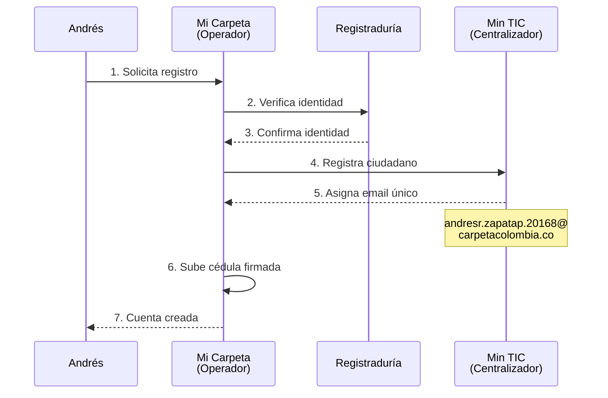
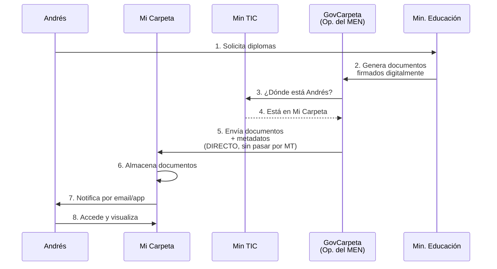
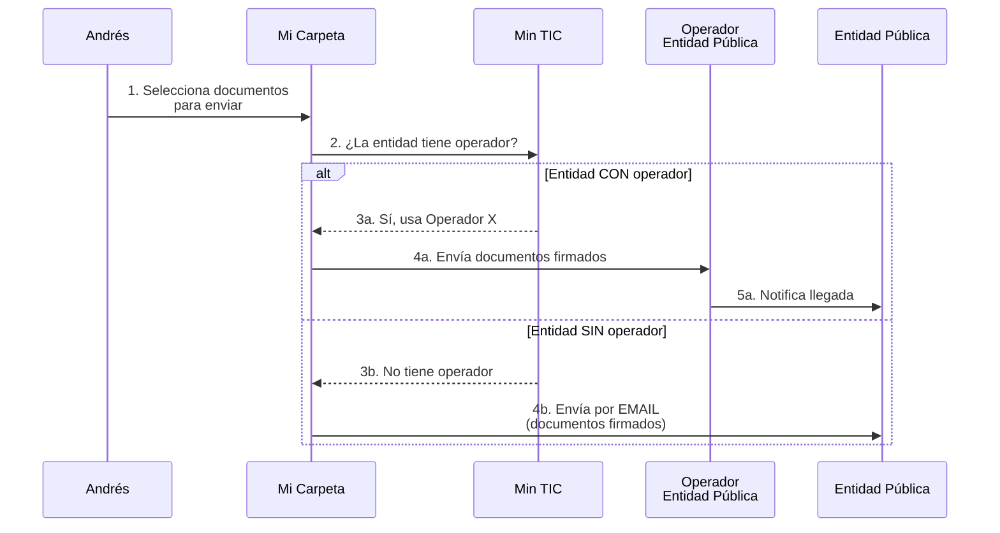
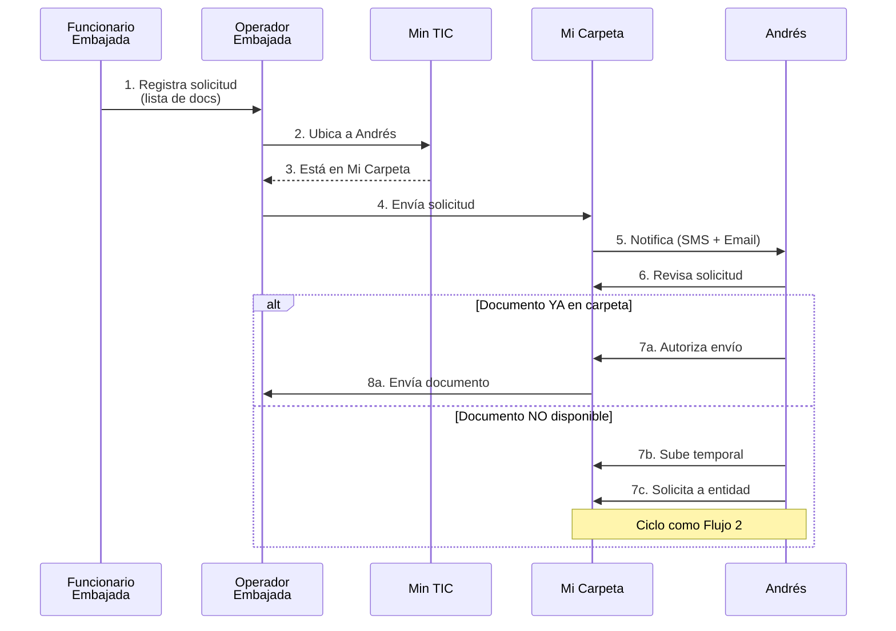

# Análisis del Caso de Estudio: Carpeta Ciudadana

## 1. Contexto y Visión del Sistema

**Principio fundamental:** "El ciudadano no debe ser el mensajero del estado"

Esto significa que los ciudadanos no deberían tener que estar llevando físicamente documentos de una entidad a otra. En su lugar, el sistema permite compartir documentos digitalmente de forma segura.

**Por ejemplo:**
Imagina que actualmente necesitas llevar tu diploma físico a 5 lugares diferentes. Con Carpeta Ciudadana, subes el diploma una vez y lo compartes electrónicamente con quien necesites, sin moverte de tu casa.

## 2. Actores Principales del Sistema

### A. **Ciudadanos**
- Usuarios finales que almacenan sus documentos
- Pueden recibir, enviar y compartir documentos
- Ejemplo: Andrés Zapata

### B. **Operadores Privados** (empresas certificadas)
- Proveen la infraestructura tecnológica
- Almacenan los documentos de los ciudadanos
- Ofrecen servicios básicos gratuitos y Premium de pago
- Ejemplos mencionados:
  - **Mi Carpeta** (operador de Andrés)
  - **GovCarpeta** (usado por el Ministerio de Educación)
  - **PQCarpeta** (servicio Premium para PQRS)

### C. **Ministerio TIC (Min TIC)**
- Opera el "centralizador"
- Facilita la interoperabilidad entre operadores
- NO almacena documentos, solo coordina
- Mantiene el registro de qué ciudadano está con qué operador

### D. **Entidades Emisoras**
- Producen y firman documentos oficiales
- Ejemplos: Registraduría, Ministerio de Educación, bancos, empleadores
- Pueden estar o no afiliadas a un operador

### E. **Entidades Receptoras**
- Reciben documentos de los ciudadanos
- Ejemplos: embajadas, empleadores, empresas de servicios

## 3. Flujos Principales del Sistema

### **Flujo 1: Registro Inicial de Andrés**

**Puntos clave:**
- Un ciudadano solo puede estar con UN operador a la vez
- El email es único y permanente (nunca cambia)
- Puede cambiar de operador, pero NO de email

### **Flujo 2: Recepción de Documentos Oficiales (Diplomas)**

**Puntos clave:**
- El centralizador solo UBICA al operador (no transfiere documentos)
- La transferencia es DIRECTA entre operadores
- Los documentos incluyen metadatos (clasificación, contexto, fechas, entidad emisora)
- Firma digital garantiza autenticidad

### **Flujo 3: Envío de Documentos a Entidad Pública**

### **Flujo 4: Solicitud de Documentos (Visa)**

**Puntos clave:**
- Las entidades pueden SOLICITAR documentos
- El ciudadano debe AUTORIZAR el envío
- Puede subir temporales mientras obtiene los oficiales

## 4. Requerimientos Clave

### **Requerimientos Funcionales**

1. **Almacenamiento perpetuo** de documentos certificados
2. **Compartir documentos** con entidades y empresas
3. **Firma digital** para autenticidad
4. **Gestión de permisos** para controlar quién ve qué
5. **Notificaciones** (email, SMS)
6. **Búsqueda y clasificación** mediante metadatos
7. **Portabilidad** entre operadores (cambio de operador)
8. **Servicios Premium** opcionales

### **Requerimientos No Funcionales (Calidad - QoS)**

#### **Escalabilidad:**
- **Usuarios:** ~50 millones de ciudadanos colombianos
- **Documentos:** Crecimiento progresivo (diplomas, certificados médicos, escrituras, declaraciones de renta, etc.)
- **Almacenamiento:** Ilimitado para documentos certificados

#### **Disponibilidad:**
- **"Prácticamente total"** → Objetivo: 99.9% o superior
- Sistema crítico (documentos importantes como escrituras, certificados médicos)

#### **Rendimiento/Latencia:**
- **NO es tiempo real**, pero debe tener latencia baja
- El ciudadano debe recibir notificaciones rápidamente
- Las transferencias deben ser ágiles

#### **Seguridad:**

**Confidencialidad:**
- Solo el dueño y autorizados pueden ver documentos

**Integridad:**
- Firma digital previene modificaciones no autorizadas

**Autenticación:**
- Verificación sólida de identidad (Registraduría)

**Autorización:**
- Control granular de permisos (quién puede ver/modificar qué)

#### **Usabilidad:**
- **Crítico:** Población con bajo nivel tecnológico debe poder usarlo
- Interfaces simples e intuitivas
- Múltiples canales (web, móvil, notificaciones)

#### **Interoperabilidad:**
- Múltiples operadores deben comunicarse entre sí
- Centralizador de Min TIC facilita la comunicación

#### **Eficiencia del Centralizador:**
- **Mínimas transacciones** al centralizador
- **Mínimo almacenamiento** en el centralizador
- **Mínima transferencia de datos** operador ↔ centralizador

## 5. Restricciones y Libertades

### **Libertades:**
- Operadores eligen su propia tecnología
- Almacenamiento puede ser en la nube (incluso fuera del país)
- Modelos de negocio flexibles (gratuito + Premium)

### **Restricciones:**
- Centralizador debe ser minimalista (poco procesamiento, poco almacenamiento)
- Transferencias directas entre operadores (no pasan por centralizador)
- Email del ciudadano es permanente
- Un ciudadano, un operador (a la vez)

## 6. Servicios Premium (Ejemplos)

**PQCarpeta para PQRS:**
- Empresas privadas (TV, internet, etc.) gestionan casos de soporte
- Solicitan documentos a clientes sin importar su operador
- Los clientes autorizan desde su carpeta
- La empresa paga por este servicio al operador PQCarpeta

## 7. Análisis de Datos (Big Data)

El Estado quiere analizar **metadatos** (NO el contenido de los documentos) para:

**Contextos de análisis:**
- **Notarías:** Tendencias en escrituras, transacciones inmobiliarias
- **Educación:** Niveles educativos, instituciones, distribución geográfica
- **Registraduría:** Información demográfica, identificación

**Ejemplo de pregunta:**
- "¿Cuántos ciudadanos entre 25-35 años tienen título universitario en Bogotá?"
- Se responde con metadatos (edad, ubicación, tipo de documento)
- NO se accede al contenido del diploma

## 8. Desafíos Arquitectónicos Principales

Basándome en los requerimientos, estos son los principales retos:

### **Reto 1: Descentralización con Interoperabilidad**
- Múltiples operadores independientes
- Deben comunicarse entre sí de forma eficiente
- Centralizador minimalista

### **Reto 2: Escalabilidad Masiva**
- 50M+ usuarios
- Documentos ilimitados (certificados)
- Crecimiento continuo

### **Reto 3: Seguridad Multi-nivel**
- Autenticación robusta
- Autorización granular
- Firma digital
- Confidencialidad entre operadores

### **Reto 4: Alta Disponibilidad**
- Documentos críticos
- Acceso 24/7
- Tolerancia a fallos

### **Reto 5: Usabilidad Universal**
- Interfaces para población no técnica
- Múltiples canales de acceso

## Preguntas para Profundizar

1. ¿Necesitas entender la arquitectura técnica que podría soportar este sistema?
2. ¿Te interesa analizar los patrones de diseño aplicables?
3. ¿Quieres que profundicemos en algún flujo específico?
4. ¿Necesitas diagramas arquitectónicos (contexto, contenedores, componentes)?
5. ¿Te gustaría analizar estrategias de implementación?
6. ¿Quieres explorar cómo garantizar los requerimientos de calidad (seguridad, disponibilidad, etc.)?

