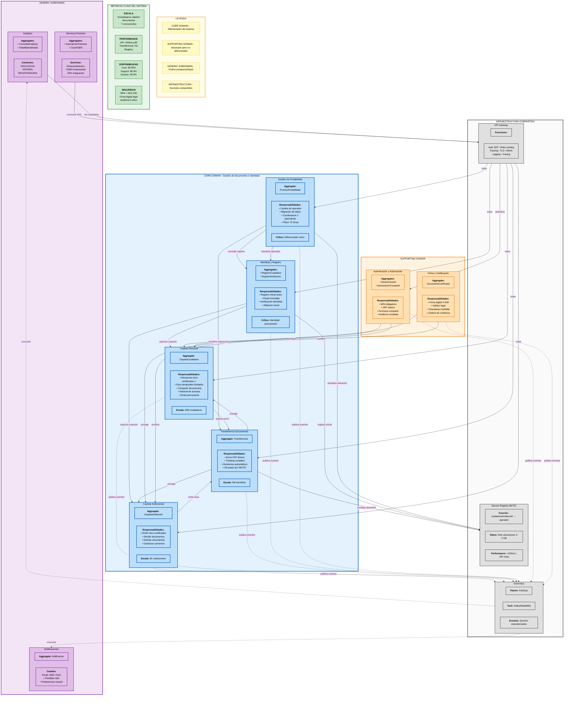
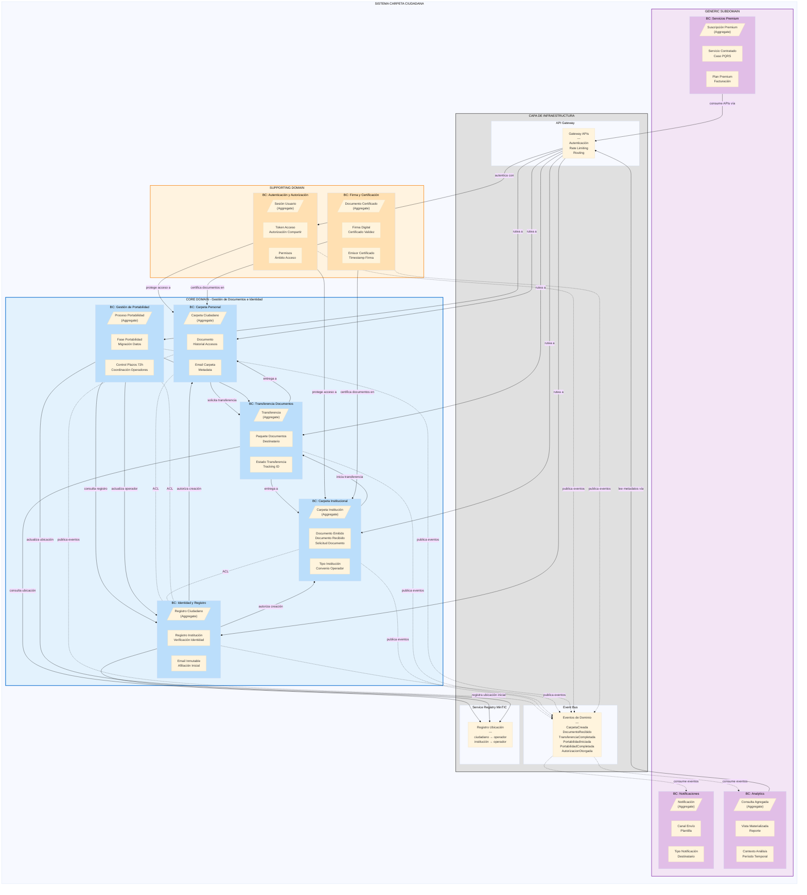

# Aplicación de Domain-Driven Design (DDD) - Arquitectura Sistema Carpeta Ciudadana

A continuación se realiza un análisis aplicando DDD al caso de estudio ["Carpeta Ciudadana"](../caso_estudio.pdf), enfocándonos **exclusivamente** en los conceptos de DDD, sin pensar aún en requisitos funcionales ni implementación.

## 1. Visión General del Sistema

## 2. Context Map y Relaciones entre Dominios

## 3. Descripción Detallada de Cada Dominio
- Visualiza [Lenguaje Ubicuo](./1_lenguaje_ubicuo.md) para entender el dialecto usado en este dominio.
- Visualiza [Descripción del dominio](./2_domain-description.md) para tener una visión completa de entidades, agregados
