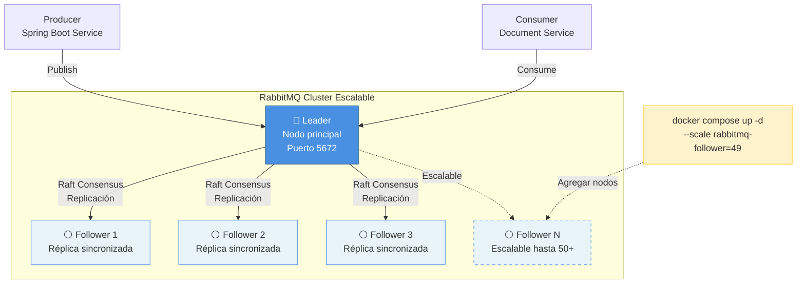

# Carpeta Ciudadana - Infraestructura de Desarrollo Local Escalable

Esta carpeta contiene la configuración de Docker Compose para ejecutar toda la infraestructura necesaria para el desarrollo local del sistema Carpeta Ciudadana, **incluyendo un cluster RabbitMQ escalable con arquitectura Leader-Followers**.

## Componentes Incluidos

### 1. **MinIO** - Almacenamiento de Documentos (S3-compatible)

- **Puerto**: 9000 (API), 9001 (Console)
- **Acceso Console**: <http://localhost:9001>
- **Credenciales**: admin / admin123

### 2. **DynamoDB Local** - Base de Datos NoSQL

- **Puerto**: 8000
- **AWS Endpoint**: <http://localhost:8000>

### 3. **DynamoDB Admin** - Interfaz Web para DynamoDB

- **Puerto**: 8001
- **Acceso**: <http://localhost:8001>

### 4. **RabbitMQ Cluster Escalable** - Message Broker (Leader + Followers)

- **Arquitectura**: Leader-Followers escalable (ADR-0004)
- **Configuración Default**: 1 Leader + 4 Followers = 5 nodos
- **Escalabilidad**: De 3 hasta 50+ nodos con un solo comando
- **Acceso Leader**:
  - AMQP: localhost:5672
  - Management UI: <http://localhost:15672>
- **Credenciales**: admin / admin123
- **ADRs**: Ver ADR-0004 (Leader-Followers) y ADR-0005 (Ubicación)

### 5. **Carpeta Ciudadana Service** - Microservicio Spring Boot

- **Puerto**: 8080
- **API Base**: <http://localhost:8080>

## Inicio Rápido

### Requisitos Previos

- Docker Desktop 4.0+ con Docker Compose
- **RAM Recomendada por Configuración:**
  - 3 nodos: 8GB RAM
  - 5 nodos (default): 12GB RAM
  - 10 nodos: 16GB RAM
  - 50 nodos: 32GB+ RAM
- Mínimo 4 cores CPU
- 20GB espacio en disco disponible

### Iniciar con Configuración Default (5 Nodos)

```bash
# Desde la raíz del proyecto
cd infrastructure/docker

# Iniciar todos los servicios con configuración default
# 1 Leader + 4 Followers = 5 nodos RabbitMQ
docker compose up -d

# Ver logs de todos los servicios
docker compose logs -f

# Ver logs solo de RabbitMQ
docker compose logs -f rabbitmq-leader rabbitmq-follower
```

### Escalar el Cluster RabbitMQ

El cluster RabbitMQ usa arquitectura **Leader-Followers escalable** que permite ajustar el número de nodos dinámicamente:

```bash
# Escalar a 3 nodos (1 Leader + 2 Followers) - Mínimo para HA
docker compose up -d --scale rabbitmq-follower=2

# Escalar a 10 nodos (1 Leader + 9 Followers) - Testing
docker compose up -d --scale rabbitmq-follower=9

# Escalar a 50 nodos (1 Leader + 49 Followers) - Stress Testing
docker compose up -d --scale rabbitmq-follower=49

# Volver a configuración default (5 nodos)
docker compose up -d --scale rabbitmq-follower=4
```

**Ventajas del Escalado:**

- ✅ Sin editar `docker-compose.yml`
- ✅ Ajuste dinámico según necesidades de testing
- ✅ Validación de escalabilidad horizontal (RNF-09)
- ✅ Un solo comando para escalar

### Verificar Estado de los Servicios

```bash
# Ver servicios en ejecución
docker compose ps

# Verificar salud de los servicios
docker compose ps --format json | jq '.[] | {name: .Name, status: .Status, health: .Health}'

# Contar número de nodos RabbitMQ activos
docker compose ps | grep rabbitmq | wc -l
```

## RabbitMQ Cluster Escalable

### Arquitectura Leader-Followers



### Verificar Estado del Cluster

```bash
# Conectarse al Leader
docker exec -it rabbitmq-leader rabbitmqctl cluster_status

# Salida esperada (ejemplo con 5 nodos):
# Cluster name: rabbit@rabbitmq-leader
# Running nodes: [rabbit@rabbitmq-leader, rabbit@rabbitmq-follower-1, 
#                 rabbit@rabbitmq-follower-2, rabbit@rabbitmq-follower-3, 
#                 rabbit@rabbitmq-follower-4]
```

### Verificar Quorum Queues

```bash
# Listar todas las queues y su tipo
docker exec -it rabbitmq-leader rabbitmqctl list_queues name type state

# Verificar que las queues sean de tipo "quorum"
# Ejemplo de salida:
# documento.deletion.queue    quorum  running
# minio.cleanup.queue         quorum  running
```

### Acceder a Management UI

- **Leader**: <http://localhost:15672>

**Usuario**: admin  
**Contraseña**: admin123

En la interfaz, verifica:

1. **Overview** → Nodes: debería mostrar N nodos (1 Leader + N-1 Followers)
2. **Queues** → Tipo: "Quorum" para las queues críticas
3. **Admin** → Cluster → Ver todos los nodos activos

### Test de Escalabilidad

```bash
# 1. Iniciar con 3 nodos mínimo
docker compose up -d --scale rabbitmq-follower=2

# 2. Verificar cluster
docker exec rabbitmq-leader rabbitmqctl cluster_status
# Expected: 3 nodos

# 3. Escalar a 10 nodos
docker compose up -d --scale rabbitmq-follower=9

# 4. Verificar escalado
docker exec rabbitmq-leader rabbitmqctl cluster_status
# Expected: 10 nodos

# 5. Verificar que queues siguen operacionales
docker exec rabbitmq-leader rabbitmqctl list_queues name state
```

### Test de Failover (Opcional)

```bash
# 1. Detener el nodo líder
docker stop rabbitmq-leader

# 2. Verificar que el cluster sigue funcionando
# Conectarse a un follower cualquiera
docker exec rabbitmq-follower-1 rabbitmqctl cluster_status

# 3. Reiniciar el líder
docker start rabbitmq-leader

# 4. Verificar re-sincronización
docker exec rabbitmq-leader rabbitmqctl cluster_status
```

## Detener la Infraestructura

### Detener sin eliminar datos

```bash
docker compose down
```

### Detener y eliminar TODOS los datos (⚠️ Data Loss)

```bash
docker compose down -v
```

### Detener solo RabbitMQ

```bash
# Detener Leader + todos los Followers
docker compose stop rabbitmq-leader rabbitmq-follower

# Reiniciar RabbitMQ
docker compose start rabbitmq-leader rabbitmq-follower
```

## Troubleshooting

### RabbitMQ Followers no se unen al cluster

**Síntomas**: Followers muestran error "failed to join cluster"

**Solución**:

```bash
# 1. Verificar que el Leader esté saludable
docker exec rabbitmq-leader rabbitmq-diagnostics ping

# 2. Ver logs de followers
docker compose logs rabbitmq-follower

# 3. Reiniciar followers
docker compose restart rabbitmq-follower
```

### Error "Erlang Cookie mismatch"

**Causa**: Nodos tienen diferentes Erlang cookies

**Solución**: Verificar que todos los nodos tengan el mismo `RABBITMQ_ERLANG_COOKIE`:

```bash
docker compose config | grep ERLANG_COOKIE
```

Todos deben mostrar: `SWQOKODSQALRPCLNMEQG`

### Disco lleno en el Leader

**Síntomas**: RabbitMQ bloquea publishers

**Solución**:

```bash
# Ver uso de disco
docker exec rabbitmq-leader df -h

# Limpiar datos antiguos (⚠️ solo desarrollo)
docker volume rm rabbitmq-leader-data
docker compose up -d rabbitmq-leader
```

### Puerto ya en uso (5672)

**Síntomas**: Error "port is already allocated"

**Solución**:

```bash
# Ver qué proceso usa el puerto
lsof -i :5672
# o en Linux:
sudo netstat -tulpn | grep 5672

# Detener el proceso conflictivo o cambiar puerto en docker-compose.yml
```

### Cluster con muchos nodos consume mucha RAM

**Síntomas**: Sistema lento con 10+ nodos

**Solución**:

- Reducir número de nodos: `docker compose up -d --scale rabbitmq-follower=4`
- Aumentar RAM de Docker Desktop: Settings → Resources → Memory
- Usar perfil "light" con solo 2 followers para desarrollo normal

## Configuración Avanzada

### Perfiles de Escalabilidad

Crear archivo `.env` en `infrastructure/docker/`:

```bash
# .env

# Perfil Desarrollo (recursos limitados)
RABBITMQ_FOLLOWERS=2  # 3 nodos totales

# Perfil Staging (balanceado)
# RABBITMQ_FOLLOWERS=4  # 5 nodos totales

# Perfil Stress Test (máximo)
# RABBITMQ_FOLLOWERS=49  # 50 nodos totales
```

Luego:

```bash
docker compose up -d --scale rabbitmq-follower=${RABBITMQ_FOLLOWERS}
```

### Cambiar Configuración de RabbitMQ

Crear archivo `rabbitmq/rabbitmq.conf`:

```ini
# Límites de memoria
vm_memory_high_watermark.relative = 0.6

# Límites de disco
disk_free_limit.absolute = 2GB

# Heartbeat
heartbeat = 60

# Logging
log.console.level = info
```

Montar en `rabbitmq-leader` en docker-compose.yml:

```yaml
volumes:
  - ./rabbitmq/rabbitmq.conf:/etc/rabbitmq/rabbitmq.conf:ro
```

## Monitoreo

### Métricas de Cluster Escalable

Acceder a <http://localhost:15672> y navegar a:

- **Overview**: Métricas generales + número dinámico de nodos
- **Queues**: Estado de queues, mensajes pending, consumers
- **Nodes**: Lista de Leader + Followers activos

### Logs en tiempo real

```bash
# Todos los servicios
docker compose logs -f

# Solo RabbitMQ (Leader + Followers)
docker compose logs -f rabbitmq-leader rabbitmq-follower

# Últimas 100 líneas
docker compose logs --tail=100 rabbitmq-leader
```

### Exportar métricas (Prometheus)

```bash
# Habilitar plugin de Prometheus en el Leader
docker exec rabbitmq-leader rabbitmq-plugins enable rabbitmq_prometheus

# Métricas disponibles en:
# http://localhost:15692/metrics
```

## Referencias

- [ADR-0003: Eliminación de Documentos Event-Driven](../../docs/ADR/0003-eliminacion-documentos-event-driven-rabbitmq.md)
- [ADR-0004: RabbitMQ Leader-Followers Escalable](../../docs/ADR/0004-rabbitmq-quorum-queues-arquitectura-leader-followers.md)
- [ADR-0005: Ubicación de RabbitMQ en Docker Compose](../../docs/ADR/0005-ubicacion-rabbitmq-docker-compose-escalable.md)
- [RabbitMQ Clustering Guide](https://www.rabbitmq.com/clustering.html)
- [RabbitMQ Quorum Queues](https://www.rabbitmq.com/quorum-queues.html)
- [Docker Compose Scale](https://docs.docker.com/compose/compose-file/deploy/#replicas)

## Notas de Desarrollo

1. **Primer inicio**: Los Followers tardan ~60 segundos en unirse al cluster
2. **Recursos**: 5 nodos consumen ~10GB RAM; escalar solo cuando sea necesario
3. **Red**: Todos los servicios están en la red `carpeta-ciudadana-network`
4. **Persistencia**: Solo el Leader tiene volume nombrado; Followers son efímeros
5. **Escalabilidad**: Cluster funciona con 3-50+ nodos sin cambiar configuración
6. **Testing**: Probar con diferentes tamaños de cluster localmente antes de producción
