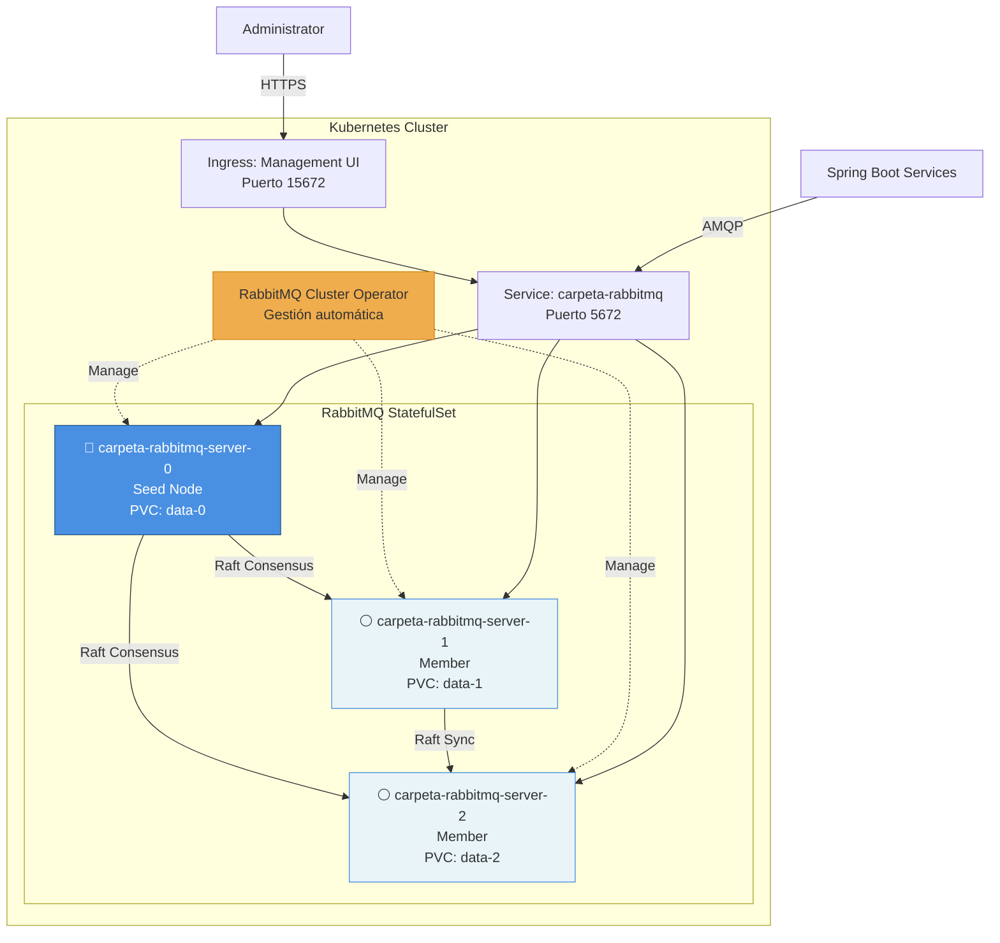

# RabbitMQ Service - Carpeta Ciudadana

Servicio de mensajería basado en RabbitMQ desplegado en Kubernetes usando el **RabbitMQ Cluster Operator**.

## 📋 Descripción

Este servicio proporciona un cluster RabbitMQ de 3 nodos con **Quorum Queues** para alta disponibilidad y durabilidad de mensajes. Utiliza el algoritmo de consenso **Raft** para replicación con un factor de replicación de 2.

## 🏗️ Arquitectura

- **Cluster RabbitMQ**: 3 nodos (mínimo para Quorum Queues)
- **Replication Factor**: 2 (mensajes replicados en 2 nodos)
- **Peer Discovery**: Kubernetes-based (automático)
- **Persistence**: Shared volume con carpeta por nodo
- **Management**: RabbitMQ Cluster Operator



## 🚀 Pre-requisitos

### Software Requerido

- **kubectl** 1.24+
- **krew** (plugin manager para kubectl)
- **Cluster Kubernetes**: Minikube, Kind, K3s, o cloud (GKE, EKS, AKS)
- **Recursos Mínimos**:
  - CPU: 3 cores
  - RAM: 6GB
  - Disk: 30GB

### Instalar krew

```bash
# macOS/Linux
(
  set -x; cd "$(mktemp -d)" &&
  OS="$(uname | tr '[:upper:]' '[:lower:]')" &&
  ARCH="$(uname -m | sed -e 's/x86_64/amd64/' -e 's/\(arm\)\(64\)\?.*/\1\2/' -e 's/aarch64$/arm64/')" &&
  KREW="krew-${OS}_${ARCH}" &&
  curl -fsSLO "https://github.com/kubernetes-sigs/krew/releases/latest/download/${KREW}.tar.gz" &&
  tar zxvf "${KREW}.tar.gz" &&
  ./"${KREW}" install krew
)

# Agregar al PATH
export PATH="${KREW_ROOT:-$HOME/.krew}/bin:$PATH"
```

### Instalar kubectl rabbitmq plugin

```bash
kubectl krew install rabbitmq
```

### Verificar Instalación

```bash
kubectl rabbitmq version
kubectl rabbitmq help
```

## 📦 Instalación

### 1. Instalar el RabbitMQ Cluster Operator

```bash
# Desde el directorio services/rabbitmq-service
cd services/rabbitmq-service

# Aplicar el Cluster Operator
kubectl apply -f k8s/00-namespace.yaml
kubectl apply -f k8s/01-cluster-operator.yaml

# Verificar que el operator esté corriendo
kubectl get pods -n rabbitmq-system
```

**Salida esperada**:
```
NAME                                         READY   STATUS    RESTARTS   AGE
rabbitmq-cluster-operator-7d9b8b9f4d-xxxxx   1/1     Running   0          30s
```

### 2. Crear el Cluster RabbitMQ

```bash
# Aplicar configuración de storage
kubectl apply -f k8s/02-storage.yaml

# Crear el cluster (3 nodos)
kubectl apply -f k8s/03-rabbitmq-cluster.yaml

# Monitorear el despliegue
kubectl get rabbitmqclusters -n carpeta-ciudadana
kubectl get pods -n carpeta-ciudadana -l app.kubernetes.io/name=carpeta-rabbitmq
```

**Tiempo de despliegue**: ~2-3 minutos

**Salida esperada**:
```
NAME              ALLREPLICASREADY   RECONCILESUCCESS   AGE
carpeta-rabbitmq  True               True               2m

NAME                           READY   STATUS    RESTARTS   AGE
carpeta-rabbitmq-server-0      1/1     Running   0          2m
carpeta-rabbitmq-server-1      1/1     Running   0          90s
carpeta-rabbitmq-server-2      1/1     Running   0          60s
```

### 3. Verificar el Cluster

```bash
# Ver estado del cluster
kubectl rabbitmq get carpeta-rabbitmq -n carpeta-ciudadana

# Ver nodos del cluster
kubectl exec -n carpeta-ciudadana carpeta-rabbitmq-server-0 -- \
  rabbitmqctl cluster_status

# Listar queues
kubectl exec -n carpeta-ciudadana carpeta-rabbitmq-server-0 -- \
  rabbitmqctl list_queues name type
```

### 4. Acceder al Management UI

```bash
# Port-forward para acceso local
kubectl port-forward -n carpeta-ciudadana svc/carpeta-rabbitmq 15672:15672

# O aplicar Ingress
kubectl apply -f k8s/04-ingress.yaml
```

**Management UI**: http://localhost:15672

**Credenciales**: Obtener desde secret
```bash
kubectl get secret carpeta-rabbitmq-default-user -n carpeta-ciudadana -o jsonpath='{.data.username}' | base64 -d
kubectl get secret carpeta-rabbitmq-default-user -n carpeta-ciudadana -o jsonpath='{.data.password}' | base64 -d
```

## 🔧 Configuración

### Peer Discovery en Kubernetes

El plugin `rabbitmq_peer_discovery_k8s` está habilitado automáticamente por el Cluster Operator. Configuración clave:

- **Seed Node**: Pod con `-0` suffix (carpeta-rabbitmq-server-0)
- **Discovery**: Automático vía Kubernetes API
- **StatefulSet ordinal start**: 0 (default)

```yaml
# Configuración automática del Operator
cluster_formation.peer_discovery_backend = kubernetes
cluster_formation.k8s.host = kubernetes.default.svc.cluster.local
cluster_formation.k8s.address_type = hostname
```

### Quorum Queues

Las queues deben crearse con tipo `quorum`:

```bash
# Via kubectl rabbitmq plugin
kubectl rabbitmq manage carpeta-rabbitmq -n carpeta-ciudadana

# En Management UI, crear queue:
# - Type: Quorum
# - Replication factor: 2
# - Arguments: x-queue-type=quorum
```

**Desde código (Spring Boot)**:
```java
@Bean
public Queue documentDeletionQueue() {
    return QueueBuilder
        .durable("documento.deletion.queue")
        .withArgument("x-queue-type", "quorum")
        .withArgument("x-quorum-initial-group-size", 3)
        .build();
}
```

## 📊 Operaciones

### Escalar el Cluster

```bash
# Escalar a 5 nodos
kubectl rabbitmq manage carpeta-rabbitmq -n carpeta-ciudadana
# Modificar replicas en el CR
kubectl edit rabbitmqcluster carpeta-rabbitmq -n carpeta-ciudadana

# O mediante patch
kubectl patch rabbitmqcluster carpeta-rabbitmq -n carpeta-ciudadana \
  --type merge -p '{"spec":{"replicas":5}}'
```

### Monitoreo

```bash
# Estado del cluster
kubectl rabbitmq get carpeta-rabbitmq -n carpeta-ciudadana

# Logs del nodo 0
kubectl logs -n carpeta-ciudadana carpeta-rabbitmq-server-0 -f

# Métricas de Prometheus
kubectl port-forward -n carpeta-ciudadana carpeta-rabbitmq-server-0 15692:15692
curl http://localhost:15692/metrics
```

### Backup y Restore

```bash
# Listar definitions
kubectl rabbitmq export-definitions carpeta-rabbitmq -n carpeta-ciudadana

# Backup a archivo
kubectl rabbitmq export-definitions carpeta-rabbitmq -n carpeta-ciudadana > backup.json

# Restore desde archivo
kubectl rabbitmq import-definitions carpeta-rabbitmq -n carpeta-ciudadana backup.json
```

### Troubleshooting

```bash
# Ver eventos del cluster
kubectl describe rabbitmqcluster carpeta-rabbitmq -n carpeta-ciudadana

# Ver logs del operator
kubectl logs -n rabbitmq-system -l app.kubernetes.io/name=rabbitmq-cluster-operator

# Reiniciar un nodo específico
kubectl delete pod carpeta-rabbitmq-server-1 -n carpeta-ciudadana

# Verificar discovery de peers
kubectl exec -n carpeta-ciudadana carpeta-rabbitmq-server-0 -- \
  rabbitmq-diagnostics cluster_status
```

## 🧪 Testing

### Test Básico de Conectividad

```bash
# Desde el directorio tools/rabbitmq-tester
cd ../../tools/rabbitmq-tester

# Port-forward para testing local
kubectl port-forward -n carpeta-ciudadana svc/carpeta-rabbitmq 5672:5672 &

# Obtener credenciales
export RABBITMQ_USER=$(kubectl get secret carpeta-rabbitmq-default-user -n carpeta-ciudadana -o jsonpath='{.data.username}' | base64 -d)
export RABBITMQ_PASSWORD=$(kubectl get secret carpeta-rabbitmq-default-user -n carpeta-ciudadana -o jsonpath='{.data.password}' | base64 -d)

# Ejecutar producer
python producer.py --host localhost --port 5672 --user $RABBITMQ_USER --password $RABBITMQ_PASSWORD

# Ejecutar consumer
python consumer.py --host localhost --port 5672 --user $RABBITMQ_USER --password $RABBITMQ_PASSWORD
```

### Test de Failover

```bash
# 1. Iniciar consumer
python consumer.py &

# 2. Enviar mensajes
python producer.py --count 10

# 3. Simular fallo del seed node
kubectl delete pod carpeta-rabbitmq-server-0 -n carpeta-ciudadana

# 4. Verificar que el cluster sigue funcionando
kubectl exec -n carpeta-ciudadana carpeta-rabbitmq-server-1 -- rabbitmqctl cluster_status

# 5. Enviar más mensajes (debería funcionar)
python producer.py --count 10
```

## 🔒 Seguridad

### Credenciales

Las credenciales se generan automáticamente y se almacenan en secrets:

```bash
# Ver el secret
kubectl get secret carpeta-rabbitmq-default-user -n carpeta-ciudadana -o yaml

# Rotar credenciales
kubectl delete secret carpeta-rabbitmq-default-user -n carpeta-ciudadana
kubectl rabbitmq secrets carpeta-rabbitmq -n carpeta-ciudadana
```

### TLS

Para habilitar TLS, ver: https://www.rabbitmq.com/kubernetes/operator/using-operator#tls

## 📚 Referencias

### Documentación RabbitMQ

- [RabbitMQ Kubernetes Operator Overview](https://www.rabbitmq.com/kubernetes/operator/operator-overview)
- [RabbitMQ Cluster Formation](https://www.rabbitmq.com/docs/cluster-formation)
- [RabbitMQ Quorum Queues](https://www.rabbitmq.com/docs/quorum-queues)
- [Peer Discovery on Kubernetes](https://www.rabbitmq.com/docs/cluster-formation#peer-discovery-k8s)
- [kubectl Plugin](https://www.rabbitmq.com/kubernetes/operator/kubectl-plugin)
- [Configure Operator Defaults](https://www.rabbitmq.com/kubernetes/operator/configure-operator-defaults)

### Ejemplos

- [DIY Kubernetes Examples - Minikube](https://github.com/rabbitmq/diy-kubernetes-examples/tree/master/minikube)

### ADRs del Proyecto

- [ADR-0003: Event-Driven Architecture](../../docs/ADR/0003-eliminacion-documentos-event-driven-rabbitmq.md)
- [ADR-0004: Quorum Queues + Kubernetes](../../docs/ADR/0004-rabbitmq-quorum-queues-arquitectura-leader-followers.md)
- [ADR-0005: Migración a Kubernetes](../../docs/ADR/0005-ubicacion-rabbitmq-docker-compose-escalable.md)

## 🗑️ Limpieza

```bash
# Eliminar el cluster
kubectl delete -f k8s/03-rabbitmq-cluster.yaml

# Eliminar storage (⚠️ pérdida de datos)
kubectl delete -f k8s/02-storage.yaml

# Eliminar el operator
kubectl delete -f k8s/01-cluster-operator.yaml
kubectl delete -f k8s/00-namespace.yaml
```

---

**Última actualización**: 2025-11-05  
**Mantenedor**: Equipo Carpeta Ciudadana
