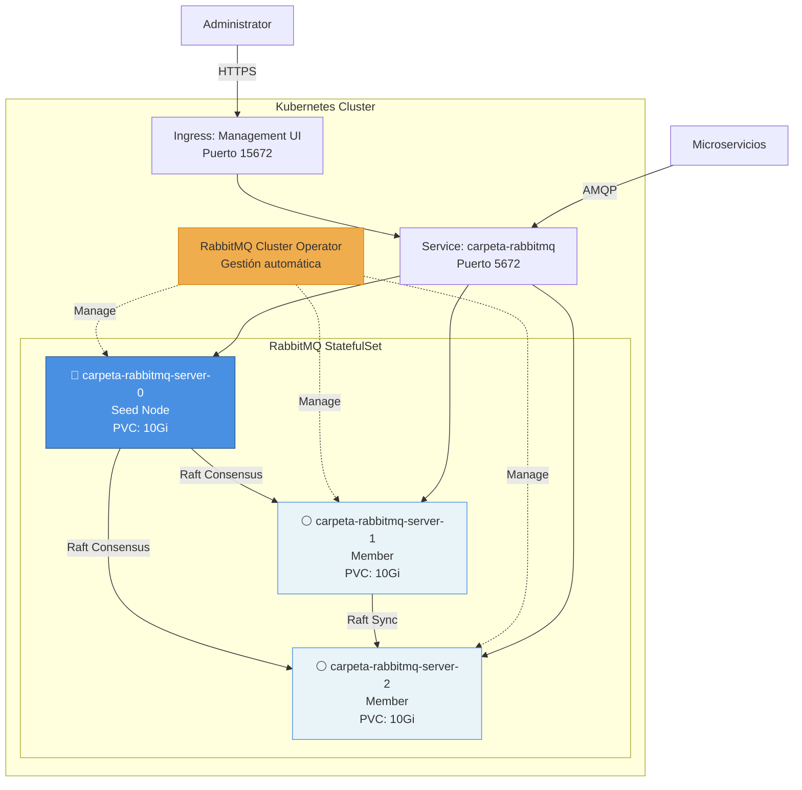

# RabbitMQ Service - Carpeta Ciudadana

## 📋 ¿Qué es este servicio?

Servicio de mensajería basado en **RabbitMQ** desplegado en **Kubernetes** que proporciona comunicación asíncrona y confiable entre los microservicios del sistema Carpeta Ciudadana. 

Este servicio es fundamental para la arquitectura event-driven del sistema, permitiendo el procesamiento asíncrono de tareas críticas como:
- Verificación de documentos
- Notificaciones a usuarios
- Eliminación de documentos
- Auditoría de eventos

## 🎯 Características Principales

### Alta Disponibilidad
- **Cluster de 3 nodos** con replicación automática
- **Quorum Queues** con algoritmo de consenso Raft
- **Failover automático** en menos de 5 segundos
- Tolerancia a fallas de hasta 1 nodo sin pérdida de datos

### Durabilidad y Consistencia
- **Replication Factor de 2**: Mensajes replicados en 2 de 3 nodos
- **Persistencia garantizada**: Almacenamiento en volúmenes persistentes (10Gi por nodo)
- **Sin pérdida de mensajes**: ACK solo cuando se persiste en quorum

### Gestión Automatizada
- **RabbitMQ Cluster Operator**: Gestión declarativa del cluster
- **Peer Discovery automático**: Descubrimiento de nodos vía Kubernetes API
- **StatefulSet**: Identidad estable para cada nodo
- **Auto-healing**: Recuperación automática de particiones de red

### Monitoreo y Observabilidad
- **Management UI**: Interfaz web en puerto 15672
- **Prometheus metrics**: Endpoint de métricas en puerto 15692
- **Logging estructurado**: Logs en formato JSON para agregación

## 🏗️ Arquitectura



### Componentes

| Componente | Descripción | Puerto |
|------------|-------------|--------|
| **AMQP Server** | Protocolo de mensajería | 5672 |
| **Management UI** | Interfaz web de administración | 15672 |
| **Prometheus Exporter** | Métricas para monitoreo | 15692 |
| **Cluster Operator** | Gestión del ciclo de vida | N/A |

### Queues Configuradas

1. **document_verification_request**: Recibe solicitudes de verificación de documentos
2. **document_verified_response**: Envía respuestas de verificación
3. **test_queue**: Queue de pruebas y validación

Cada queue tiene su correspondiente **Dead Letter Queue (DLQ)** para mensajes que fallan después de 3 reintentos.

## 🚀 Inicio Rápido

### Pre-requisitos

- Kubernetes cluster (Minikube, Kind, K3s, GKE, EKS, AKS)
- kubectl 1.24+
- 3 CPU cores mínimo
- 6GB RAM mínimo
- 30GB almacenamiento

### Instalación en 3 pasos

```bash
# 1. Instalar el RabbitMQ Cluster Operator
kubectl apply -f https://github.com/rabbitmq/cluster-operator/releases/latest/download/cluster-operator.yml

# 2. Desplegar el cluster
cd services/rabbitmq-service
kubectl apply -f k8s/

# 3. Verificar que esté corriendo
kubectl get rabbitmqclusters -n carpeta-ciudadana
kubectl get pods -n carpeta-ciudadana -w
```

### Acceso al Management UI

```bash
# Port-forward para acceso local
kubectl port-forward -n carpeta-ciudadana svc/carpeta-rabbitmq 15672:15672

# Abrir en navegador
open http://localhost:15672
```

**Credenciales predeterminadas:**
- Usuario: `admin`
- Contraseña: `admin123`

O extraer las credenciales generadas automáticamente:

```bash
# Linux/macOS
export RABBITMQ_USER=$(kubectl get secret carpeta-rabbitmq-default-user -n carpeta-ciudadana -o jsonpath='{.data.username}' | base64 -d)
export RABBITMQ_PASSWORD=$(kubectl get secret carpeta-rabbitmq-default-user -n carpeta-ciudadana -o jsonpath='{.data.password}' | base64 -d)
echo "User: $RABBITMQ_USER"
echo "Password: $RABBITMQ_PASSWORD"
```

## 📊 Operaciones Comunes

### Ver estado del cluster

```bash
kubectl rabbitmq get carpeta-rabbitmq -n carpeta-ciudadana
kubectl exec -n carpeta-ciudadana carpeta-rabbitmq-server-0 -- rabbitmqctl cluster_status
```

### Listar queues

```bash
kubectl exec -n carpeta-ciudadana carpeta-rabbitmq-server-0 -- rabbitmqctl list_queues name type members
```

### Ver logs

```bash
kubectl logs -n carpeta-ciudadana carpeta-rabbitmq-server-0 -f
```

### Escalar el cluster

```bash
kubectl patch rabbitmqcluster carpeta-rabbitmq -n carpeta-ciudadana \
  --type merge -p '{"spec":{"replicas":5}}'
```

### Backup de configuración

```bash
kubectl rabbitmq export-definitions carpeta-rabbitmq -n carpeta-ciudadana > backup.json
```

## 🛠️ Makefile - Comandos Simplificados

El servicio incluye un Makefile completo con 30+ comandos para facilitar las operaciones:

```bash
# Ver todos los comandos disponibles
make help

# Instalación rápida
make quick-start

# Estado y monitoreo
make status              # Ver estado general
make list-queues         # Listar todas las queues
make logs                # Ver logs de todos los pods

# Acceso
make credentials         # Obtener credenciales
make port-forward        # Port-forward de servicios
make management-ui       # Abrir Management UI

# Testing
make test-connection     # Probar conectividad
make test-queues         # Probar con producer/consumer

# Limpieza
make uninstall           # Eliminar cluster
make uninstall-all       # Eliminar todo (incluyendo operator)
```

## 🔗 Documentación Adicional

- **[DEPLOYMENT_GUIDE.md](./DEPLOYMENT_GUIDE.md)**: Guía completa de despliegue paso a paso con comandos específicos para Windows y Linux
- **[docs/QUORUM_QUEUES.md](./docs/QUORUM_QUEUES.md)**: Guía detallada sobre Quorum Queues y algoritmo Raft
- **[docs/INSTALL_KUBECTL_PLUGIN.md](./docs/INSTALL_KUBECTL_PLUGIN.md)**: Instalación del plugin kubectl rabbitmq con krew
- **Makefile**: Comandos helper para todas las operaciones comunes

### ADRs Relacionados

- [ADR-0003: Event-Driven Architecture](../../docs/ADR/0003-eliminacion-documentos-event-driven-rabbitmq.md)
- [ADR-0004: Quorum Queues + Kubernetes](../../docs/ADR/0004-rabbitmq-quorum-queues-arquitectura-leader-followers.md)
- [ADR-0005: Migración a Kubernetes](../../docs/ADR/0005-ubicacion-rabbitmq-docker-compose-escalable.md)

## 🧪 Testing

Ver herramientas de testing en `tools/rabbitmq-tester/`:

```bash
cd ../../tools/rabbitmq-tester

# Port-forward primero
kubectl port-forward -n carpeta-ciudadana svc/carpeta-rabbitmq 5672:5672 &

# Terminal 1: Consumer
python consumer.py --host localhost --user admin --password admin123

# Terminal 2: Producer
python producer.py --count 10 --host localhost --user admin --password admin123
```

## 🔒 Seguridad

- **Credenciales en Secrets**: Usuario y contraseña almacenados en Kubernetes Secrets
- **Network Policies**: Aislamiento de red a nivel de cluster
- **RBAC**: Control de acceso basado en roles
- **TLS opcional**: Configuración de Ingress con certificados TLS

## 📈 Escalabilidad

El cluster puede escalar horizontalmente de 3 a N nodos:

- **3 nodos**: Desarrollo y staging (configuración actual)
- **5 nodos**: Producción con carga media
- **7+ nodos**: Producción con alta carga (>10K msg/s)

Recomendaciones de recursos por escala:
- **Ligera** (<1K msg/s): 500m CPU / 1Gi RAM por nodo ✅ Actual
- **Media** (1K-10K msg/s): 1 CPU / 2Gi RAM por nodo
- **Alta** (>10K msg/s): 2 CPU / 4Gi RAM por nodo

## 🆘 Troubleshooting

### Pods no inician

```bash
kubectl logs -n rabbitmq-system -l app.kubernetes.io/name=rabbitmq-cluster-operator
kubectl describe rabbitmqcluster carpeta-rabbitmq -n carpeta-ciudadana
```

### Connection refused

```bash
# Verificar port-forward activo
ps aux | grep port-forward

# Reiniciar port-forward
kubectl port-forward -n carpeta-ciudadana svc/carpeta-rabbitmq 5672:5672 15672:15672
```

### Problemas de autenticación

Ver guía completa en `DEPLOYMENT_GUIDE.md` sección de Troubleshooting.

## 🗑️ Desinstalación

```bash
# Eliminar cluster (mantiene operator)
kubectl delete -f k8s/03-rabbitmq-cluster.yaml

# Eliminar todo incluyendo datos
kubectl delete -f k8s/

# Eliminar operator
kubectl delete -f https://github.com/rabbitmq/cluster-operator/releases/latest/download/cluster-operator.yml
```

## 📚 Referencias Oficiales

- [RabbitMQ Kubernetes Operator Overview](https://www.rabbitmq.com/kubernetes/operator/operator-overview)
- [RabbitMQ Cluster Formation](https://www.rabbitmq.com/docs/cluster-formation)
- [RabbitMQ Quorum Queues](https://www.rabbitmq.com/docs/quorum-queues)
- [Peer Discovery on Kubernetes](https://www.rabbitmq.com/docs/cluster-formation#peer-discovery-k8s)
- [kubectl Plugin Documentation](https://www.rabbitmq.com/kubernetes/operator/kubectl-plugin)
- [Configure Operator Defaults](https://www.rabbitmq.com/kubernetes/operator/configure-operator-defaults)
- [DIY Kubernetes Examples](https://github.com/rabbitmq/diy-kubernetes-examples/tree/master/minikube)

---

**Última actualización**: 2025-11-06  
**Mantenedor**: Equipo Carpeta Ciudadana  
**Versión RabbitMQ**: 3.13-management  
**Versión Operator**: Latest
