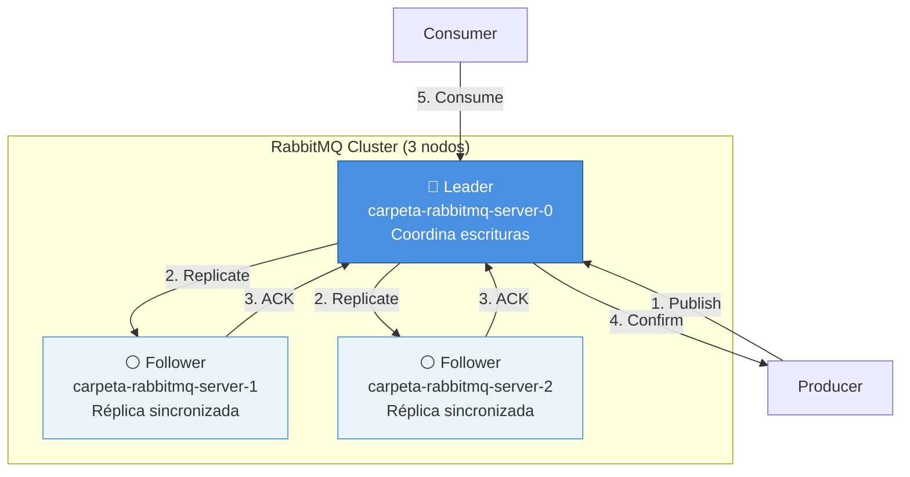

# Quorum Queues en Kubernetes

Este documento explica cómo funcionan las **Quorum Queues** en RabbitMQ desplegado en Kubernetes con el Cluster Operator.

## 🎯 ¿Qué son las Quorum Queues?

Las **Quorum Queues** son un tipo de queue en RabbitMQ (desde v3.8) que utilizan el algoritmo de consenso **Raft** para replicación, ofreciendo:

- ✅ **Alta durabilidad**: Mensajes replicados en múltiples nodos
- ✅ **Consistencia fuerte**: Garantía de orden y entrega
- ✅ **Failover automático**: Elección de nuevo líder en <5 segundos
- ✅ **Sin pérdida de mensajes**: ACK solo cuando persiste en quorum (mayoría)

## 🏗️ Arquitectura con Raft Consensus



### Características Clave

1. **Seed Node**: El pod con ordinal más bajo (-0) forma el cluster inicial
2. **Replication Factor**: 2 (mensajes en 2 de 3 nodos mínimo)
3. **Quorum**: Mayoría simple (2 de 3 nodos deben estar activos)
4. **Líder Raft**: Un nodo es líder, maneja todas las escrituras
5. **Followers**: Replican datos del líder, pueden manejar lecturas

## 📝 Crear Quorum Queues

### Opción 1: Management UI

1. Acceder a http://localhost:15672
2. Ir a **Queues** → **Add a new queue**
3. Configurar:
   - **Type**: Quorum
   - **Name**: documento.deletion.queue
   - **Durability**: Durable
   - **Arguments**:
     - `x-queue-type`: quorum
     - `x-quorum-initial-group-size`: 3
     - `x-delivery-limit`: 3 (opcional, para DLQ)

### Opción 2: CLI con rabbitmqadmin

```bash
# Port-forward primero
kubectl port-forward -n carpeta-ciudadana svc/carpeta-rabbitmq 15672:15672 &

# Crear queue
kubectl exec -n carpeta-ciudadana carpeta-rabbitmq-server-0 -- \
  rabbitmqadmin declare queue \
  name=documento.deletion.queue \
  durable=true \
  arguments='{"x-queue-type":"quorum","x-quorum-initial-group-size":3}'
```

### Opción 3: Spring Boot (Código)

```java
@Configuration
public class RabbitMQQuorumConfig {

    @Bean
    public Queue documentDeletionQueue() {
        return QueueBuilder
            .durable("documento.deletion.queue")
            .withArgument("x-queue-type", "quorum")
            .withArgument("x-quorum-initial-group-size", 3)
            .withArgument("x-delivery-limit", 3)
            .build();
    }

    @Bean
    public TopicExchange documentoExchange() {
        return ExchangeBuilder
            .topicExchange("documento.events")
            .durable(true)
            .build();
    }

    @Bean
    public Binding deletionBinding() {
        return BindingBuilder
            .bind(documentDeletionQueue())
            .to(documentoExchange())
            .with("documento.deletion.requested");
    }
}
```

### Opción 4: Definitions JSON

Crear archivo `definitions.json`:

```json
{
  "queues": [
    {
      "name": "documento.deletion.queue",
      "vhost": "/",
      "durable": true,
      "auto_delete": false,
      "arguments": {
        "x-queue-type": "quorum",
        "x-quorum-initial-group-size": 3
      }
    }
  ],
  "exchanges": [
    {
      "name": "documento.events",
      "vhost": "/",
      "type": "topic",
      "durable": true,
      "auto_delete": false
    }
  ],
  "bindings": [
    {
      "source": "documento.events",
      "vhost": "/",
      "destination": "documento.deletion.queue",
      "destination_type": "queue",
      "routing_key": "documento.deletion.requested"
    }
  ]
}
```

Importar:
```bash
kubectl rabbitmq import-definitions carpeta-rabbitmq -n carpeta-ciudadana definitions.json
```

## ⚙️ Configuración de Replication Factor

### x-quorum-initial-group-size

Define el número inicial de réplicas:

```java
.withArgument("x-quorum-initial-group-size", 3)  // 3 réplicas
```

**Restricciones**:
- Debe ser ≤ número de nodos en el cluster
- Para 3 nodos: máximo 3
- Para 5 nodos: máximo 5
- Recomendado: usar número total de nodos

**Replication Factor efectivo**:
- `x-quorum-initial-group-size` = 3 → RF = 3 (todos los nodos)
- Quorum = ⌈(N+1)/2⌉ = ⌈4/2⌉ = 2 nodos mínimo

## 🔄 Conversión de Classic Queues a Quorum

**⚠️ IMPORTANTE**: No se puede cambiar el tipo de una queue existente. Hay que:

1. **Detener consumers y producers**
2. **Drenar mensajes** (procesar todos los pendientes)
3. **Eliminar la classic queue**
4. **Crear nueva quorum queue** con el mismo nombre
5. **Reiniciar producers y consumers**

```bash
# 1. Verificar tipo de queue
kubectl exec -n carpeta-ciudadana carpeta-rabbitmq-server-0 -- \
  rabbitmqctl list_queues name type

# 2. Si es "classic", eliminar (⚠️ pérdida de mensajes pendientes)
kubectl exec -n carpeta-ciudadana carpeta-rabbitmq-server-0 -- \
  rabbitmqctl delete_queue documento.deletion.queue

# 3. Crear quorum queue
kubectl exec -n carpeta-ciudadana carpeta-rabbitmq-server-0 -- \
  rabbitmqadmin declare queue \
  name=documento.deletion.queue \
  durable=true \
  arguments='{"x-queue-type":"quorum","x-quorum-initial-group-size":3}'

# 4. Verificar
kubectl exec -n carpeta-ciudadana carpeta-rabbitmq-server-0 -- \
  rabbitmqctl list_queues name type members
```

## 📊 Verificación y Monitoreo

### Ver tipo y miembros de queues

```bash
kubectl exec -n carpeta-ciudadana carpeta-rabbitmq-server-0 -- \
  rabbitmqctl list_queues name type members state
```

**Salida esperada**:
```
Timeout: 60.0 seconds ...
Listing queues for vhost / ...
name                        type    members                                                           state
documento.deletion.queue    quorum  [rabbit@carpeta-rabbitmq-server-0,rabbit@carpeta-rabbitmq-server-1,rabbit@carpeta-rabbitmq-server-2]  running
```

### Ver líder de cada queue

```bash
kubectl exec -n carpeta-ciudadana carpeta-rabbitmq-server-0 -- \
  rabbitmqctl list_queues name type leader
```

### Estadísticas de replicación

```bash
kubectl exec -n carpeta-ciudadana carpeta-rabbitmq-server-0 -- \
  rabbitmq-diagnostics quorum_status documento.deletion.queue
```

### Métricas en Prometheus

```bash
# Port-forward prometheus endpoint
kubectl port-forward -n carpeta-ciudadana carpeta-rabbitmq-server-0 15692:15692 &

# Consultar métricas
curl http://localhost:15692/metrics | grep quorum
```

**Métricas clave**:
- `rabbitmq_queue_messages{queue="documento.deletion.queue"}`: Mensajes pendientes
- `rabbitmq_quorum_queue_members_online`: Miembros activos
- `rabbitmq_quorum_queue_members_total`: Miembros totales

## 🧪 Testing de Failover

### Test 1: Fallo de un Follower

```bash
# 1. Enviar mensajes
python producer.py --count 10

# 2. Ver replicación
kubectl exec -n carpeta-ciudadana carpeta-rabbitmq-server-0 -- \
  rabbitmqctl list_queues name type members

# 3. Eliminar un follower
kubectl delete pod carpeta-rabbitmq-server-2 -n carpeta-ciudadana

# 4. Verificar que sigue funcionando (quorum = 2/3)
python producer.py --count 5

# 5. Consumer funciona
python consumer.py

# 6. El pod se recrea automáticamente
kubectl get pods -n carpeta-ciudadana -w
```

### Test 2: Fallo del Líder (Seed Node)

```bash
# 1. Identificar líder
kubectl exec -n carpeta-ciudadana carpeta-rabbitmq-server-0 -- \
  rabbitmqctl list_queues name leader

# 2. Eliminar el seed node
kubectl delete pod carpeta-rabbitmq-server-0 -n carpeta-ciudadana

# 3. Raft elige nuevo líder (~5 segundos)
sleep 10

# 4. Verificar nuevo líder
kubectl exec -n carpeta-ciudadana carpeta-rabbitmq-server-1 -- \
  rabbitmqctl list_queues name leader

# 5. Sistema sigue funcionando
python producer.py --count 5
python consumer.py
```

## ⚠️ Limitaciones y Consideraciones

### Particionamiento de Red (Split Brain)

Si el cluster se divide en 2 particiones:
- Partición con mayoría (≥2 nodos): **sigue operando**
- Partición minoritaria (<2 nodos): **se vuelve read-only**

**Raft previene split brain**: Solo una partición con mayoría puede aceptar escrituras.

### Pérdida de Mayoría

Si fallan 2+ nodos de 3:
- ❌ **Cluster en read-only mode**
- ❌ **No se pueden publicar nuevos mensajes**
- ✅ **Se pueden consumir mensajes existentes**

**Solución**: Restaurar al menos 2 de 3 nodos.

### Performance

Quorum Queues son ~20% más lentas que Classic Queues debido a:
- Replicación sincrónica a múltiples nodos
- Consenso Raft para cada operación de escritura

**Trade-off aceptable** para durabilidad y consistencia.

### Rebalanceo de Réplicas

Si agregas nodos al cluster, las queues existentes **NO se rebalancean automáticamente**.

Para distribuir réplicas en nuevos nodos:
1. Crear nuevas queues
2. Migrar tráfico
3. Eliminar queues antiguas

O usar: `rabbitmqctl grow_quorum_queue_membership`

## 📚 Referencias

- [RabbitMQ Quorum Queues Documentation](https://www.rabbitmq.com/docs/quorum-queues)
- [Raft Consensus Algorithm](https://raft.github.io/)
- [RabbitMQ Cluster Formation](https://www.rabbitmq.com/docs/cluster-formation)
- [Peer Discovery on Kubernetes](https://www.rabbitmq.com/docs/cluster-formation#peer-discovery-k8s)

---

**Última actualización**: 2025-11-05
